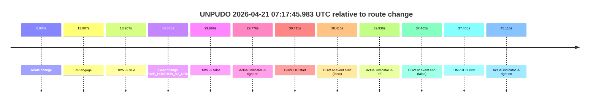
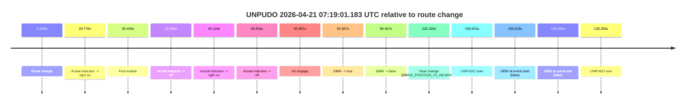
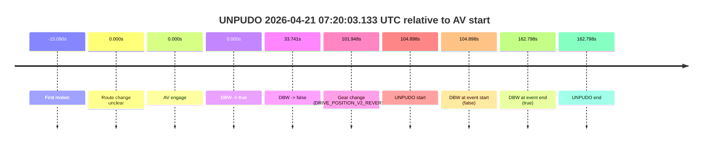
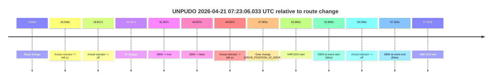

# Run Report: fme20038/2026-04-21--07-11-09--gen2-av-7682c037-e88d-4b10-bda6-6c941cd2b835

| Field | Value |
|---|---|
| Run ID | `fme20038/2026-04-21--07-11-09--gen2-av-7682c037-e88d-4b10-bda6-6c941cd2b835` |
| Date | `2026-04-21` |
| Model(s) | `pink-manta-ray-smooth` |
| Author | `guy.geva` |
| Event count | `4` |

## unpudo 2026-04-21 07:17:45.983 UTC

| Field | Value |
|---|---|
| Model | `pink-manta-ray-smooth` |
| Author | `guy.geva` |
| Run ID | `fme20038/2026-04-21--07-11-09--gen2-av-7682c037-e88d-4b10-bda6-6c941cd2b835` |
| Date | `2026-04-21` |
| Time (UTC) | `07:17:45.983` |
| Event type | `unpudo` |
| Disengagement type | `failed_to_maintain_speed` |
| Route change | `found` |
| Console | [run](https://console.sso.wayve.ai/run/fme20038/2026-04-21--07-11-09--gen2-av-7682c037-e88d-4b10-bda6-6c941cd2b835?id=&time-unixus=1776755865983317) |
| Foxglove | [segment](https://app.foxglove.dev/wayve-on-prem/p/prj_0dX18KZdVHg1fmmI/view?ds=foxglove-stream&ds.deviceName=fme20038&ds.start=2026-04-21T07%3A17%3A05.568462Z&ds.end=2026-04-21T07%3A18%3A03.033317Z&layoutId=lay_0e7VD4WIKDQGU73Y&time=2026-04-21T07%3A17%3A45.983317Z) |

### Event card: fail

- Fail: AV owns part of the segment, but the event still resolves as a model-performance failure under the AV-only scoring rule.

| Event | Time (UTC) | Delta from route change |
|---|---:|---:|
| Route change | 2026-04-21 07:17:15.568 | `0.000s` |
| AV engage | 2026-04-21 07:17:29.475 | `13.907s` |
| DBW -> true | 2026-04-21 07:17:29.475 | `13.907s` |
| Gear change (DRIVE_POSITION_V2_DRIVE) | 2026-04-21 07:17:29.933 | `14.365s` |
| DBW -> false | 2026-04-21 07:17:45.236 | `29.668s` |
| Actual indicator -> right on | 2026-04-21 07:17:45.344 | `29.776s` |
| UNPUDO start | 2026-04-21 07:17:45.983 | `30.415s` |
| DBW at event start (false) | 2026-04-21 07:17:45.983 | `30.415s` |
| Actual indicator -> off | 2026-04-21 07:17:48.504 | `32.936s` |
| DBW at event end (false) | 2026-04-21 07:17:53.033 | `37.465s` |
| UNPUDO end | 2026-04-21 07:17:53.033 | `37.465s` |
| Actual indicator -> right on | 2026-04-21 07:18:00.684 | `45.116s` |

| Metric | Value |
|---|---|
| Outcome | `fail` |
| Effective failure type | `failed_to_maintain_speed` |
| Route change status | `found` |
| DBW at event start | `false` |
| DBW at event end | `false` |
| Predicted gear at AV start | `DRIVE_POSITION_V2_DRIVE` |
| Actual gear at AV start | `DRIVE_POSITION_V2_PARK` |
| Predicted gear at event start | `DRIVE_POSITION_V2_DRIVE` |
| Actual gear at event start | `DRIVE_POSITION_V2_DRIVE` |
| Planned indicator direction | `INDICATORS_STATE_V2_RIGHT_ON` |
| Controller indicator direction | `INDICATORS_STATE_V2_RIGHT_ON` |
| Actual indicator direction | `INDICATORS_STATE_V2_RIGHT_ON` |
| Actual indicator at maneuver end | `INDICATORS_STATE_V2_OFF` |
| Driver accel help in AV | `false` |
| Driver accel help timestamp | `n/a` |
| Max accel pedal pct in AV | `0.0%` |
| Max brake pedal pct in AV | `10.1%` |
| Max speed mps in AV | `0.000` |
| Success timing baseline | `route change` |
| Route -> AV | `13.907s` |
| AV -> event start | `16.508s` |
| AV -> first motion | `n/a` |
| Success baseline -> event start | `30.415s` |
| Success baseline -> first motion | `n/a` |
| AV duration before disengagement | `15.761s` |
| Trajectory waypoint count | `36` |
| Driving-plan step count | `11` |

The scored portion starts from the AV-owned window, not from the pre-AV setup. Route-change search in the stopped pre-event segment was `found`, with the baseline therefore set to route change. At the event anchor the model predicts `DRIVE_POSITION_V2_DRIVE` and the actual gear is `DRIVE_POSITION_V2_DRIVE`. The effective model outcome is `fail` because `failed_to_maintain_speed.`

### Resolution

| Field | Value |
|---|---|
| Final outcome | `fail` |
| Do we agree with this label? | `yes` |
| Source disengagement type | `failed_to_maintain_speed` |
| Resolved effective failure type | `failed_to_maintain_speed` |
| Confidence | `high` |

## unpudo 2026-04-21 07:19:01.183 UTC

| Field | Value |
|---|---|
| Model | `pink-manta-ray-smooth` |
| Author | `guy.geva` |
| Run ID | `fme20038/2026-04-21--07-11-09--gen2-av-7682c037-e88d-4b10-bda6-6c941cd2b835` |
| Date | `2026-04-21` |
| Time (UTC) | `07:19:01.183` |
| Event type | `unpudo` |
| Disengagement type | `none observed` |
| Route change | `found` |
| Console | [run](https://console.sso.wayve.ai/run/fme20038/2026-04-21--07-11-09--gen2-av-7682c037-e88d-4b10-bda6-6c941cd2b835?id=&time-unixus=1776755941183305) |
| Foxglove | [segment](https://app.foxglove.dev/wayve-on-prem/p/prj_0dX18KZdVHg1fmmI/view?ds=foxglove-stream&ds.deviceName=fme20038&ds.start=2026-04-21T07%3A17%3A05.568462Z&ds.end=2026-04-21T07%3A19%3A33.833299Z&layoutId=lay_0e7VD4WIKDQGU73Y&time=2026-04-21T07%3A19%3A01.183305Z) |

### Event card: fail

- Fail: the credited unpudo does not stay AV-owned. The event window starts with DBW false, and the maneuver outcome lands outside a clean AV-owned segment.

| Event | Time (UTC) | Delta from route change |
|---|---:|---:|
| Route change | 2026-04-21 07:17:15.568 | `0.000s` |
| Actual indicator -> right on | 2026-04-21 07:17:45.344 | `29.776s` |
| First motion | 2026-04-21 07:17:46.004 | `30.436s` |
| Actual indicator -> off | 2026-04-21 07:17:48.504 | `32.936s` |
| Actual indicator -> right on | 2026-04-21 07:18:00.684 | `45.116s` |
| Actual indicator -> off | 2026-04-21 07:18:15.384 | `59.816s` |
| AV engage | 2026-04-21 07:18:18.235 | `62.667s` |
| DBW -> true | 2026-04-21 07:18:18.235 | `62.667s` |
| DBW -> false | 2026-04-21 07:18:51.975 | `96.407s` |
| Gear change (DRIVE_POSITION_V2_REVERSE) | 2026-04-21 07:18:57.733 | `102.165s` |
| UNPUDO start | 2026-04-21 07:19:01.183 | `105.615s` |
| DBW at event start (false) | 2026-04-21 07:19:01.183 | `105.615s` |
| DBW at event end (false) | 2026-04-21 07:19:23.833 | `128.265s` |
| UNPUDO end | 2026-04-21 07:19:23.833 | `128.265s` |

| Metric | Value |
|---|---|
| Outcome | `fail` |
| Effective failure type | `completed_outside_av` |
| Route change status | `found` |
| DBW at event start | `false` |
| DBW at event end | `false` |
| Predicted gear at AV start | `DRIVE_POSITION_V2_DRIVE` |
| Actual gear at AV start | `DRIVE_POSITION_V2_DRIVE` |
| Predicted gear at event start | `DRIVE_POSITION_V2_REVERSE` |
| Actual gear at event start | `DRIVE_POSITION_V2_REVERSE` |
| Planned indicator direction | `INDICATORS_STATE_V2_OFF` |
| Controller indicator direction | `INDICATORS_STATE_V2_OFF` |
| Actual indicator direction | `INDICATORS_STATE_V2_OFF` |
| Actual indicator at maneuver end | `INDICATORS_STATE_V2_OFF` |
| Driver accel help in AV | `false` |
| Driver accel help timestamp | `n/a` |
| Max accel pedal pct in AV | `0.0%` |
| Max brake pedal pct in AV | `8.0%` |
| Max speed mps in AV | `6.333` |
| Success timing baseline | `route change` |
| Route -> AV | `62.667s` |
| AV -> event start | `42.948s` |
| AV -> first motion | `-32.231s` |
| Success baseline -> event start | `105.615s` |
| Success baseline -> first motion | `30.436s` |
| AV duration before disengagement | `33.741s` |
| Trajectory waypoint count | `36` |
| Driving-plan step count | `11` |

The scored portion starts from the AV-owned window, not from the pre-AV setup. Route-change search in the stopped pre-event segment was `found`, with the baseline therefore set to route change. At the event anchor the model predicts `DRIVE_POSITION_V2_REVERSE` and the actual gear is `DRIVE_POSITION_V2_REVERSE`. The effective model outcome is `fail` because `completed_outside_av.`

### Resolution

| Field | Value |
|---|---|
| Final outcome | `fail` |
| Do we agree with this label? | `yes` |
| Source disengagement type | `none observed` |
| Resolved effective failure type | `completed_outside_av` |
| Confidence | `high` |

## unpudo 2026-04-21 07:20:03.133 UTC

| Field | Value |
|---|---|
| Model | `pink-manta-ray-smooth` |
| Author | `guy.geva` |
| Run ID | `fme20038/2026-04-21--07-11-09--gen2-av-7682c037-e88d-4b10-bda6-6c941cd2b835` |
| Date | `2026-04-21` |
| Time (UTC) | `07:20:03.133` |
| Event type | `unpudo` |
| Disengagement type | `none observed` |
| Route change | `unclear` |
| Console | [run](https://console.sso.wayve.ai/run/fme20038/2026-04-21--07-11-09--gen2-av-7682c037-e88d-4b10-bda6-6c941cd2b835?id=&time-unixus=1776756003133304) |
| Foxglove | [segment](https://app.foxglove.dev/wayve-on-prem/p/prj_0dX18KZdVHg1fmmI/view?ds=foxglove-stream&ds.deviceName=fme20038&ds.start=2026-04-21T07%3A18%3A08.235043Z&ds.end=2026-04-21T07%3A21%3A11.033310Z&layoutId=lay_0e7VD4WIKDQGU73Y&time=2026-04-21T07%3A20%3A03.133304Z) |

### Event card: fail

- Fail: the credited unpudo does not stay AV-owned. The event window starts with DBW false, and the maneuver outcome lands outside a clean AV-owned segment.

| Event | Time (UTC) | Delta from AV start |
|---|---:|---:|
| First motion | 2026-04-21 07:18:03.144 | `-15.090s` |
| Route change unclear | 2026-04-21 07:18:18.235 | `0.000s` |
| AV engage | 2026-04-21 07:18:18.235 | `0.000s` |
| DBW -> true | 2026-04-21 07:18:18.235 | `0.000s` |
| DBW -> false | 2026-04-21 07:18:51.975 | `33.741s` |
| Gear change (DRIVE_POSITION_V2_REVERSE) | 2026-04-21 07:20:00.183 | `101.948s` |
| UNPUDO start | 2026-04-21 07:20:03.133 | `104.898s` |
| DBW at event start (false) | 2026-04-21 07:20:03.133 | `104.898s` |
| DBW at event end (true) | 2026-04-21 07:21:01.033 | `162.798s` |
| UNPUDO end | 2026-04-21 07:21:01.033 | `162.798s` |

| Metric | Value |
|---|---|
| Outcome | `fail` |
| Effective failure type | `completed_outside_av` |
| Route change status | `unclear` |
| DBW at event start | `false` |
| DBW at event end | `true` |
| Predicted gear at AV start | `DRIVE_POSITION_V2_DRIVE` |
| Actual gear at AV start | `DRIVE_POSITION_V2_DRIVE` |
| Predicted gear at event start | `DRIVE_POSITION_V2_REVERSE` |
| Actual gear at event start | `DRIVE_POSITION_V2_REVERSE` |
| Planned indicator direction | `INDICATORS_STATE_V2_OFF` |
| Controller indicator direction | `INDICATORS_STATE_V2_OFF` |
| Actual indicator direction | `INDICATORS_STATE_V2_OFF` |
| Actual indicator at maneuver end | `INDICATORS_STATE_V2_OFF` |
| Driver accel help in AV | `false` |
| Driver accel help timestamp | `n/a` |
| Max accel pedal pct in AV | `0.0%` |
| Max brake pedal pct in AV | `8.0%` |
| Max speed mps in AV | `6.333` |
| Success timing baseline | `AV start` |
| Route -> AV | `n/a` |
| AV -> event start | `104.898s` |
| AV -> first motion | `-15.090s` |
| Success baseline -> event start | `104.898s` |
| Success baseline -> first motion | `-15.090s` |
| AV duration before disengagement | `33.741s` |
| Trajectory waypoint count | `37` |
| Driving-plan step count | `11` |

The scored portion starts from the AV-owned window, not from the pre-AV setup. Route-change search in the stopped pre-event segment was `unclear`, with the baseline therefore set to AV start. At the event anchor the model predicts `DRIVE_POSITION_V2_REVERSE` and the actual gear is `DRIVE_POSITION_V2_REVERSE`. The effective model outcome is `fail` because `completed_outside_av.`

### Resolution

| Field | Value |
|---|---|
| Final outcome | `fail` |
| Do we agree with this label? | `yes` |
| Source disengagement type | `none observed` |
| Resolved effective failure type | `completed_outside_av` |
| Confidence | `medium` |

## unpudo 2026-04-21 07:23:06.033 UTC

| Field | Value |
|---|---|
| Model | `pink-manta-ray-smooth` |
| Author | `guy.geva` |
| Run ID | `fme20038/2026-04-21--07-11-09--gen2-av-7682c037-e88d-4b10-bda6-6c941cd2b835` |
| Date | `2026-04-21` |
| Time (UTC) | `07:23:06.033` |
| Event type | `unpudo` |
| Disengagement type | `none observed` |
| Route change | `found` |
| Console | [run](https://console.sso.wayve.ai/run/fme20038/2026-04-21--07-11-09--gen2-av-7682c037-e88d-4b10-bda6-6c941cd2b835?id=&time-unixus=1776756186033328) |
| Foxglove | [segment](https://app.foxglove.dev/wayve-on-prem/p/prj_0dX18KZdVHg1fmmI/view?ds=foxglove-stream&ds.deviceName=fme20038&ds.start=2026-04-21T07%3A22%3A03.168243Z&ds.end=2026-04-21T07%3A23%3A20.483294Z&layoutId=lay_0e7VD4WIKDQGU73Y&time=2026-04-21T07%3A23%3A06.033328Z) |

### Event card: fail

- Fail: the credited unpudo does not stay AV-owned. The event window starts with DBW false, and the maneuver outcome lands outside a clean AV-owned segment.

| Event | Time (UTC) | Delta from route change |
|---|---:|---:|
| Route change | 2026-04-21 07:22:13.168 | `0.000s` |
| Actual indicator -> left on | 2026-04-21 07:22:30.084 | `16.916s` |
| Actual indicator -> off | 2026-04-21 07:22:31.984 | `18.817s` |
| AV engage | 2026-04-21 07:22:54.475 | `41.307s` |
| DBW -> true | 2026-04-21 07:22:54.475 | `41.307s` |
| DBW -> false | 2026-04-21 07:22:58.095 | `44.927s` |
| Actual indicator -> left on | 2026-04-21 07:22:58.104 | `44.937s` |
| Gear change (DRIVE_POSITION_V2_DRIVE) | 2026-04-21 07:23:01.133 | `47.965s` |
| UNPUDO start | 2026-04-21 07:23:06.033 | `52.865s` |
| DBW at event start (false) | 2026-04-21 07:23:06.033 | `52.865s` |
| Actual indicator -> off | 2026-04-21 07:23:07.724 | `54.556s` |
| DBW at event end (false) | 2026-04-21 07:23:10.483 | `57.315s` |
| UNPUDO end | 2026-04-21 07:23:10.483 | `57.315s` |

| Metric | Value |
|---|---|
| Outcome | `fail` |
| Effective failure type | `not_av_owned` |
| Route change status | `found` |
| DBW at event start | `false` |
| DBW at event end | `false` |
| Predicted gear at AV start | `DRIVE_POSITION_V2_DRIVE` |
| Actual gear at AV start | `DRIVE_POSITION_V2_PARK` |
| Predicted gear at event start | `DRIVE_POSITION_V2_DRIVE` |
| Actual gear at event start | `DRIVE_POSITION_V2_DRIVE` |
| Planned indicator direction | `INDICATORS_STATE_V2_RIGHT_ON` |
| Controller indicator direction | `INDICATORS_STATE_V2_RIGHT_ON` |
| Actual indicator direction | `INDICATORS_STATE_V2_LEFT_ON` |
| Actual indicator at maneuver end | `INDICATORS_STATE_V2_OFF` |
| Driver accel help in AV | `false` |
| Driver accel help timestamp | `n/a` |
| Max accel pedal pct in AV | `0.0%` |
| Max brake pedal pct in AV | `10.6%` |
| Max speed mps in AV | `0.000` |
| Success timing baseline | `route change` |
| Route -> AV | `41.307s` |
| AV -> event start | `11.558s` |
| AV -> first motion | `n/a` |
| Success baseline -> event start | `52.865s` |
| Success baseline -> first motion | `n/a` |
| AV duration before disengagement | `3.620s` |
| Trajectory waypoint count | `35` |
| Driving-plan step count | `11` |

The scored portion starts from the AV-owned window, not from the pre-AV setup. Route-change search in the stopped pre-event segment was `found`, with the baseline therefore set to route change. At the event anchor the model predicts `DRIVE_POSITION_V2_DRIVE` and the actual gear is `DRIVE_POSITION_V2_DRIVE`. The effective model outcome is `fail` because `not_av_owned.`

### Resolution

| Field | Value |
|---|---|
| Final outcome | `fail` |
| Do we agree with this label? | `yes` |
| Source disengagement type | `none observed` |
| Resolved effective failure type | `not_av_owned` |
| Confidence | `high` |
