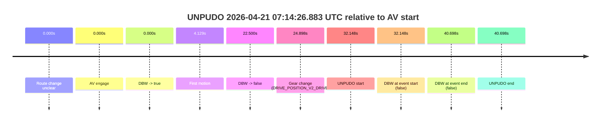

# Run Report: fme20038/2026-04-21--07-11-09--gen2-av-7682c037-e88d-4b10-bda6-6c941cd2b835

| Field | Value |
|---|---|
| Run ID | `fme20038/2026-04-21--07-11-09--gen2-av-7682c037-e88d-4b10-bda6-6c941cd2b835` |
| Date | `2026-04-21` |
| Model(s) | `eel-teal-outspoken` |
| Author | `zak` |
| Event count | `1` |

## unpudo 2026-04-21 07:14:26.883 UTC

| Field | Value |
|---|---|
| Model | `eel-teal-outspoken` |
| Author | `zak` |
| Run ID | `fme20038/2026-04-21--07-11-09--gen2-av-7682c037-e88d-4b10-bda6-6c941cd2b835` |
| Date | `2026-04-21` |
| Time (UTC) | `07:14:26.883` |
| Event type | `unpudo` |
| Disengagement type | `failed_to_maintain_speed` |
| Route change | `unclear` |
| Console | [run](https://console.sso.wayve.ai/run/fme20038/2026-04-21--07-11-09--gen2-av-7682c037-e88d-4b10-bda6-6c941cd2b835?id=&time-unixus=1776755666883315) |
| Foxglove | [segment](https://app.foxglove.dev/wayve-on-prem/p/prj_0dX18KZdVHg1fmmI/view?ds=foxglove-stream&ds.deviceName=fme20038&ds.start=2026-04-21T07%3A13%3A44.735283Z&ds.end=2026-04-21T07%3A14%3A45.433301Z&layoutId=lay_0e7VD4WIKDQGU73Y&time=2026-04-21T07%3A14%3A26.883315Z) |

### Event card: fail

- Fail: AV owns part of the segment, but the event still resolves as a model-performance failure under the AV-only scoring rule.

| Event | Time (UTC) | Delta from AV start |
|---|---:|---:|
| Route change unclear | 2026-04-21 07:13:54.735 | `0.000s` |
| AV engage | 2026-04-21 07:13:54.735 | `0.000s` |
| DBW -> true | 2026-04-21 07:13:54.735 | `0.000s` |
| First motion | 2026-04-21 07:13:58.864 | `4.129s` |
| DBW -> false | 2026-04-21 07:14:17.235 | `22.500s` |
| Gear change (DRIVE_POSITION_V2_DRIVE) | 2026-04-21 07:14:19.633 | `24.898s` |
| UNPUDO start | 2026-04-21 07:14:26.883 | `32.148s` |
| DBW at event start (false) | 2026-04-21 07:14:26.883 | `32.148s` |
| DBW at event end (false) | 2026-04-21 07:14:35.433 | `40.698s` |
| UNPUDO end | 2026-04-21 07:14:35.433 | `40.698s` |

| Metric | Value |
|---|---|
| Outcome | `fail` |
| Effective failure type | `failed_to_maintain_speed` |
| Route change status | `unclear` |
| DBW at event start | `false` |
| DBW at event end | `false` |
| Predicted gear at AV start | `DRIVE_POSITION_V2_DRIVE` |
| Actual gear at AV start | `DRIVE_POSITION_V2_PARK` |
| Predicted gear at event start | `DRIVE_POSITION_V2_DRIVE` |
| Actual gear at event start | `DRIVE_POSITION_V2_DRIVE` |
| Planned indicator direction | `INDICATORS_STATE_V2_OFF` |
| Controller indicator direction | `INDICATORS_STATE_V2_OFF` |
| Actual indicator direction | `INDICATORS_STATE_V2_OFF` |
| Actual indicator at maneuver end | `INDICATORS_STATE_V2_OFF` |
| Driver accel help in AV | `false` |
| Driver accel help timestamp | `n/a` |
| Max accel pedal pct in AV | `0.0%` |
| Max brake pedal pct in AV | `23.6%` |
| Max speed mps in AV | `3.611` |
| Success timing baseline | `AV start` |
| Route -> AV | `n/a` |
| AV -> event start | `32.148s` |
| AV -> first motion | `4.129s` |
| Success baseline -> event start | `32.148s` |
| Success baseline -> first motion | `4.129s` |
| AV duration before disengagement | `22.500s` |
| Trajectory waypoint count | `36` |
| Driving-plan step count | `11` |

The scored portion starts from the AV-owned window, not from the pre-AV setup. Route-change search in the stopped pre-event segment was `unclear`, with the baseline therefore set to AV start. At the event anchor the model predicts `DRIVE_POSITION_V2_DRIVE` and the actual gear is `DRIVE_POSITION_V2_DRIVE`. The effective model outcome is `fail` because `failed_to_maintain_speed.`

### Resolution

| Field | Value |
|---|---|
| Final outcome | `fail` |
| Do we agree with this label? | `yes` |
| Source disengagement type | `failed_to_maintain_speed` |
| Resolved effective failure type | `failed_to_maintain_speed` |
| Confidence | `medium` |
