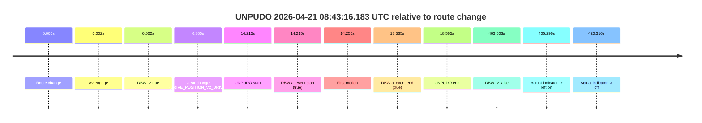
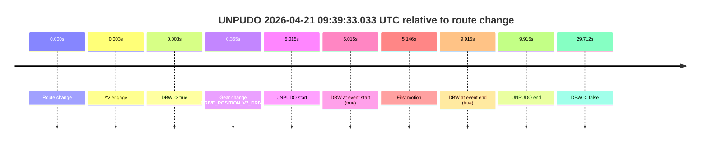

# Run Report: fme20038/2026-04-21--08-28-49--gen2-av-39637566-e5c2-44a6-87cc-8c6b8aafa0bd

| Field | Value |
|---|---|
| Run ID | `fme20038/2026-04-21--08-28-49--gen2-av-39637566-e5c2-44a6-87cc-8c6b8aafa0bd` |
| Date | `2026-04-21` |
| Model(s) | `eel-teal-outspoken` |
| Author | `zak` |
| Event count | `4` |

## unpudo 2026-04-21 08:43:16.183 UTC

| Field | Value |
|---|---|
| Model | `eel-teal-outspoken` |
| Author | `zak` |
| Run ID | `fme20038/2026-04-21--08-28-49--gen2-av-39637566-e5c2-44a6-87cc-8c6b8aafa0bd` |
| Date | `2026-04-21` |
| Time (UTC) | `08:43:16.183` |
| Event type | `unpudo` |
| Disengagement type | `none observed` |
| Route change | `found` |
| Console | [run](https://console.sso.wayve.ai/run/fme20038/2026-04-21--08-28-49--gen2-av-39637566-e5c2-44a6-87cc-8c6b8aafa0bd?id=&time-unixus=1776760996183294) |
| Foxglove | [segment](https://app.foxglove.dev/wayve-on-prem/p/prj_0dX18KZdVHg1fmmI/view?ds=foxglove-stream&ds.deviceName=fme20038&ds.start=2026-04-21T08%3A42%3A51.968439Z&ds.end=2026-04-21T08%3A49%3A55.571733Z&layoutId=lay_0e7VD4WIKDQGU73Y&time=2026-04-21T08%3A43%3A16.183294Z) |

### Event card: pass

- Pass: AV owns the credited unpudo from route change through the official unpudo window, the gear state is aligned at the anchor, and the vehicle moves without driver accelerator help in AV.

| Event | Time (UTC) | Delta from route change |
|---|---:|---:|
| Route change | 2026-04-21 08:43:01.968 | `0.000s` |
| AV engage | 2026-04-21 08:43:01.970 | `0.002s` |
| DBW -> true | 2026-04-21 08:43:01.970 | `0.002s` |
| Gear change (DRIVE_POSITION_V2_DRIVE) | 2026-04-21 08:43:02.333 | `0.365s` |
| UNPUDO start | 2026-04-21 08:43:16.183 | `14.215s` |
| DBW at event start (true) | 2026-04-21 08:43:16.183 | `14.215s` |
| First motion | 2026-04-21 08:43:16.224 | `14.256s` |
| DBW at event end (true) | 2026-04-21 08:43:20.533 | `18.565s` |
| UNPUDO end | 2026-04-21 08:43:20.533 | `18.565s` |
| DBW -> false | 2026-04-21 08:49:45.571 | `403.603s` |
| Actual indicator -> left on | 2026-04-21 08:49:47.264 | `405.296s` |
| Actual indicator -> off | 2026-04-21 08:50:02.284 | `420.316s` |

| Metric | Value |
|---|---|
| Outcome | `pass` |
| Effective failure type | `none` |
| Route change status | `found` |
| DBW at event start | `true` |
| DBW at event end | `true` |
| Predicted gear at AV start | `DRIVE_POSITION_V2_PARK` |
| Actual gear at AV start | `DRIVE_POSITION_V2_PARK` |
| Predicted gear at event start | `DRIVE_POSITION_V2_DRIVE` |
| Actual gear at event start | `DRIVE_POSITION_V2_DRIVE` |
| Planned indicator direction | `INDICATORS_STATE_V2_RIGHT_ON` |
| Controller indicator direction | `INDICATORS_STATE_V2_RIGHT_ON` |
| Actual indicator direction | `INDICATORS_STATE_V2_OFF` |
| Actual indicator at maneuver end | `INDICATORS_STATE_V2_OFF` |
| Driver accel help in AV | `false` |
| Driver accel help timestamp | `n/a` |
| Max accel pedal pct in AV | `0.0%` |
| Max brake pedal pct in AV | `8.9%` |
| Max speed mps in AV | `3.711` |
| Success timing baseline | `route change` |
| Route -> AV | `0.002s` |
| AV -> event start | `14.212s` |
| AV -> first motion | `14.253s` |
| Success baseline -> event start | `14.215s` |
| Success baseline -> first motion | `14.256s` |
| AV duration before disengagement | `403.601s` |
| Trajectory waypoint count | `37` |
| Driving-plan step count | `11` |

The scored portion starts from the AV-owned window, not from the pre-AV setup. Route-change search in the stopped pre-event segment was `found`, with the baseline therefore set to route change. At the event anchor the model predicts `DRIVE_POSITION_V2_DRIVE` and the actual gear is `DRIVE_POSITION_V2_DRIVE`. The effective model outcome is `pass` because `the credited unpudo stays AV-owned through the official unpudo window.`

### Resolution

| Field | Value |
|---|---|
| Final outcome | `pass` |
| Do we agree with this label? | `yes` |
| Source disengagement type | `none observed` |
| Resolved effective failure type | `none` |
| Confidence | `high` |

## unpudo 2026-04-21 09:19:04.533 UTC

| Field | Value |
|---|---|
| Model | `eel-teal-outspoken` |
| Author | `zak` |
| Run ID | `fme20038/2026-04-21--08-28-49--gen2-av-39637566-e5c2-44a6-87cc-8c6b8aafa0bd` |
| Date | `2026-04-21` |
| Time (UTC) | `09:19:04.533` |
| Event type | `unpudo` |
| Disengagement type | `none observed` |
| Route change | `found` |
| Console | [run](https://console.sso.wayve.ai/run/fme20038/2026-04-21--08-28-49--gen2-av-39637566-e5c2-44a6-87cc-8c6b8aafa0bd?id=&time-unixus=1776763144533313) |
| Foxglove | [segment](https://app.foxglove.dev/wayve-on-prem/p/prj_0dX18KZdVHg1fmmI/view?ds=foxglove-stream&ds.deviceName=fme20038&ds.start=2026-04-21T09%3A18%3A49.518306Z&ds.end=2026-04-21T09%3A21%3A34.090694Z&layoutId=lay_0e7VD4WIKDQGU73Y&time=2026-04-21T09%3A19%3A04.533313Z) |

### Event card: pass

- Pass: AV owns the credited unpudo from route change through the official unpudo window, the gear state is aligned at the anchor, and the vehicle moves without driver accelerator help in AV.

| Event | Time (UTC) | Delta from route change |
|---|---:|---:|
| Route change | 2026-04-21 09:18:59.518 | `0.000s` |
| AV engage | 2026-04-21 09:18:59.520 | `0.002s` |
| DBW -> true | 2026-04-21 09:18:59.520 | `0.002s` |
| Gear change (DRIVE_POSITION_V2_DRIVE) | 2026-04-21 09:18:59.833 | `0.315s` |
| UNPUDO start | 2026-04-21 09:19:04.533 | `5.015s` |
| DBW at event start (true) | 2026-04-21 09:19:04.533 | `5.015s` |
| First motion | 2026-04-21 09:19:04.604 | `5.086s` |
| DBW at event end (true) | 2026-04-21 09:19:09.033 | `9.515s` |
| UNPUDO end | 2026-04-21 09:19:09.033 | `9.515s` |
| DBW -> false | 2026-04-21 09:21:24.090 | `144.572s` |
| Actual indicator -> left on | 2026-04-21 09:21:26.484 | `146.966s` |
| Actual indicator -> off | 2026-04-21 09:21:39.724 | `160.206s` |

| Metric | Value |
|---|---|
| Outcome | `pass` |
| Effective failure type | `none` |
| Route change status | `found` |
| DBW at event start | `true` |
| DBW at event end | `true` |
| Predicted gear at AV start | `DRIVE_POSITION_V2_PARK` |
| Actual gear at AV start | `DRIVE_POSITION_V2_PARK` |
| Predicted gear at event start | `DRIVE_POSITION_V2_DRIVE` |
| Actual gear at event start | `DRIVE_POSITION_V2_DRIVE` |
| Planned indicator direction | `INDICATORS_STATE_V2_RIGHT_ON` |
| Controller indicator direction | `INDICATORS_STATE_V2_RIGHT_ON` |
| Actual indicator direction | `INDICATORS_STATE_V2_OFF` |
| Actual indicator at maneuver end | `INDICATORS_STATE_V2_OFF` |
| Driver accel help in AV | `false` |
| Driver accel help timestamp | `n/a` |
| Max accel pedal pct in AV | `0.0%` |
| Max brake pedal pct in AV | `8.0%` |
| Max speed mps in AV | `4.381` |
| Success timing baseline | `route change` |
| Route -> AV | `0.002s` |
| AV -> event start | `5.013s` |
| AV -> first motion | `5.083s` |
| Success baseline -> event start | `5.015s` |
| Success baseline -> first motion | `5.086s` |
| AV duration before disengagement | `144.570s` |
| Trajectory waypoint count | `38` |
| Driving-plan step count | `11` |

The scored portion starts from the AV-owned window, not from the pre-AV setup. Route-change search in the stopped pre-event segment was `found`, with the baseline therefore set to route change. At the event anchor the model predicts `DRIVE_POSITION_V2_DRIVE` and the actual gear is `DRIVE_POSITION_V2_DRIVE`. The effective model outcome is `pass` because `the credited unpudo stays AV-owned through the official unpudo window.`

### Resolution

| Field | Value |
|---|---|
| Final outcome | `pass` |
| Do we agree with this label? | `yes` |
| Source disengagement type | `none observed` |
| Resolved effective failure type | `none` |
| Confidence | `high` |

## unpudo 2026-04-21 09:30:10.433 UTC

| Field | Value |
|---|---|
| Model | `eel-teal-outspoken` |
| Author | `zak` |
| Run ID | `fme20038/2026-04-21--08-28-49--gen2-av-39637566-e5c2-44a6-87cc-8c6b8aafa0bd` |
| Date | `2026-04-21` |
| Time (UTC) | `09:30:10.433` |
| Event type | `unpudo` |
| Disengagement type | `none observed` |
| Route change | `found` |
| Console | [run](https://console.sso.wayve.ai/run/fme20038/2026-04-21--08-28-49--gen2-av-39637566-e5c2-44a6-87cc-8c6b8aafa0bd?id=&time-unixus=1776763810433291) |
| Foxglove | [segment](https://app.foxglove.dev/wayve-on-prem/p/prj_0dX18KZdVHg1fmmI/view?ds=foxglove-stream&ds.deviceName=fme20038&ds.start=2026-04-21T09%3A29%3A53.368285Z&ds.end=2026-04-21T09%3A30%3A26.071385Z&layoutId=lay_0e7VD4WIKDQGU73Y&time=2026-04-21T09%3A30%3A10.433291Z) |

### Event card: pass

- Pass: AV owns the credited unpudo from route change through the official unpudo window, the gear state is aligned at the anchor, and the vehicle moves without driver accelerator help in AV.

| Event | Time (UTC) | Delta from route change |
|---|---:|---:|
| Route change | 2026-04-21 09:30:03.368 | `0.000s` |
| AV engage | 2026-04-21 09:30:03.370 | `0.003s` |
| DBW -> true | 2026-04-21 09:30:03.370 | `0.003s` |
| Gear change (DRIVE_POSITION_V2_DRIVE) | 2026-04-21 09:30:03.683 | `0.315s` |
| UNPUDO start | 2026-04-21 09:30:10.433 | `7.065s` |
| DBW at event start (true) | 2026-04-21 09:30:10.433 | `7.065s` |
| First motion | 2026-04-21 09:30:10.485 | `7.117s` |
| DBW at event end (true) | 2026-04-21 09:30:15.233 | `11.865s` |
| UNPUDO end | 2026-04-21 09:30:15.233 | `11.865s` |
| DBW -> false | 2026-04-21 09:30:16.071 | `12.703s` |
| Actual indicator -> right on | 2026-04-21 09:30:19.664 | `16.296s` |
| Actual indicator -> off | 2026-04-21 09:30:23.524 | `20.156s` |

| Metric | Value |
|---|---|
| Outcome | `pass` |
| Effective failure type | `none` |
| Route change status | `found` |
| DBW at event start | `true` |
| DBW at event end | `true` |
| Predicted gear at AV start | `DRIVE_POSITION_V2_PARK` |
| Actual gear at AV start | `DRIVE_POSITION_V2_PARK` |
| Predicted gear at event start | `DRIVE_POSITION_V2_DRIVE` |
| Actual gear at event start | `DRIVE_POSITION_V2_DRIVE` |
| Planned indicator direction | `INDICATORS_STATE_V2_RIGHT_ON` |
| Controller indicator direction | `INDICATORS_STATE_V2_RIGHT_ON` |
| Actual indicator direction | `INDICATORS_STATE_V2_OFF` |
| Actual indicator at maneuver end | `INDICATORS_STATE_V2_OFF` |
| Driver accel help in AV | `false` |
| Driver accel help timestamp | `n/a` |
| Max accel pedal pct in AV | `0.0%` |
| Max brake pedal pct in AV | `12.0%` |
| Max speed mps in AV | `3.044` |
| Success timing baseline | `route change` |
| Route -> AV | `0.003s` |
| AV -> event start | `7.062s` |
| AV -> first motion | `7.115s` |
| Success baseline -> event start | `7.065s` |
| Success baseline -> first motion | `7.117s` |
| AV duration before disengagement | `12.701s` |
| Trajectory waypoint count | `38` |
| Driving-plan step count | `11` |

The scored portion starts from the AV-owned window, not from the pre-AV setup. Route-change search in the stopped pre-event segment was `found`, with the baseline therefore set to route change. At the event anchor the model predicts `DRIVE_POSITION_V2_DRIVE` and the actual gear is `DRIVE_POSITION_V2_DRIVE`. The effective model outcome is `pass` because `the credited unpudo stays AV-owned through the official unpudo window.`

### Resolution

| Field | Value |
|---|---|
| Final outcome | `pass` |
| Do we agree with this label? | `yes` |
| Source disengagement type | `none observed` |
| Resolved effective failure type | `none` |
| Confidence | `high` |

## unpudo 2026-04-21 09:39:33.033 UTC

| Field | Value |
|---|---|
| Model | `eel-teal-outspoken` |
| Author | `zak` |
| Run ID | `fme20038/2026-04-21--08-28-49--gen2-av-39637566-e5c2-44a6-87cc-8c6b8aafa0bd` |
| Date | `2026-04-21` |
| Time (UTC) | `09:39:33.033` |
| Event type | `unpudo` |
| Disengagement type | `none observed` |
| Route change | `found` |
| Console | [run](https://console.sso.wayve.ai/run/fme20038/2026-04-21--08-28-49--gen2-av-39637566-e5c2-44a6-87cc-8c6b8aafa0bd?id=&time-unixus=1776764373033299) |
| Foxglove | [segment](https://app.foxglove.dev/wayve-on-prem/p/prj_0dX18KZdVHg1fmmI/view?ds=foxglove-stream&ds.deviceName=fme20038&ds.start=2026-04-21T09%3A39%3A18.018324Z&ds.end=2026-04-21T09%3A40%3A07.730602Z&layoutId=lay_0e7VD4WIKDQGU73Y&time=2026-04-21T09%3A39%3A33.033299Z) |

### Event card: pass

- Pass: AV owns the credited unpudo from route change through the official unpudo window, the gear state is aligned at the anchor, and the vehicle moves without driver accelerator help in AV.

| Event | Time (UTC) | Delta from route change |
|---|---:|---:|
| Route change | 2026-04-21 09:39:28.018 | `0.000s` |
| AV engage | 2026-04-21 09:39:28.020 | `0.003s` |
| DBW -> true | 2026-04-21 09:39:28.020 | `0.003s` |
| Gear change (DRIVE_POSITION_V2_DRIVE) | 2026-04-21 09:39:28.383 | `0.365s` |
| UNPUDO start | 2026-04-21 09:39:33.033 | `5.015s` |
| DBW at event start (true) | 2026-04-21 09:39:33.033 | `5.015s` |
| First motion | 2026-04-21 09:39:33.164 | `5.146s` |
| DBW at event end (true) | 2026-04-21 09:39:37.933 | `9.915s` |
| UNPUDO end | 2026-04-21 09:39:37.933 | `9.915s` |
| DBW -> false | 2026-04-21 09:39:57.730 | `29.712s` |

| Metric | Value |
|---|---|
| Outcome | `pass` |
| Effective failure type | `none` |
| Route change status | `found` |
| DBW at event start | `true` |
| DBW at event end | `true` |
| Predicted gear at AV start | `DRIVE_POSITION_V2_PARK` |
| Actual gear at AV start | `DRIVE_POSITION_V2_PARK` |
| Predicted gear at event start | `DRIVE_POSITION_V2_DRIVE` |
| Actual gear at event start | `DRIVE_POSITION_V2_DRIVE` |
| Planned indicator direction | `INDICATORS_STATE_V2_LEFT_ON` |
| Controller indicator direction | `INDICATORS_STATE_V2_LEFT_ON` |
| Actual indicator direction | `INDICATORS_STATE_V2_OFF` |
| Actual indicator at maneuver end | `INDICATORS_STATE_V2_OFF` |
| Driver accel help in AV | `false` |
| Driver accel help timestamp | `n/a` |
| Max accel pedal pct in AV | `0.0%` |
| Max brake pedal pct in AV | `10.2%` |
| Max speed mps in AV | `4.553` |
| Success timing baseline | `route change` |
| Route -> AV | `0.003s` |
| AV -> event start | `5.012s` |
| AV -> first motion | `5.143s` |
| Success baseline -> event start | `5.015s` |
| Success baseline -> first motion | `5.146s` |
| AV duration before disengagement | `29.710s` |
| Trajectory waypoint count | `38` |
| Driving-plan step count | `11` |

The scored portion starts from the AV-owned window, not from the pre-AV setup. Route-change search in the stopped pre-event segment was `found`, with the baseline therefore set to route change. At the event anchor the model predicts `DRIVE_POSITION_V2_DRIVE` and the actual gear is `DRIVE_POSITION_V2_DRIVE`. The effective model outcome is `pass` because `the credited unpudo stays AV-owned through the official unpudo window.`

### Resolution

| Field | Value |
|---|---|
| Final outcome | `pass` |
| Do we agree with this label? | `yes` |
| Source disengagement type | `none observed` |
| Resolved effective failure type | `none` |
| Confidence | `high` |
