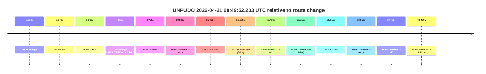
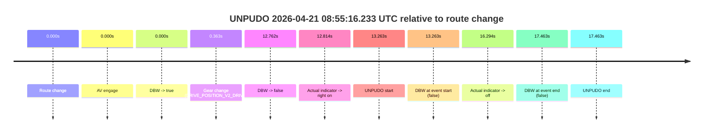
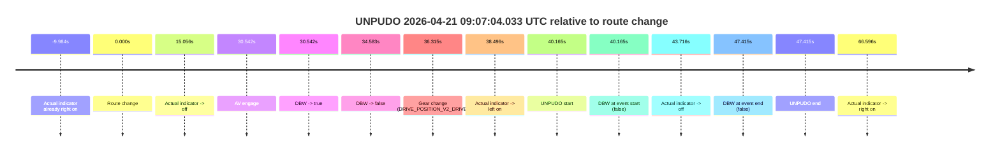
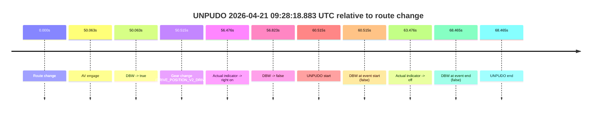
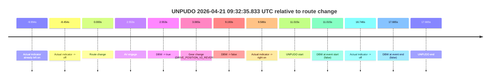
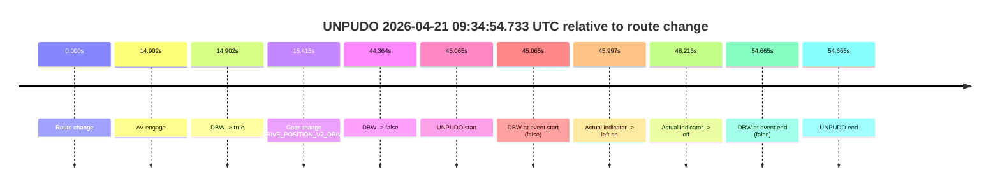
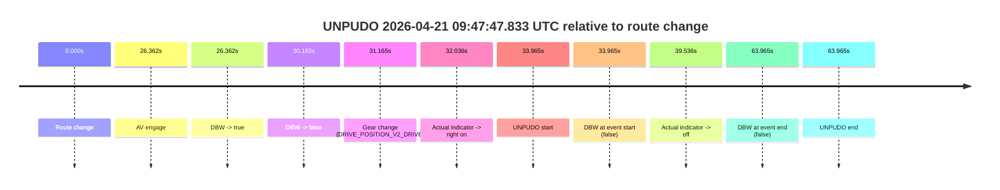

# Run Report: fme20038/2026-04-21--08-28-49--gen2-av-39637566-e5c2-44a6-87cc-8c6b8aafa0bd

| Field | Value |
|---|---|
| Run ID | `fme20038/2026-04-21--08-28-49--gen2-av-39637566-e5c2-44a6-87cc-8c6b8aafa0bd` |
| Date | `2026-04-21` |
| Model(s) | `pink-manta-ray-smooth` |
| Author | `guy.geva` |
| Event count | `10` |

## unpudo 2026-04-21 08:36:07.983 UTC

| Field | Value |
|---|---|
| Model | `pink-manta-ray-smooth` |
| Author | `guy.geva` |
| Run ID | `fme20038/2026-04-21--08-28-49--gen2-av-39637566-e5c2-44a6-87cc-8c6b8aafa0bd` |
| Date | `2026-04-21` |
| Time (UTC) | `08:36:07.983` |
| Event type | `unpudo` |
| Disengagement type | `none observed` |
| Route change | `found` |
| Console | [run](https://console.sso.wayve.ai/run/fme20038/2026-04-21--08-28-49--gen2-av-39637566-e5c2-44a6-87cc-8c6b8aafa0bd?id=&time-unixus=1776760567983311) |
| Foxglove | [segment](https://app.foxglove.dev/wayve-on-prem/p/prj_0dX18KZdVHg1fmmI/view?ds=foxglove-stream&ds.deviceName=fme20038&ds.start=2026-04-21T08%3A35%3A24.468271Z&ds.end=2026-04-21T08%3A36%3A44.333302Z&layoutId=lay_0e7VD4WIKDQGU73Y&time=2026-04-21T08%3A36%3A07.983311Z) |

### Event card: fail

- Fail: the credited unpudo does not stay AV-owned. The event window starts with DBW false, and the maneuver outcome lands outside a clean AV-owned segment.

| Event | Time (UTC) | Delta from route change |
|---|---:|---:|
| Route change | 2026-04-21 08:35:34.468 | `0.000s` |
| AV engage | 2026-04-21 08:35:34.470 | `0.003s` |
| DBW -> true | 2026-04-21 08:35:34.470 | `0.003s` |
| Gear change (DRIVE_POSITION_V2_DRIVE) | 2026-04-21 08:35:34.733 | `0.265s` |
| DBW -> false | 2026-04-21 08:35:55.491 | `21.023s` |
| Actual indicator -> right on | 2026-04-21 08:35:56.804 | `22.336s` |
| UNPUDO start | 2026-04-21 08:36:07.983 | `33.515s` |
| DBW at event start (false) | 2026-04-21 08:36:07.983 | `33.515s` |
| Actual indicator -> off | 2026-04-21 08:36:17.325 | `42.857s` |
| DBW at event end (false) | 2026-04-21 08:36:34.333 | `59.865s` |
| UNPUDO end | 2026-04-21 08:36:34.333 | `59.865s` |

| Metric | Value |
|---|---|
| Outcome | `fail` |
| Effective failure type | `not_av_owned` |
| Route change status | `found` |
| DBW at event start | `false` |
| DBW at event end | `false` |
| Predicted gear at AV start | `DRIVE_POSITION_V2_PARK` |
| Actual gear at AV start | `DRIVE_POSITION_V2_PARK` |
| Predicted gear at event start | `DRIVE_POSITION_V2_DRIVE` |
| Actual gear at event start | `DRIVE_POSITION_V2_DRIVE` |
| Planned indicator direction | `INDICATORS_STATE_V2_RIGHT_ON` |
| Controller indicator direction | `INDICATORS_STATE_V2_RIGHT_ON` |
| Actual indicator direction | `INDICATORS_STATE_V2_RIGHT_ON` |
| Actual indicator at maneuver end | `INDICATORS_STATE_V2_OFF` |
| Driver accel help in AV | `false` |
| Driver accel help timestamp | `n/a` |
| Max accel pedal pct in AV | `0.0%` |
| Max brake pedal pct in AV | `9.7%` |
| Max speed mps in AV | `0.000` |
| Success timing baseline | `route change` |
| Route -> AV | `0.003s` |
| AV -> event start | `33.513s` |
| AV -> first motion | `n/a` |
| Success baseline -> event start | `33.515s` |
| Success baseline -> first motion | `n/a` |
| AV duration before disengagement | `21.020s` |
| Trajectory waypoint count | `37` |
| Driving-plan step count | `11` |

The scored portion starts from the AV-owned window, not from the pre-AV setup. Route-change search in the stopped pre-event segment was `found`, with the baseline therefore set to route change. At the event anchor the model predicts `DRIVE_POSITION_V2_DRIVE` and the actual gear is `DRIVE_POSITION_V2_DRIVE`. The effective model outcome is `fail` because `not_av_owned.`

### Resolution

| Field | Value |
|---|---|
| Final outcome | `fail` |
| Do we agree with this label? | `yes` |
| Source disengagement type | `none observed` |
| Resolved effective failure type | `not_av_owned` |
| Confidence | `high` |

## unpudo 2026-04-21 08:39:57.233 UTC

| Field | Value |
|---|---|
| Model | `pink-manta-ray-smooth` |
| Author | `guy.geva` |
| Run ID | `fme20038/2026-04-21--08-28-49--gen2-av-39637566-e5c2-44a6-87cc-8c6b8aafa0bd` |
| Date | `2026-04-21` |
| Time (UTC) | `08:39:57.233` |
| Event type | `unpudo` |
| Disengagement type | `none observed` |
| Route change | `found` |
| Console | [run](https://console.sso.wayve.ai/run/fme20038/2026-04-21--08-28-49--gen2-av-39637566-e5c2-44a6-87cc-8c6b8aafa0bd?id=&time-unixus=1776760797233312) |
| Foxglove | [segment](https://app.foxglove.dev/wayve-on-prem/p/prj_0dX18KZdVHg1fmmI/view?ds=foxglove-stream&ds.deviceName=fme20038&ds.start=2026-04-21T08%3A39%3A30.918269Z&ds.end=2026-04-21T08%3A40%3A35.233294Z&layoutId=lay_0e7VD4WIKDQGU73Y&time=2026-04-21T08%3A39%3A57.233312Z) |

### Event card: fail

- Fail: the credited unpudo does not stay AV-owned. The event window starts with DBW false, and the maneuver outcome lands outside a clean AV-owned segment.

| Event | Time (UTC) | Delta from route change |
|---|---:|---:|
| Route change | 2026-04-21 08:39:40.918 | `0.000s` |
| AV engage | 2026-04-21 08:39:40.920 | `0.002s` |
| DBW -> true | 2026-04-21 08:39:40.920 | `0.002s` |
| Gear change (DRIVE_POSITION_V2_DRIVE) | 2026-04-21 08:39:41.233 | `0.315s` |
| DBW -> false | 2026-04-21 08:39:56.370 | `15.453s` |
| Actual indicator -> right on | 2026-04-21 08:39:56.385 | `15.467s` |
| UNPUDO start | 2026-04-21 08:39:57.233 | `16.315s` |
| DBW at event start (false) | 2026-04-21 08:39:57.233 | `16.315s` |
| Actual indicator -> off | 2026-04-21 08:39:58.685 | `17.767s` |
| DBW at event end (false) | 2026-04-21 08:40:25.233 | `44.315s` |
| UNPUDO end | 2026-04-21 08:40:25.233 | `44.315s` |

| Metric | Value |
|---|---|
| Outcome | `fail` |
| Effective failure type | `not_av_owned` |
| Route change status | `found` |
| DBW at event start | `false` |
| DBW at event end | `false` |
| Predicted gear at AV start | `DRIVE_POSITION_V2_PARK` |
| Actual gear at AV start | `DRIVE_POSITION_V2_PARK` |
| Predicted gear at event start | `DRIVE_POSITION_V2_DRIVE` |
| Actual gear at event start | `DRIVE_POSITION_V2_DRIVE` |
| Planned indicator direction | `INDICATORS_STATE_V2_RIGHT_ON` |
| Controller indicator direction | `INDICATORS_STATE_V2_RIGHT_ON` |
| Actual indicator direction | `INDICATORS_STATE_V2_RIGHT_ON` |
| Actual indicator at maneuver end | `INDICATORS_STATE_V2_OFF` |
| Driver accel help in AV | `false` |
| Driver accel help timestamp | `n/a` |
| Max accel pedal pct in AV | `0.0%` |
| Max brake pedal pct in AV | `8.8%` |
| Max speed mps in AV | `0.000` |
| Success timing baseline | `route change` |
| Route -> AV | `0.002s` |
| AV -> event start | `16.313s` |
| AV -> first motion | `n/a` |
| Success baseline -> event start | `16.315s` |
| Success baseline -> first motion | `n/a` |
| AV duration before disengagement | `15.450s` |
| Trajectory waypoint count | `38` |
| Driving-plan step count | `11` |

The scored portion starts from the AV-owned window, not from the pre-AV setup. Route-change search in the stopped pre-event segment was `found`, with the baseline therefore set to route change. At the event anchor the model predicts `DRIVE_POSITION_V2_DRIVE` and the actual gear is `DRIVE_POSITION_V2_DRIVE`. The effective model outcome is `fail` because `not_av_owned.`

### Resolution

| Field | Value |
|---|---|
| Final outcome | `fail` |
| Do we agree with this label? | `yes` |
| Source disengagement type | `none observed` |
| Resolved effective failure type | `not_av_owned` |
| Confidence | `high` |

## unpudo 2026-04-21 08:49:52.233 UTC

| Field | Value |
|---|---|
| Model | `pink-manta-ray-smooth` |
| Author | `guy.geva` |
| Run ID | `fme20038/2026-04-21--08-28-49--gen2-av-39637566-e5c2-44a6-87cc-8c6b8aafa0bd` |
| Date | `2026-04-21` |
| Time (UTC) | `08:49:52.233` |
| Event type | `unpudo` |
| Disengagement type | `none observed` |
| Route change | `found` |
| Console | [run](https://console.sso.wayve.ai/run/fme20038/2026-04-21--08-28-49--gen2-av-39637566-e5c2-44a6-87cc-8c6b8aafa0bd?id=&time-unixus=1776761392233306) |
| Foxglove | [segment](https://app.foxglove.dev/wayve-on-prem/p/prj_0dX18KZdVHg1fmmI/view?ds=foxglove-stream&ds.deviceName=fme20038&ds.start=2026-04-21T08%3A49%3A26.868403Z&ds.end=2026-04-21T08%3A50%3A42.083295Z&layoutId=lay_0e7VD4WIKDQGU73Y&time=2026-04-21T08%3A49%3A52.233306Z) |

### Event card: fail

- Fail: the credited unpudo does not stay AV-owned. The event window starts with DBW false, and the maneuver outcome lands outside a clean AV-owned segment.

| Event | Time (UTC) | Delta from route change |
|---|---:|---:|
| Route change | 2026-04-21 08:49:36.868 | `0.000s` |
| AV engage | 2026-04-21 08:49:36.870 | `0.002s` |
| DBW -> true | 2026-04-21 08:49:36.870 | `0.002s` |
| Gear change (DRIVE_POSITION_V2_DRIVE) | 2026-04-21 08:49:37.133 | `0.265s` |
| DBW -> false | 2026-04-21 08:49:45.571 | `8.703s` |
| Actual indicator -> left on | 2026-04-21 08:49:47.264 | `10.396s` |
| UNPUDO start | 2026-04-21 08:49:52.233 | `15.365s` |
| DBW at event start (false) | 2026-04-21 08:49:52.233 | `15.365s` |
| Actual indicator -> off | 2026-04-21 08:50:02.284 | `25.416s` |
| DBW at event end (false) | 2026-04-21 08:50:32.083 | `55.215s` |
| UNPUDO end | 2026-04-21 08:50:32.083 | `55.215s` |
| Actual indicator -> left on | 2026-04-21 08:50:33.484 | `56.616s` |
| Actual indicator -> off | 2026-04-21 08:50:36.924 | `60.056s` |
| Actual indicator -> right on | 2026-04-21 08:50:50.304 | `73.436s` |

| Metric | Value |
|---|---|
| Outcome | `fail` |
| Effective failure type | `not_av_owned` |
| Route change status | `found` |
| DBW at event start | `false` |
| DBW at event end | `false` |
| Predicted gear at AV start | `DRIVE_POSITION_V2_PARK` |
| Actual gear at AV start | `DRIVE_POSITION_V2_PARK` |
| Predicted gear at event start | `DRIVE_POSITION_V2_DRIVE` |
| Actual gear at event start | `DRIVE_POSITION_V2_DRIVE` |
| Planned indicator direction | `INDICATORS_STATE_V2_OFF` |
| Controller indicator direction | `INDICATORS_STATE_V2_OFF` |
| Actual indicator direction | `INDICATORS_STATE_V2_LEFT_ON` |
| Actual indicator at maneuver end | `INDICATORS_STATE_V2_OFF` |
| Driver accel help in AV | `false` |
| Driver accel help timestamp | `n/a` |
| Max accel pedal pct in AV | `0.0%` |
| Max brake pedal pct in AV | `8.0%` |
| Max speed mps in AV | `0.000` |
| Success timing baseline | `route change` |
| Route -> AV | `0.002s` |
| AV -> event start | `15.362s` |
| AV -> first motion | `n/a` |
| Success baseline -> event start | `15.365s` |
| Success baseline -> first motion | `n/a` |
| AV duration before disengagement | `8.701s` |
| Trajectory waypoint count | `36` |
| Driving-plan step count | `11` |

The scored portion starts from the AV-owned window, not from the pre-AV setup. Route-change search in the stopped pre-event segment was `found`, with the baseline therefore set to route change. At the event anchor the model predicts `DRIVE_POSITION_V2_DRIVE` and the actual gear is `DRIVE_POSITION_V2_DRIVE`. The effective model outcome is `fail` because `not_av_owned.`

### Resolution

| Field | Value |
|---|---|
| Final outcome | `fail` |
| Do we agree with this label? | `yes` |
| Source disengagement type | `none observed` |
| Resolved effective failure type | `not_av_owned` |
| Confidence | `high` |

## unpudo 2026-04-21 08:55:16.233 UTC

| Field | Value |
|---|---|
| Model | `pink-manta-ray-smooth` |
| Author | `guy.geva` |
| Run ID | `fme20038/2026-04-21--08-28-49--gen2-av-39637566-e5c2-44a6-87cc-8c6b8aafa0bd` |
| Date | `2026-04-21` |
| Time (UTC) | `08:55:16.233` |
| Event type | `unpudo` |
| Disengagement type | `none observed` |
| Route change | `found` |
| Console | [run](https://console.sso.wayve.ai/run/fme20038/2026-04-21--08-28-49--gen2-av-39637566-e5c2-44a6-87cc-8c6b8aafa0bd?id=&time-unixus=1776761716233301) |
| Foxglove | [segment](https://app.foxglove.dev/wayve-on-prem/p/prj_0dX18KZdVHg1fmmI/view?ds=foxglove-stream&ds.deviceName=fme20038&ds.start=2026-04-21T08%3A54%3A52.970789Z&ds.end=2026-04-21T08%3A55%3A30.433296Z&layoutId=lay_0e7VD4WIKDQGU73Y&time=2026-04-21T08%3A55%3A16.233301Z) |

### Event card: fail

- Fail: the credited unpudo does not stay AV-owned. The event window starts with DBW false, and the maneuver outcome lands outside a clean AV-owned segment.

| Event | Time (UTC) | Delta from route change |
|---|---:|---:|
| Route change | 2026-04-21 08:55:02.970 | `0.000s` |
| AV engage | 2026-04-21 08:55:02.970 | `0.000s` |
| DBW -> true | 2026-04-21 08:55:02.970 | `0.000s` |
| Gear change (DRIVE_POSITION_V2_DRIVE) | 2026-04-21 08:55:03.333 | `0.363s` |
| DBW -> false | 2026-04-21 08:55:15.732 | `12.762s` |
| Actual indicator -> right on | 2026-04-21 08:55:15.784 | `12.814s` |
| UNPUDO start | 2026-04-21 08:55:16.233 | `13.263s` |
| DBW at event start (false) | 2026-04-21 08:55:16.233 | `13.263s` |
| Actual indicator -> off | 2026-04-21 08:55:19.264 | `16.294s` |
| DBW at event end (false) | 2026-04-21 08:55:20.433 | `17.463s` |
| UNPUDO end | 2026-04-21 08:55:20.433 | `17.463s` |

| Metric | Value |
|---|---|
| Outcome | `fail` |
| Effective failure type | `not_av_owned` |
| Route change status | `found` |
| DBW at event start | `false` |
| DBW at event end | `false` |
| Predicted gear at AV start | `DRIVE_POSITION_V2_PARK` |
| Actual gear at AV start | `DRIVE_POSITION_V2_PARK` |
| Predicted gear at event start | `DRIVE_POSITION_V2_DRIVE` |
| Actual gear at event start | `DRIVE_POSITION_V2_DRIVE` |
| Planned indicator direction | `INDICATORS_STATE_V2_OFF` |
| Controller indicator direction | `INDICATORS_STATE_V2_OFF` |
| Actual indicator direction | `INDICATORS_STATE_V2_RIGHT_ON` |
| Actual indicator at maneuver end | `INDICATORS_STATE_V2_OFF` |
| Driver accel help in AV | `false` |
| Driver accel help timestamp | `n/a` |
| Max accel pedal pct in AV | `0.0%` |
| Max brake pedal pct in AV | `8.0%` |
| Max speed mps in AV | `0.000` |
| Success timing baseline | `route change` |
| Route -> AV | `0.000s` |
| AV -> event start | `13.262s` |
| AV -> first motion | `n/a` |
| Success baseline -> event start | `13.263s` |
| Success baseline -> first motion | `n/a` |
| AV duration before disengagement | `12.762s` |
| Trajectory waypoint count | `36` |
| Driving-plan step count | `11` |

The scored portion starts from the AV-owned window, not from the pre-AV setup. Route-change search in the stopped pre-event segment was `found`, with the baseline therefore set to route change. At the event anchor the model predicts `DRIVE_POSITION_V2_DRIVE` and the actual gear is `DRIVE_POSITION_V2_DRIVE`. The effective model outcome is `fail` because `not_av_owned.`

### Resolution

| Field | Value |
|---|---|
| Final outcome | `fail` |
| Do we agree with this label? | `yes` |
| Source disengagement type | `none observed` |
| Resolved effective failure type | `not_av_owned` |
| Confidence | `high` |

## unpudo 2026-04-21 09:07:04.033 UTC

| Field | Value |
|---|---|
| Model | `pink-manta-ray-smooth` |
| Author | `guy.geva` |
| Run ID | `fme20038/2026-04-21--08-28-49--gen2-av-39637566-e5c2-44a6-87cc-8c6b8aafa0bd` |
| Date | `2026-04-21` |
| Time (UTC) | `09:07:04.033` |
| Event type | `unpudo` |
| Disengagement type | `none observed` |
| Route change | `found` |
| Console | [run](https://console.sso.wayve.ai/run/fme20038/2026-04-21--08-28-49--gen2-av-39637566-e5c2-44a6-87cc-8c6b8aafa0bd?id=&time-unixus=1776762424033320) |
| Foxglove | [segment](https://app.foxglove.dev/wayve-on-prem/p/prj_0dX18KZdVHg1fmmI/view?ds=foxglove-stream&ds.deviceName=fme20038&ds.start=2026-04-21T09%3A06%3A13.868319Z&ds.end=2026-04-21T09%3A07%3A21.283307Z&layoutId=lay_0e7VD4WIKDQGU73Y&time=2026-04-21T09%3A07%3A04.033320Z) |

### Event card: fail

- Fail: the credited unpudo does not stay AV-owned. The event window starts with DBW false, and the maneuver outcome lands outside a clean AV-owned segment.

| Event | Time (UTC) | Delta from route change |
|---|---:|---:|
| Actual indicator already right on | 2026-04-21 09:06:13.884 | `-9.984s` |
| Route change | 2026-04-21 09:06:23.868 | `0.000s` |
| Actual indicator -> off | 2026-04-21 09:06:38.924 | `15.056s` |
| AV engage | 2026-04-21 09:06:54.410 | `30.542s` |
| DBW -> true | 2026-04-21 09:06:54.410 | `30.542s` |
| DBW -> false | 2026-04-21 09:06:58.451 | `34.583s` |
| Gear change (DRIVE_POSITION_V2_DRIVE) | 2026-04-21 09:07:00.183 | `36.315s` |
| Actual indicator -> left on | 2026-04-21 09:07:02.364 | `38.496s` |
| UNPUDO start | 2026-04-21 09:07:04.033 | `40.165s` |
| DBW at event start (false) | 2026-04-21 09:07:04.033 | `40.165s` |
| Actual indicator -> off | 2026-04-21 09:07:07.584 | `43.716s` |
| DBW at event end (false) | 2026-04-21 09:07:11.283 | `47.415s` |
| UNPUDO end | 2026-04-21 09:07:11.283 | `47.415s` |
| Actual indicator -> right on | 2026-04-21 09:07:30.464 | `66.596s` |

| Metric | Value |
|---|---|
| Outcome | `fail` |
| Effective failure type | `not_av_owned` |
| Route change status | `found` |
| DBW at event start | `false` |
| DBW at event end | `false` |
| Predicted gear at AV start | `DRIVE_POSITION_V2_DRIVE` |
| Actual gear at AV start | `DRIVE_POSITION_V2_PARK` |
| Predicted gear at event start | `DRIVE_POSITION_V2_DRIVE` |
| Actual gear at event start | `DRIVE_POSITION_V2_DRIVE` |
| Planned indicator direction | `INDICATORS_STATE_V2_LEFT_ON` |
| Controller indicator direction | `INDICATORS_STATE_V2_LEFT_ON` |
| Actual indicator direction | `INDICATORS_STATE_V2_LEFT_ON` |
| Actual indicator at maneuver end | `INDICATORS_STATE_V2_OFF` |
| Driver accel help in AV | `false` |
| Driver accel help timestamp | `n/a` |
| Max accel pedal pct in AV | `0.0%` |
| Max brake pedal pct in AV | `8.0%` |
| Max speed mps in AV | `0.000` |
| Success timing baseline | `route change` |
| Route -> AV | `30.542s` |
| AV -> event start | `9.623s` |
| AV -> first motion | `n/a` |
| Success baseline -> event start | `40.165s` |
| Success baseline -> first motion | `n/a` |
| AV duration before disengagement | `4.041s` |
| Trajectory waypoint count | `38` |
| Driving-plan step count | `11` |

The scored portion starts from the AV-owned window, not from the pre-AV setup. Route-change search in the stopped pre-event segment was `found`, with the baseline therefore set to route change. At the event anchor the model predicts `DRIVE_POSITION_V2_DRIVE` and the actual gear is `DRIVE_POSITION_V2_DRIVE`. The effective model outcome is `fail` because `not_av_owned.`

### Resolution

| Field | Value |
|---|---|
| Final outcome | `fail` |
| Do we agree with this label? | `yes` |
| Source disengagement type | `none observed` |
| Resolved effective failure type | `not_av_owned` |
| Confidence | `high` |

## unpudo 2026-04-21 09:28:18.883 UTC

| Field | Value |
|---|---|
| Model | `pink-manta-ray-smooth` |
| Author | `guy.geva` |
| Run ID | `fme20038/2026-04-21--08-28-49--gen2-av-39637566-e5c2-44a6-87cc-8c6b8aafa0bd` |
| Date | `2026-04-21` |
| Time (UTC) | `09:28:18.883` |
| Event type | `unpudo` |
| Disengagement type | `none observed` |
| Route change | `found` |
| Console | [run](https://console.sso.wayve.ai/run/fme20038/2026-04-21--08-28-49--gen2-av-39637566-e5c2-44a6-87cc-8c6b8aafa0bd?id=&time-unixus=1776763698883308) |
| Foxglove | [segment](https://app.foxglove.dev/wayve-on-prem/p/prj_0dX18KZdVHg1fmmI/view?ds=foxglove-stream&ds.deviceName=fme20038&ds.start=2026-04-21T09%3A27%3A08.368252Z&ds.end=2026-04-21T09%3A28%3A36.833300Z&layoutId=lay_0e7VD4WIKDQGU73Y&time=2026-04-21T09%3A28%3A18.883308Z) |

### Event card: fail

- Fail: the credited unpudo does not stay AV-owned. The event window starts with DBW false, and the maneuver outcome lands outside a clean AV-owned segment.

| Event | Time (UTC) | Delta from route change |
|---|---:|---:|
| Route change | 2026-04-21 09:27:18.368 | `0.000s` |
| AV engage | 2026-04-21 09:28:08.430 | `50.063s` |
| DBW -> true | 2026-04-21 09:28:08.430 | `50.063s` |
| Gear change (DRIVE_POSITION_V2_DRIVE) | 2026-04-21 09:28:08.883 | `50.515s` |
| Actual indicator -> right on | 2026-04-21 09:28:14.844 | `56.476s` |
| DBW -> false | 2026-04-21 09:28:15.191 | `56.823s` |
| UNPUDO start | 2026-04-21 09:28:18.883 | `60.515s` |
| DBW at event start (false) | 2026-04-21 09:28:18.883 | `60.515s` |
| Actual indicator -> off | 2026-04-21 09:28:21.844 | `63.476s` |
| DBW at event end (false) | 2026-04-21 09:28:26.833 | `68.465s` |
| UNPUDO end | 2026-04-21 09:28:26.833 | `68.465s` |

| Metric | Value |
|---|---|
| Outcome | `fail` |
| Effective failure type | `not_av_owned` |
| Route change status | `found` |
| DBW at event start | `false` |
| DBW at event end | `false` |
| Predicted gear at AV start | `DRIVE_POSITION_V2_DRIVE` |
| Actual gear at AV start | `DRIVE_POSITION_V2_PARK` |
| Predicted gear at event start | `DRIVE_POSITION_V2_DRIVE` |
| Actual gear at event start | `DRIVE_POSITION_V2_DRIVE` |
| Planned indicator direction | `INDICATORS_STATE_V2_RIGHT_ON` |
| Controller indicator direction | `INDICATORS_STATE_V2_RIGHT_ON` |
| Actual indicator direction | `INDICATORS_STATE_V2_RIGHT_ON` |
| Actual indicator at maneuver end | `INDICATORS_STATE_V2_OFF` |
| Driver accel help in AV | `false` |
| Driver accel help timestamp | `n/a` |
| Max accel pedal pct in AV | `0.0%` |
| Max brake pedal pct in AV | `15.4%` |
| Max speed mps in AV | `0.000` |
| Success timing baseline | `route change` |
| Route -> AV | `50.063s` |
| AV -> event start | `10.453s` |
| AV -> first motion | `n/a` |
| Success baseline -> event start | `60.515s` |
| Success baseline -> first motion | `n/a` |
| AV duration before disengagement | `6.761s` |
| Trajectory waypoint count | `37` |
| Driving-plan step count | `11` |

The scored portion starts from the AV-owned window, not from the pre-AV setup. Route-change search in the stopped pre-event segment was `found`, with the baseline therefore set to route change. At the event anchor the model predicts `DRIVE_POSITION_V2_DRIVE` and the actual gear is `DRIVE_POSITION_V2_DRIVE`. The effective model outcome is `fail` because `not_av_owned.`

### Resolution

| Field | Value |
|---|---|
| Final outcome | `fail` |
| Do we agree with this label? | `yes` |
| Source disengagement type | `none observed` |
| Resolved effective failure type | `not_av_owned` |
| Confidence | `high` |

## unpudo 2026-04-21 09:32:35.833 UTC

| Field | Value |
|---|---|
| Model | `pink-manta-ray-smooth` |
| Author | `guy.geva` |
| Run ID | `fme20038/2026-04-21--08-28-49--gen2-av-39637566-e5c2-44a6-87cc-8c6b8aafa0bd` |
| Date | `2026-04-21` |
| Time (UTC) | `09:32:35.833` |
| Event type | `unpudo` |
| Disengagement type | `none observed` |
| Route change | `found` |
| Console | [run](https://console.sso.wayve.ai/run/fme20038/2026-04-21--08-28-49--gen2-av-39637566-e5c2-44a6-87cc-8c6b8aafa0bd?id=&time-unixus=1776763955833305) |
| Foxglove | [segment](https://app.foxglove.dev/wayve-on-prem/p/prj_0dX18KZdVHg1fmmI/view?ds=foxglove-stream&ds.deviceName=fme20038&ds.start=2026-04-21T09%3A32%3A14.818243Z&ds.end=2026-04-21T09%3A32%3A52.483309Z&layoutId=lay_0e7VD4WIKDQGU73Y&time=2026-04-21T09%3A32%3A35.833305Z) |

### Event card: fail

- Fail: the credited unpudo does not stay AV-owned. The event window starts with DBW false, and the maneuver outcome lands outside a clean AV-owned segment.

| Event | Time (UTC) | Delta from route change |
|---|---:|---:|
| Actual indicator already left on | 2026-04-21 09:32:14.824 | `-9.994s` |
| Actual indicator -> off | 2026-04-21 09:32:16.364 | `-8.454s` |
| Route change | 2026-04-21 09:32:24.818 | `0.000s` |
| AV engage | 2026-04-21 09:32:27.370 | `2.553s` |
| DBW -> true | 2026-04-21 09:32:27.370 | `2.553s` |
| Gear change (DRIVE_POSITION_V2_REVERSE) | 2026-04-21 09:32:27.883 | `3.065s` |
| DBW -> false | 2026-04-21 09:32:34.010 | `9.193s` |
| Actual indicator -> right on | 2026-04-21 09:32:34.404 | `9.586s` |
| UNPUDO start | 2026-04-21 09:32:35.833 | `11.015s` |
| DBW at event start (false) | 2026-04-21 09:32:35.833 | `11.015s` |
| Actual indicator -> off | 2026-04-21 09:32:41.564 | `16.746s` |
| DBW at event end (false) | 2026-04-21 09:32:42.483 | `17.665s` |
| UNPUDO end | 2026-04-21 09:32:42.483 | `17.665s` |

| Metric | Value |
|---|---|
| Outcome | `fail` |
| Effective failure type | `not_av_owned` |
| Route change status | `found` |
| DBW at event start | `false` |
| DBW at event end | `false` |
| Predicted gear at AV start | `DRIVE_POSITION_V2_DRIVE` |
| Actual gear at AV start | `DRIVE_POSITION_V2_PARK` |
| Predicted gear at event start | `DRIVE_POSITION_V2_REVERSE` |
| Actual gear at event start | `DRIVE_POSITION_V2_REVERSE` |
| Planned indicator direction | `INDICATORS_STATE_V2_LEFT_ON` |
| Controller indicator direction | `INDICATORS_STATE_V2_LEFT_ON` |
| Actual indicator direction | `INDICATORS_STATE_V2_RIGHT_ON` |
| Actual indicator at maneuver end | `INDICATORS_STATE_V2_OFF` |
| Driver accel help in AV | `false` |
| Driver accel help timestamp | `n/a` |
| Max accel pedal pct in AV | `0.0%` |
| Max brake pedal pct in AV | `8.0%` |
| Max speed mps in AV | `0.000` |
| Success timing baseline | `route change` |
| Route -> AV | `2.553s` |
| AV -> event start | `8.462s` |
| AV -> first motion | `n/a` |
| Success baseline -> event start | `11.015s` |
| Success baseline -> first motion | `n/a` |
| AV duration before disengagement | `6.640s` |
| Trajectory waypoint count | `36` |
| Driving-plan step count | `11` |

The scored portion starts from the AV-owned window, not from the pre-AV setup. Route-change search in the stopped pre-event segment was `found`, with the baseline therefore set to route change. At the event anchor the model predicts `DRIVE_POSITION_V2_REVERSE` and the actual gear is `DRIVE_POSITION_V2_REVERSE`. The effective model outcome is `fail` because `not_av_owned.`

### Resolution

| Field | Value |
|---|---|
| Final outcome | `fail` |
| Do we agree with this label? | `yes` |
| Source disengagement type | `none observed` |
| Resolved effective failure type | `not_av_owned` |
| Confidence | `high` |

## unpudo 2026-04-21 09:34:54.733 UTC

| Field | Value |
|---|---|
| Model | `pink-manta-ray-smooth` |
| Author | `guy.geva` |
| Run ID | `fme20038/2026-04-21--08-28-49--gen2-av-39637566-e5c2-44a6-87cc-8c6b8aafa0bd` |
| Date | `2026-04-21` |
| Time (UTC) | `09:34:54.733` |
| Event type | `unpudo` |
| Disengagement type | `none observed` |
| Route change | `found` |
| Console | [run](https://console.sso.wayve.ai/run/fme20038/2026-04-21--08-28-49--gen2-av-39637566-e5c2-44a6-87cc-8c6b8aafa0bd?id=&time-unixus=1776764094733319) |
| Foxglove | [segment](https://app.foxglove.dev/wayve-on-prem/p/prj_0dX18KZdVHg1fmmI/view?ds=foxglove-stream&ds.deviceName=fme20038&ds.start=2026-04-21T09%3A33%3A59.668268Z&ds.end=2026-04-21T09%3A35%3A14.333303Z&layoutId=lay_0e7VD4WIKDQGU73Y&time=2026-04-21T09%3A34%3A54.733319Z) |

### Event card: fail

- Fail: the credited unpudo does not stay AV-owned. The event window starts with DBW false, and the maneuver outcome lands outside a clean AV-owned segment.

| Event | Time (UTC) | Delta from route change |
|---|---:|---:|
| Route change | 2026-04-21 09:34:09.668 | `0.000s` |
| AV engage | 2026-04-21 09:34:24.570 | `14.902s` |
| DBW -> true | 2026-04-21 09:34:24.570 | `14.902s` |
| Gear change (DRIVE_POSITION_V2_DRIVE) | 2026-04-21 09:34:25.083 | `15.415s` |
| DBW -> false | 2026-04-21 09:34:54.032 | `44.364s` |
| UNPUDO start | 2026-04-21 09:34:54.733 | `45.065s` |
| DBW at event start (false) | 2026-04-21 09:34:54.733 | `45.065s` |
| Actual indicator -> left on | 2026-04-21 09:34:55.665 | `45.997s` |
| Actual indicator -> off | 2026-04-21 09:34:57.884 | `48.216s` |
| DBW at event end (false) | 2026-04-21 09:35:04.333 | `54.665s` |
| UNPUDO end | 2026-04-21 09:35:04.333 | `54.665s` |

| Metric | Value |
|---|---|
| Outcome | `fail` |
| Effective failure type | `not_av_owned` |
| Route change status | `found` |
| DBW at event start | `false` |
| DBW at event end | `false` |
| Predicted gear at AV start | `DRIVE_POSITION_V2_DRIVE` |
| Actual gear at AV start | `DRIVE_POSITION_V2_PARK` |
| Predicted gear at event start | `DRIVE_POSITION_V2_DRIVE` |
| Actual gear at event start | `DRIVE_POSITION_V2_DRIVE` |
| Planned indicator direction | `INDICATORS_STATE_V2_LEFT_ON` |
| Controller indicator direction | `INDICATORS_STATE_V2_LEFT_ON` |
| Actual indicator direction | `INDICATORS_STATE_V2_OFF` |
| Actual indicator at maneuver end | `INDICATORS_STATE_V2_OFF` |
| Driver accel help in AV | `false` |
| Driver accel help timestamp | `n/a` |
| Max accel pedal pct in AV | `0.0%` |
| Max brake pedal pct in AV | `8.0%` |
| Max speed mps in AV | `0.000` |
| Success timing baseline | `route change` |
| Route -> AV | `14.902s` |
| AV -> event start | `30.163s` |
| AV -> first motion | `n/a` |
| Success baseline -> event start | `45.065s` |
| Success baseline -> first motion | `n/a` |
| AV duration before disengagement | `29.462s` |
| Trajectory waypoint count | `36` |
| Driving-plan step count | `11` |

The scored portion starts from the AV-owned window, not from the pre-AV setup. Route-change search in the stopped pre-event segment was `found`, with the baseline therefore set to route change. At the event anchor the model predicts `DRIVE_POSITION_V2_DRIVE` and the actual gear is `DRIVE_POSITION_V2_DRIVE`. The effective model outcome is `fail` because `not_av_owned.`

### Resolution

| Field | Value |
|---|---|
| Final outcome | `fail` |
| Do we agree with this label? | `yes` |
| Source disengagement type | `none observed` |
| Resolved effective failure type | `not_av_owned` |
| Confidence | `high` |

## unpudo 2026-04-21 09:42:35.233 UTC

| Field | Value |
|---|---|
| Model | `pink-manta-ray-smooth` |
| Author | `guy.geva` |
| Run ID | `fme20038/2026-04-21--08-28-49--gen2-av-39637566-e5c2-44a6-87cc-8c6b8aafa0bd` |
| Date | `2026-04-21` |
| Time (UTC) | `09:42:35.233` |
| Event type | `unpudo` |
| Disengagement type | `none observed` |
| Route change | `found` |
| Console | [run](https://console.sso.wayve.ai/run/fme20038/2026-04-21--08-28-49--gen2-av-39637566-e5c2-44a6-87cc-8c6b8aafa0bd?id=&time-unixus=1776764555233314) |
| Foxglove | [segment](https://app.foxglove.dev/wayve-on-prem/p/prj_0dX18KZdVHg1fmmI/view?ds=foxglove-stream&ds.deviceName=fme20038&ds.start=2026-04-21T09%3A42%3A13.168278Z&ds.end=2026-04-21T09%3A42%3A51.683317Z&layoutId=lay_0e7VD4WIKDQGU73Y&time=2026-04-21T09%3A42%3A35.233314Z) |

### Event card: fail

- Fail: the credited unpudo does not stay AV-owned. The event window starts with DBW false, and the maneuver outcome lands outside a clean AV-owned segment.

| Event | Time (UTC) | Delta from route change |
|---|---:|---:|
| Route change | 2026-04-21 09:42:23.168 | `0.000s` |
| AV engage | 2026-04-21 09:42:23.170 | `0.003s` |
| DBW -> true | 2026-04-21 09:42:23.170 | `0.003s` |
| Gear change (DRIVE_POSITION_V2_DRIVE) | 2026-04-21 09:42:23.483 | `0.315s` |
| DBW -> false | 2026-04-21 09:42:34.510 | `11.343s` |
| Actual indicator -> left on | 2026-04-21 09:42:34.844 | `11.676s` |
| UNPUDO start | 2026-04-21 09:42:35.233 | `12.065s` |
| DBW at event start (false) | 2026-04-21 09:42:35.233 | `12.065s` |
| Actual indicator -> off | 2026-04-21 09:42:38.504 | `15.336s` |
| DBW at event end (false) | 2026-04-21 09:42:41.683 | `18.515s` |
| UNPUDO end | 2026-04-21 09:42:41.683 | `18.515s` |

| Metric | Value |
|---|---|
| Outcome | `fail` |
| Effective failure type | `not_av_owned` |
| Route change status | `found` |
| DBW at event start | `false` |
| DBW at event end | `false` |
| Predicted gear at AV start | `DRIVE_POSITION_V2_PARK` |
| Actual gear at AV start | `DRIVE_POSITION_V2_PARK` |
| Predicted gear at event start | `DRIVE_POSITION_V2_DRIVE` |
| Actual gear at event start | `DRIVE_POSITION_V2_DRIVE` |
| Planned indicator direction | `INDICATORS_STATE_V2_LEFT_ON` |
| Controller indicator direction | `INDICATORS_STATE_V2_LEFT_ON` |
| Actual indicator direction | `INDICATORS_STATE_V2_LEFT_ON` |
| Actual indicator at maneuver end | `INDICATORS_STATE_V2_OFF` |
| Driver accel help in AV | `false` |
| Driver accel help timestamp | `n/a` |
| Max accel pedal pct in AV | `0.0%` |
| Max brake pedal pct in AV | `8.0%` |
| Max speed mps in AV | `0.000` |
| Success timing baseline | `route change` |
| Route -> AV | `0.003s` |
| AV -> event start | `12.062s` |
| AV -> first motion | `n/a` |
| Success baseline -> event start | `12.065s` |
| Success baseline -> first motion | `n/a` |
| AV duration before disengagement | `11.340s` |
| Trajectory waypoint count | `36` |
| Driving-plan step count | `11` |

The scored portion starts from the AV-owned window, not from the pre-AV setup. Route-change search in the stopped pre-event segment was `found`, with the baseline therefore set to route change. At the event anchor the model predicts `DRIVE_POSITION_V2_DRIVE` and the actual gear is `DRIVE_POSITION_V2_DRIVE`. The effective model outcome is `fail` because `not_av_owned.`

### Resolution

| Field | Value |
|---|---|
| Final outcome | `fail` |
| Do we agree with this label? | `yes` |
| Source disengagement type | `none observed` |
| Resolved effective failure type | `not_av_owned` |
| Confidence | `high` |

## unpudo 2026-04-21 09:47:47.833 UTC

| Field | Value |
|---|---|
| Model | `pink-manta-ray-smooth` |
| Author | `guy.geva` |
| Run ID | `fme20038/2026-04-21--08-28-49--gen2-av-39637566-e5c2-44a6-87cc-8c6b8aafa0bd` |
| Date | `2026-04-21` |
| Time (UTC) | `09:47:47.833` |
| Event type | `unpudo` |
| Disengagement type | `none observed` |
| Route change | `found` |
| Console | [run](https://console.sso.wayve.ai/run/fme20038/2026-04-21--08-28-49--gen2-av-39637566-e5c2-44a6-87cc-8c6b8aafa0bd?id=&time-unixus=1776764867833315) |
| Foxglove | [segment](https://app.foxglove.dev/wayve-on-prem/p/prj_0dX18KZdVHg1fmmI/view?ds=foxglove-stream&ds.deviceName=fme20038&ds.start=2026-04-21T09%3A47%3A03.868324Z&ds.end=2026-04-21T09%3A48%3A27.833307Z&layoutId=lay_0e7VD4WIKDQGU73Y&time=2026-04-21T09%3A47%3A47.833315Z) |

### Event card: fail

- Fail: the credited unpudo does not stay AV-owned. The event window starts with DBW false, and the maneuver outcome lands outside a clean AV-owned segment.

| Event | Time (UTC) | Delta from route change |
|---|---:|---:|
| Route change | 2026-04-21 09:47:13.868 | `0.000s` |
| AV engage | 2026-04-21 09:47:40.230 | `26.362s` |
| DBW -> true | 2026-04-21 09:47:40.230 | `26.362s` |
| DBW -> false | 2026-04-21 09:47:44.050 | `30.183s` |
| Gear change (DRIVE_POSITION_V2_DRIVE) | 2026-04-21 09:47:45.033 | `31.165s` |
| Actual indicator -> right on | 2026-04-21 09:47:45.904 | `32.036s` |
| UNPUDO start | 2026-04-21 09:47:47.833 | `33.965s` |
| DBW at event start (false) | 2026-04-21 09:47:47.833 | `33.965s` |
| Actual indicator -> off | 2026-04-21 09:47:53.404 | `39.536s` |
| DBW at event end (false) | 2026-04-21 09:48:17.833 | `63.965s` |
| UNPUDO end | 2026-04-21 09:48:17.833 | `63.965s` |

| Metric | Value |
|---|---|
| Outcome | `fail` |
| Effective failure type | `not_av_owned` |
| Route change status | `found` |
| DBW at event start | `false` |
| DBW at event end | `false` |
| Predicted gear at AV start | `DRIVE_POSITION_V2_REVERSE` |
| Actual gear at AV start | `DRIVE_POSITION_V2_PARK` |
| Predicted gear at event start | `DRIVE_POSITION_V2_DRIVE` |
| Actual gear at event start | `DRIVE_POSITION_V2_DRIVE` |
| Planned indicator direction | `INDICATORS_STATE_V2_OFF` |
| Controller indicator direction | `INDICATORS_STATE_V2_OFF` |
| Actual indicator direction | `INDICATORS_STATE_V2_RIGHT_ON` |
| Actual indicator at maneuver end | `INDICATORS_STATE_V2_OFF` |
| Driver accel help in AV | `false` |
| Driver accel help timestamp | `n/a` |
| Max accel pedal pct in AV | `0.0%` |
| Max brake pedal pct in AV | `8.0%` |
| Max speed mps in AV | `0.000` |
| Success timing baseline | `route change` |
| Route -> AV | `26.362s` |
| AV -> event start | `7.603s` |
| AV -> first motion | `n/a` |
| Success baseline -> event start | `33.965s` |
| Success baseline -> first motion | `n/a` |
| AV duration before disengagement | `3.820s` |
| Trajectory waypoint count | `36` |
| Driving-plan step count | `11` |

The scored portion starts from the AV-owned window, not from the pre-AV setup. Route-change search in the stopped pre-event segment was `found`, with the baseline therefore set to route change. At the event anchor the model predicts `DRIVE_POSITION_V2_DRIVE` and the actual gear is `DRIVE_POSITION_V2_DRIVE`. The effective model outcome is `fail` because `not_av_owned.`

### Resolution

| Field | Value |
|---|---|
| Final outcome | `fail` |
| Do we agree with this label? | `yes` |
| Source disengagement type | `none observed` |
| Resolved effective failure type | `not_av_owned` |
| Confidence | `high` |
