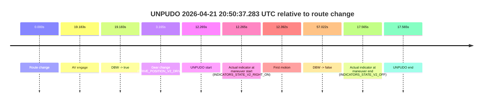
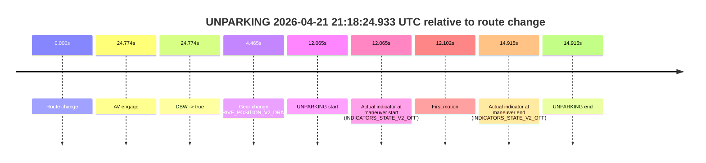

# Run Report: fme20038/2026-04-21--20-19-17--gen2-av-88adeb84-7a68-4715-8787-659129aef260

| Field | Value |
|---|---|
| Run ID | `fme20038/2026-04-21--20-19-17--gen2-av-88adeb84-7a68-4715-8787-659129aef260` |
| Date | `2026-04-21` |
| Model(s) | `blue-panther-solid` |
| Author | `guy.geva` |
| Event count | `6` |

## unpudo 2026-04-21 20:40:20.583 UTC

| Field | Value |
|---|---|
| Model | `blue-panther-solid` |
| Author | `guy.geva` |
| Run ID | `fme20038/2026-04-21--20-19-17--gen2-av-88adeb84-7a68-4715-8787-659129aef260` |
| Date | `2026-04-21` |
| Time (UTC) | `20:40:20.583` |
| Event type | `unpudo` |
| Disengagement type | `none observed` |
| Route change | `found` |
| Console | [run](https://console.sso.wayve.ai/run/fme20038/2026-04-21--20-19-17--gen2-av-88adeb84-7a68-4715-8787-659129aef260?id=&time-unixus=1776804020583313) |
| Foxglove | [segment](https://app.foxglove.dev/wayve-on-prem/p/prj_0dX18KZdVHg1fmmI/view?ds=foxglove-stream&ds.deviceName=fme20038&ds.start=2026-04-21T20%3A39%3A25.842378Z&ds.end=2026-04-21T20%3A44%3A57.762392Z&layoutId=lay_0e7VD4WIKDQGU73Y&time=2026-04-21T20%3A40%3A20.583313Z) |

### Event card: pass

- Pass: AV owns the credited unpudo through the official event window, the gear state is aligned at the anchor, and the vehicle moves without driver accelerator help in AV.

| Event | Time (UTC) | Delta from route change |
|---|---:|---:|
| Route change | 2026-04-21 20:40:13.068 | `0.000s` |
| AV engage | 2026-04-21 20:39:35.842 | `-37.226s` |
| DBW -> true | 2026-04-21 20:39:35.842 | `-37.226s` |
| Gear change (DRIVE_POSITION_V2_DRIVE) | 2026-04-21 20:40:11.983 | `-1.085s` |
| UNPUDO start | 2026-04-21 20:40:20.583 | `7.515s` |
| Actual indicator at maneuver start (INDICATORS_STATE_V2_RIGHT_ON) | 2026-04-21 20:40:20.583 | `7.515s` |
| First motion | 2026-04-21 20:40:20.630 | `7.563s` |
| DBW -> false | 2026-04-21 20:44:47.762 | `274.694s` |
| Actual indicator at maneuver end (INDICATORS_STATE_V2_OFF) | 2026-04-21 20:40:23.933 | `10.865s` |
| UNPUDO end | 2026-04-21 20:40:23.933 | `10.865s` |

| Metric | Value |
|---|---|
| Outcome | `pass` |
| Effective failure type | `none` |
| Route change status | `found` |
| DBW at event start | `true` |
| DBW at event end | `true` |
| Predicted gear at AV start | `DRIVE_POSITION_V2_DRIVE` |
| Actual gear at AV start | `DRIVE_POSITION_V2_DRIVE` |
| Predicted gear at event start | `DRIVE_POSITION_V2_DRIVE` |
| Actual gear at event start | `DRIVE_POSITION_V2_DRIVE` |
| Planned indicator direction | `INDICATORS_STATE_V2_RIGHT_ON` |
| Controller indicator direction | `INDICATORS_STATE_V2_RIGHT_ON` |
| Actual indicator direction | `INDICATORS_STATE_V2_RIGHT_ON` |
| Actual indicator at maneuver end | `INDICATORS_STATE_V2_OFF` |
| Driver accel help in AV | `false` |
| Driver accel help timestamp | `n/a` |
| Max accel pedal pct in AV | `0.0%` |
| Max brake pedal pct in AV | `26.3%` |
| Max speed mps in AV | `5.650` |
| Route -> AV | `-37.226s` |
| AV -> event start | `44.741s` |
| AV -> first motion | `44.788s` |
| AV duration before disengagement | `311.920s` |
| Trajectory waypoint count | `37` |
| Driving-plan step count | `11` |

The scored portion starts from the AV-owned window, not from the pre-AV setup. Route-change search in the stopped pre-event segment was `found`, with the baseline therefore set to route change. At the event anchor the model predicts `DRIVE_POSITION_V2_DRIVE` and the actual gear is `DRIVE_POSITION_V2_DRIVE`. The effective model outcome is `pass` because `the credited maneuver stays AV-owned through the official event end`.

### Resolution

| Field | Value |
|---|---|
| Final outcome | `pass` |
| Do we agree with this label? | `yes` |
| Source disengagement type | `none observed` |
| Resolved effective failure type | `none` |
| Confidence | `high` |

## unpudo 2026-04-21 20:50:37.283 UTC

| Field | Value |
|---|---|
| Model | `blue-panther-solid` |
| Author | `guy.geva` |
| Run ID | `fme20038/2026-04-21--20-19-17--gen2-av-88adeb84-7a68-4715-8787-659129aef260` |
| Date | `2026-04-21` |
| Time (UTC) | `20:50:37.283` |
| Event type | `unpudo` |
| Disengagement type | `none observed` |
| Route change | `found` |
| Console | [run](https://console.sso.wayve.ai/run/fme20038/2026-04-21--20-19-17--gen2-av-88adeb84-7a68-4715-8787-659129aef260?id=&time-unixus=1776804637283311) |
| Foxglove | [segment](https://app.foxglove.dev/wayve-on-prem/p/prj_0dX18KZdVHg1fmmI/view?ds=foxglove-stream&ds.deviceName=fme20038&ds.start=2026-04-21T20%3A50%3A15.018327Z&ds.end=2026-04-21T20%3A51%3A32.040553Z&layoutId=lay_0e7VD4WIKDQGU73Y&time=2026-04-21T20%3A50%3A37.283311Z) |

### Event card: accidental

- Accidental: AV ownership is present for less than `2s`, so this is treated as an accidental brush with the maneuver rather than a meaningful model attempt.

| Event | Time (UTC) | Delta from route change |
|---|---:|---:|
| Route change | 2026-04-21 20:50:25.018 | `0.000s` |
| AV engage | 2026-04-21 20:50:44.201 | `19.183s` |
| DBW -> true | 2026-04-21 20:50:44.201 | `19.183s` |
| Gear change (DRIVE_POSITION_V2_DRIVE) | 2026-04-21 20:50:28.183 | `3.165s` |
| UNPUDO start | 2026-04-21 20:50:37.283 | `12.265s` |
| Actual indicator at maneuver start (INDICATORS_STATE_V2_RIGHT_ON) | 2026-04-21 20:50:37.283 | `12.265s` |
| First motion | 2026-04-21 20:50:37.410 | `12.392s` |
| DBW -> false | 2026-04-21 20:51:22.040 | `57.022s` |
| Actual indicator at maneuver end (INDICATORS_STATE_V2_OFF) | 2026-04-21 20:50:42.583 | `17.565s` |
| UNPUDO end | 2026-04-21 20:50:42.583 | `17.565s` |

| Metric | Value |
|---|---|
| Outcome | `accidental` |
| Effective failure type | `none` |
| Route change status | `found` |
| DBW at event start | `false` |
| DBW at event end | `false` |
| Predicted gear at AV start | `DRIVE_POSITION_V2_DRIVE` |
| Actual gear at AV start | `DRIVE_POSITION_V2_DRIVE` |
| Predicted gear at event start | `DRIVE_POSITION_V2_DRIVE` |
| Actual gear at event start | `DRIVE_POSITION_V2_DRIVE` |
| Planned indicator direction | `INDICATORS_STATE_V2_RIGHT_ON` |
| Controller indicator direction | `INDICATORS_STATE_V2_RIGHT_ON` |
| Actual indicator direction | `INDICATORS_STATE_V2_RIGHT_ON` |
| Actual indicator at maneuver end | `INDICATORS_STATE_V2_OFF` |
| Driver accel help in AV | `false` |
| Driver accel help timestamp | `n/a` |
| Max accel pedal pct in AV | `0.0%` |
| Max brake pedal pct in AV | `0.0%` |
| Max speed mps in AV | `0.000` |
| Route -> AV | `19.183s` |
| AV -> event start | `-6.918s` |
| AV -> first motion | `-6.791s` |
| AV duration before disengagement | `37.839s` |
| Trajectory waypoint count | `37` |
| Driving-plan step count | `11` |

The scored portion starts from the AV-owned window, not from the pre-AV setup. Route-change search in the stopped pre-event segment was `found`, with the baseline therefore set to route change. At the event anchor the model predicts `DRIVE_POSITION_V2_DRIVE` and the actual gear is `DRIVE_POSITION_V2_DRIVE`. The effective model outcome is `accidental` because `the AV-owned portion is shorter than 2s`.

### Resolution

| Field | Value |
|---|---|
| Final outcome | `accidental` |
| Do we agree with this label? | `yes` |
| Source disengagement type | `none observed` |
| Resolved effective failure type | `none` |
| Confidence | `high` |

## unpudo 2026-04-21 20:53:00.533 UTC

| Field | Value |
|---|---|
| Model | `blue-panther-solid` |
| Author | `guy.geva` |
| Run ID | `fme20038/2026-04-21--20-19-17--gen2-av-88adeb84-7a68-4715-8787-659129aef260` |
| Date | `2026-04-21` |
| Time (UTC) | `20:53:00.533` |
| Event type | `unpudo` |
| Disengagement type | `none observed` |
| Route change | `found` |
| Console | [run](https://console.sso.wayve.ai/run/fme20038/2026-04-21--20-19-17--gen2-av-88adeb84-7a68-4715-8787-659129aef260?id=&time-unixus=1776804780533317) |
| Foxglove | [segment](https://app.foxglove.dev/wayve-on-prem/p/prj_0dX18KZdVHg1fmmI/view?ds=foxglove-stream&ds.deviceName=fme20038&ds.start=2026-04-21T20%3A51%3A22.561034Z&ds.end=2026-04-21T20%3A54%3A45.201985Z&layoutId=lay_0e7VD4WIKDQGU73Y&time=2026-04-21T20%3A53%3A00.533317Z) |

### Event card: pass

- Pass: AV owns the credited unpudo through the official event window, the gear state is aligned at the anchor, and the vehicle moves without driver accelerator help in AV.

| Event | Time (UTC) | Delta from route change |
|---|---:|---:|
| Route change | 2026-04-21 20:52:48.918 | `0.000s` |
| AV engage | 2026-04-21 20:51:32.561 | `-76.357s` |
| DBW -> true | 2026-04-21 20:51:32.561 | `-76.357s` |
| Gear change (DRIVE_POSITION_V2_DRIVE) | 2026-04-21 20:52:49.233 | `0.315s` |
| UNPUDO start | 2026-04-21 20:53:00.533 | `11.615s` |
| Actual indicator at maneuver start (INDICATORS_STATE_V2_LEFT_ON) | 2026-04-21 20:53:00.533 | `11.615s` |
| First motion | 2026-04-21 20:53:00.590 | `11.672s` |
| DBW -> false | 2026-04-21 20:54:35.201 | `106.284s` |
| Actual indicator at maneuver end (INDICATORS_STATE_V2_OFF) | 2026-04-21 20:53:03.933 | `15.015s` |
| UNPUDO end | 2026-04-21 20:53:03.933 | `15.015s` |

| Metric | Value |
|---|---|
| Outcome | `pass` |
| Effective failure type | `none` |
| Route change status | `found` |
| DBW at event start | `true` |
| DBW at event end | `true` |
| Predicted gear at AV start | `DRIVE_POSITION_V2_DRIVE` |
| Actual gear at AV start | `DRIVE_POSITION_V2_DRIVE` |
| Predicted gear at event start | `DRIVE_POSITION_V2_DRIVE` |
| Actual gear at event start | `DRIVE_POSITION_V2_DRIVE` |
| Planned indicator direction | `INDICATORS_STATE_V2_LEFT_ON` |
| Controller indicator direction | `INDICATORS_STATE_V2_LEFT_ON` |
| Actual indicator direction | `INDICATORS_STATE_V2_LEFT_ON` |
| Actual indicator at maneuver end | `INDICATORS_STATE_V2_OFF` |
| Driver accel help in AV | `false` |
| Driver accel help timestamp | `n/a` |
| Max accel pedal pct in AV | `0.0%` |
| Max brake pedal pct in AV | `8.4%` |
| Max speed mps in AV | `7.858` |
| Route -> AV | `-76.357s` |
| AV -> event start | `87.972s` |
| AV -> first motion | `88.030s` |
| AV duration before disengagement | `182.641s` |
| Trajectory waypoint count | `36` |
| Driving-plan step count | `11` |

The scored portion starts from the AV-owned window, not from the pre-AV setup. Route-change search in the stopped pre-event segment was `found`, with the baseline therefore set to route change. At the event anchor the model predicts `DRIVE_POSITION_V2_DRIVE` and the actual gear is `DRIVE_POSITION_V2_DRIVE`. The effective model outcome is `pass` because `the credited maneuver stays AV-owned through the official event end`.

### Resolution

| Field | Value |
|---|---|
| Final outcome | `pass` |
| Do we agree with this label? | `yes` |
| Source disengagement type | `none observed` |
| Resolved effective failure type | `none` |
| Confidence | `high` |

## unpudo 2026-04-21 20:54:36.033 UTC

| Field | Value |
|---|---|
| Model | `blue-panther-solid` |
| Author | `guy.geva` |
| Run ID | `fme20038/2026-04-21--20-19-17--gen2-av-88adeb84-7a68-4715-8787-659129aef260` |
| Date | `2026-04-21` |
| Time (UTC) | `20:54:36.033` |
| Event type | `unpudo` |
| Disengagement type | `none observed` |
| Route change | `found` |
| Console | [run](https://console.sso.wayve.ai/run/fme20038/2026-04-21--20-19-17--gen2-av-88adeb84-7a68-4715-8787-659129aef260?id=&time-unixus=1776804876033299) |
| Foxglove | [segment](https://app.foxglove.dev/wayve-on-prem/p/prj_0dX18KZdVHg1fmmI/view?ds=foxglove-stream&ds.deviceName=fme20038&ds.start=2026-04-21T20%3A52%3A38.918269Z&ds.end=2026-04-21T20%3A55%3A48.742335Z&layoutId=lay_0e7VD4WIKDQGU73Y&time=2026-04-21T20%3A54%3A36.033299Z) |

### Event card: accidental

- Accidental: AV ownership is present for less than `2s`, so this is treated as an accidental brush with the maneuver rather than a meaningful model attempt.

| Event | Time (UTC) | Delta from route change |
|---|---:|---:|
| Route change | 2026-04-21 20:52:48.918 | `0.000s` |
| AV engage | 2026-04-21 20:54:43.921 | `115.003s` |
| DBW -> true | 2026-04-21 20:54:43.921 | `115.003s` |
| Gear change (DRIVE_POSITION_V2_DRIVE) | 2026-04-21 20:54:27.433 | `98.515s` |
| UNPUDO start | 2026-04-21 20:54:36.033 | `107.115s` |
| Actual indicator at maneuver start (INDICATORS_STATE_V2_LEFT_ON) | 2026-04-21 20:54:36.033 | `107.115s` |
| First motion | 2026-04-21 20:54:36.050 | `107.132s` |
| DBW -> false | 2026-04-21 20:55:38.742 | `169.824s` |
| Actual indicator at maneuver end (INDICATORS_STATE_V2_OFF) | 2026-04-21 20:54:40.433 | `111.515s` |
| UNPUDO end | 2026-04-21 20:54:40.433 | `111.515s` |

| Metric | Value |
|---|---|
| Outcome | `accidental` |
| Effective failure type | `none` |
| Route change status | `found` |
| DBW at event start | `false` |
| DBW at event end | `false` |
| Predicted gear at AV start | `DRIVE_POSITION_V2_DRIVE` |
| Actual gear at AV start | `DRIVE_POSITION_V2_DRIVE` |
| Predicted gear at event start | `DRIVE_POSITION_V2_DRIVE` |
| Actual gear at event start | `DRIVE_POSITION_V2_DRIVE` |
| Planned indicator direction | `INDICATORS_STATE_V2_LEFT_ON` |
| Controller indicator direction | `INDICATORS_STATE_V2_LEFT_ON` |
| Actual indicator direction | `INDICATORS_STATE_V2_LEFT_ON` |
| Actual indicator at maneuver end | `INDICATORS_STATE_V2_OFF` |
| Driver accel help in AV | `false` |
| Driver accel help timestamp | `n/a` |
| Max accel pedal pct in AV | `0.0%` |
| Max brake pedal pct in AV | `0.0%` |
| Max speed mps in AV | `0.000` |
| Route -> AV | `115.003s` |
| AV -> event start | `-7.888s` |
| AV -> first motion | `-7.870s` |
| AV duration before disengagement | `54.821s` |
| Trajectory waypoint count | `36` |
| Driving-plan step count | `11` |

The scored portion starts from the AV-owned window, not from the pre-AV setup. Route-change search in the stopped pre-event segment was `found`, with the baseline therefore set to route change. At the event anchor the model predicts `DRIVE_POSITION_V2_DRIVE` and the actual gear is `DRIVE_POSITION_V2_DRIVE`. The effective model outcome is `accidental` because `the AV-owned portion is shorter than 2s`.

### Resolution

| Field | Value |
|---|---|
| Final outcome | `accidental` |
| Do we agree with this label? | `yes` |
| Source disengagement type | `none observed` |
| Resolved effective failure type | `none` |
| Confidence | `high` |

## unpudo 2026-04-21 21:02:20.133 UTC

| Field | Value |
|---|---|
| Model | `blue-panther-solid` |
| Author | `guy.geva` |
| Run ID | `fme20038/2026-04-21--20-19-17--gen2-av-88adeb84-7a68-4715-8787-659129aef260` |
| Date | `2026-04-21` |
| Time (UTC) | `21:02:20.133` |
| Event type | `unpudo` |
| Disengagement type | `none observed` |
| Route change | `found` |
| Console | [run](https://console.sso.wayve.ai/run/fme20038/2026-04-21--20-19-17--gen2-av-88adeb84-7a68-4715-8787-659129aef260?id=&time-unixus=1776805340133292) |
| Foxglove | [segment](https://app.foxglove.dev/wayve-on-prem/p/prj_0dX18KZdVHg1fmmI/view?ds=foxglove-stream&ds.deviceName=fme20038&ds.start=2026-04-21T21%3A01%3A59.568283Z&ds.end=2026-04-21T21%3A05%3A42.901058Z&layoutId=lay_0e7VD4WIKDQGU73Y&time=2026-04-21T21%3A02%3A20.133292Z) |

### Event card: accidental

- Accidental: AV ownership is present for less than `2s`, so this is treated as an accidental brush with the maneuver rather than a meaningful model attempt.

| Event | Time (UTC) | Delta from route change |
|---|---:|---:|
| Route change | 2026-04-21 21:02:09.568 | `0.000s` |
| AV engage | 2026-04-21 21:02:26.761 | `17.193s` |
| DBW -> true | 2026-04-21 21:02:26.761 | `17.193s` |
| Gear change (DRIVE_POSITION_V2_DRIVE) | 2026-04-21 21:02:09.933 | `0.365s` |
| UNPUDO start | 2026-04-21 21:02:20.133 | `10.565s` |
| Actual indicator at maneuver start (INDICATORS_STATE_V2_RIGHT_ON) | 2026-04-21 21:02:20.133 | `10.565s` |
| First motion | 2026-04-21 21:02:20.190 | `10.622s` |
| DBW -> false | 2026-04-21 21:05:32.901 | `203.333s` |
| Actual indicator at maneuver end (INDICATORS_STATE_V2_OFF) | 2026-04-21 21:02:23.933 | `14.365s` |
| UNPUDO end | 2026-04-21 21:02:23.933 | `14.365s` |

| Metric | Value |
|---|---|
| Outcome | `accidental` |
| Effective failure type | `none` |
| Route change status | `found` |
| DBW at event start | `false` |
| DBW at event end | `false` |
| Predicted gear at AV start | `DRIVE_POSITION_V2_DRIVE` |
| Actual gear at AV start | `DRIVE_POSITION_V2_DRIVE` |
| Predicted gear at event start | `DRIVE_POSITION_V2_DRIVE` |
| Actual gear at event start | `DRIVE_POSITION_V2_DRIVE` |
| Planned indicator direction | `INDICATORS_STATE_V2_RIGHT_ON` |
| Controller indicator direction | `INDICATORS_STATE_V2_RIGHT_ON` |
| Actual indicator direction | `INDICATORS_STATE_V2_RIGHT_ON` |
| Actual indicator at maneuver end | `INDICATORS_STATE_V2_OFF` |
| Driver accel help in AV | `false` |
| Driver accel help timestamp | `n/a` |
| Max accel pedal pct in AV | `0.0%` |
| Max brake pedal pct in AV | `0.0%` |
| Max speed mps in AV | `0.000` |
| Route -> AV | `17.193s` |
| AV -> event start | `-6.628s` |
| AV -> first motion | `-6.571s` |
| AV duration before disengagement | `186.140s` |
| Trajectory waypoint count | `36` |
| Driving-plan step count | `11` |

The scored portion starts from the AV-owned window, not from the pre-AV setup. Route-change search in the stopped pre-event segment was `found`, with the baseline therefore set to route change. At the event anchor the model predicts `DRIVE_POSITION_V2_DRIVE` and the actual gear is `DRIVE_POSITION_V2_DRIVE`. The effective model outcome is `accidental` because `the AV-owned portion is shorter than 2s`.

### Resolution

| Field | Value |
|---|---|
| Final outcome | `accidental` |
| Do we agree with this label? | `yes` |
| Source disengagement type | `none observed` |
| Resolved effective failure type | `none` |
| Confidence | `high` |

## unparking 2026-04-21 21:18:24.933 UTC

| Field | Value |
|---|---|
| Model | `blue-panther-solid` |
| Author | `guy.geva` |
| Run ID | `fme20038/2026-04-21--20-19-17--gen2-av-88adeb84-7a68-4715-8787-659129aef260` |
| Date | `2026-04-21` |
| Time (UTC) | `21:18:24.933` |
| Event type | `unparking` |
| Disengagement type | `none observed` |
| Route change | `found` |
| Console | [run](https://console.sso.wayve.ai/run/fme20038/2026-04-21--20-19-17--gen2-av-88adeb84-7a68-4715-8787-659129aef260?id=&time-unixus=1776806304933316) |
| Foxglove | [segment](https://app.foxglove.dev/wayve-on-prem/p/prj_0dX18KZdVHg1fmmI/view?ds=foxglove-stream&ds.deviceName=fme20038&ds.start=2026-04-21T21%3A18%3A02.868280Z&ds.end=2026-04-21T21%3A18%3A37.783318Z&layoutId=lay_0e7VD4WIKDQGU73Y&time=2026-04-21T21%3A18%3A24.933316Z) |

### Event card: accidental

- Accidental: AV ownership is present for less than `2s`, so this is treated as an accidental brush with the maneuver rather than a meaningful model attempt.

| Event | Time (UTC) | Delta from route change |
|---|---:|---:|
| Route change | 2026-04-21 21:18:12.868 | `0.000s` |
| AV engage | 2026-04-21 21:18:37.642 | `24.774s` |
| DBW -> true | 2026-04-21 21:18:37.642 | `24.774s` |
| Gear change (DRIVE_POSITION_V2_DRIVE) | 2026-04-21 21:18:17.333 | `4.465s` |
| UNPARKING start | 2026-04-21 21:18:24.933 | `12.065s` |
| Actual indicator at maneuver start (INDICATORS_STATE_V2_OFF) | 2026-04-21 21:18:24.933 | `12.065s` |
| First motion | 2026-04-21 21:18:24.970 | `12.102s` |
| Actual indicator at maneuver end (INDICATORS_STATE_V2_OFF) | 2026-04-21 21:18:27.783 | `14.915s` |
| UNPARKING end | 2026-04-21 21:18:27.783 | `14.915s` |

| Metric | Value |
|---|---|
| Outcome | `accidental` |
| Effective failure type | `none` |
| Route change status | `found` |
| DBW at event start | `false` |
| DBW at event end | `false` |
| Predicted gear at AV start | `DRIVE_POSITION_V2_DRIVE` |
| Actual gear at AV start | `DRIVE_POSITION_V2_DRIVE` |
| Predicted gear at event start | `DRIVE_POSITION_V2_DRIVE` |
| Actual gear at event start | `DRIVE_POSITION_V2_DRIVE` |
| Planned indicator direction | `INDICATORS_STATE_V2_RIGHT_ON` |
| Controller indicator direction | `INDICATORS_STATE_V2_RIGHT_ON` |
| Actual indicator direction | `INDICATORS_STATE_V2_OFF` |
| Actual indicator at maneuver end | `INDICATORS_STATE_V2_OFF` |
| Driver accel help in AV | `false` |
| Driver accel help timestamp | `n/a` |
| Max accel pedal pct in AV | `0.0%` |
| Max brake pedal pct in AV | `0.0%` |
| Max speed mps in AV | `0.000` |
| Route -> AV | `24.774s` |
| AV -> event start | `-12.709s` |
| AV -> first motion | `-12.672s` |
| AV duration before disengagement | `n/a` |
| Trajectory waypoint count | `38` |
| Driving-plan step count | `11` |

The scored portion starts from the AV-owned window, not from the pre-AV setup. Route-change search in the stopped pre-event segment was `found`, with the baseline therefore set to route change. At the event anchor the model predicts `DRIVE_POSITION_V2_DRIVE` and the actual gear is `DRIVE_POSITION_V2_DRIVE`. The effective model outcome is `accidental` because `the AV-owned portion is shorter than 2s`.

### Resolution

| Field | Value |
|---|---|
| Final outcome | `accidental` |
| Do we agree with this label? | `yes` |
| Source disengagement type | `none observed` |
| Resolved effective failure type | `none` |
| Confidence | `high` |
