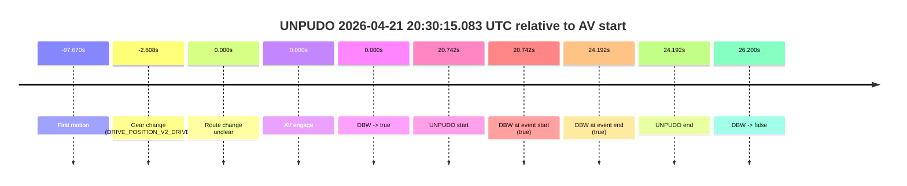
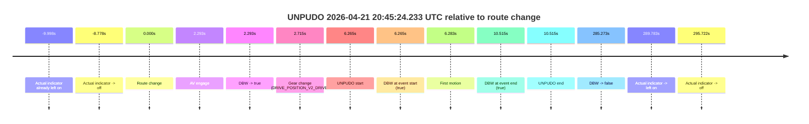
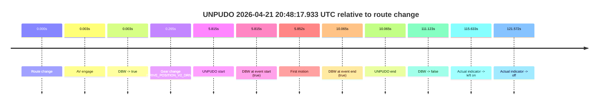
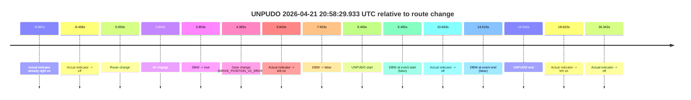

# Run Report: fme20038/2026-04-21--20-19-17--gen2-av-88adeb84-7a68-4715-8787-659129aef260

| Field | Value |
|---|---|
| Run ID | `fme20038/2026-04-21--20-19-17--gen2-av-88adeb84-7a68-4715-8787-659129aef260` |
| Date | `2026-04-21` |
| Model(s) | `eel-teal-outspoken` |
| Author | `zak` |
| Event count | `4` |

## unpudo 2026-04-21 20:30:15.083 UTC

| Field | Value |
|---|---|
| Model | `eel-teal-outspoken` |
| Author | `zak` |
| Run ID | `fme20038/2026-04-21--20-19-17--gen2-av-88adeb84-7a68-4715-8787-659129aef260` |
| Date | `2026-04-21` |
| Time (UTC) | `20:30:15.083` |
| Event type | `unpudo` |
| Disengagement type | `none observed` |
| Route change | `unclear` |
| Console | [run](https://console.sso.wayve.ai/run/fme20038/2026-04-21--20-19-17--gen2-av-88adeb84-7a68-4715-8787-659129aef260?id=&time-unixus=1776803415083300) |
| Foxglove | [segment](https://app.foxglove.dev/wayve-on-prem/p/prj_0dX18KZdVHg1fmmI/view?ds=foxglove-stream&ds.deviceName=fme20038&ds.start=2026-04-21T20%3A29%3A41.733305Z&ds.end=2026-04-21T20%3A30%3A30.541097Z&layoutId=lay_0e7VD4WIKDQGU73Y&time=2026-04-21T20%3A30%3A15.083300Z) |

### Event card: pass

- Pass: AV owns the credited unpudo from route change through the official unpudo window, the gear state is aligned at the anchor, and the vehicle moves without driver accelerator help in AV.

| Event | Time (UTC) | Delta from AV start |
|---|---:|---:|
| First motion | 2026-04-21 20:28:16.671 | `-97.670s` |
| Gear change (DRIVE_POSITION_V2_DRIVE) | 2026-04-21 20:29:51.733 | `-2.608s` |
| Route change unclear | 2026-04-21 20:29:54.341 | `0.000s` |
| AV engage | 2026-04-21 20:29:54.341 | `0.000s` |
| DBW -> true | 2026-04-21 20:29:54.341 | `0.000s` |
| UNPUDO start | 2026-04-21 20:30:15.083 | `20.742s` |
| DBW at event start (true) | 2026-04-21 20:30:15.083 | `20.742s` |
| DBW at event end (true) | 2026-04-21 20:30:18.533 | `24.192s` |
| UNPUDO end | 2026-04-21 20:30:18.533 | `24.192s` |
| DBW -> false | 2026-04-21 20:30:20.541 | `26.200s` |

| Metric | Value |
|---|---|
| Outcome | `pass` |
| Effective failure type | `none` |
| Route change status | `unclear` |
| DBW at event start | `true` |
| DBW at event end | `true` |
| Predicted gear at AV start | `DRIVE_POSITION_V2_DRIVE` |
| Actual gear at AV start | `DRIVE_POSITION_V2_DRIVE` |
| Predicted gear at event start | `DRIVE_POSITION_V2_DRIVE` |
| Actual gear at event start | `DRIVE_POSITION_V2_DRIVE` |
| Planned indicator direction | `INDICATORS_STATE_V2_OFF` |
| Controller indicator direction | `INDICATORS_STATE_V2_OFF` |
| Actual indicator direction | `INDICATORS_STATE_V2_OFF` |
| Actual indicator at maneuver end | `INDICATORS_STATE_V2_OFF` |
| Driver accel help in AV | `false` |
| Driver accel help timestamp | `n/a` |
| Max accel pedal pct in AV | `0.0%` |
| Max brake pedal pct in AV | `9.1%` |
| Max speed mps in AV | `4.558` |
| Success timing baseline | `AV start` |
| Route -> AV | `n/a` |
| AV -> event start | `20.742s` |
| AV -> first motion | `-97.670s` |
| Success baseline -> event start | `20.742s` |
| Success baseline -> first motion | `-97.670s` |
| AV duration before disengagement | `26.200s` |
| Trajectory waypoint count | `37` |
| Driving-plan step count | `11` |

The scored portion starts from the AV-owned window, not from the pre-AV setup. Route-change search in the stopped pre-event segment was `unclear`, with the baseline therefore set to AV start. At the event anchor the model predicts `DRIVE_POSITION_V2_DRIVE` and the actual gear is `DRIVE_POSITION_V2_DRIVE`. The effective model outcome is `pass` because `the credited unpudo stays AV-owned through the official unpudo window.`

### Resolution

| Field | Value |
|---|---|
| Final outcome | `pass` |
| Do we agree with this label? | `yes` |
| Source disengagement type | `none observed` |
| Resolved effective failure type | `none` |
| Confidence | `medium` |

## unpudo 2026-04-21 20:45:24.233 UTC

| Field | Value |
|---|---|
| Model | `eel-teal-outspoken` |
| Author | `zak` |
| Run ID | `fme20038/2026-04-21--20-19-17--gen2-av-88adeb84-7a68-4715-8787-659129aef260` |
| Date | `2026-04-21` |
| Time (UTC) | `20:45:24.233` |
| Event type | `unpudo` |
| Disengagement type | `none observed` |
| Route change | `found` |
| Console | [run](https://console.sso.wayve.ai/run/fme20038/2026-04-21--20-19-17--gen2-av-88adeb84-7a68-4715-8787-659129aef260?id=&time-unixus=1776804324233296) |
| Foxglove | [segment](https://app.foxglove.dev/wayve-on-prem/p/prj_0dX18KZdVHg1fmmI/view?ds=foxglove-stream&ds.deviceName=fme20038&ds.start=2026-04-21T20%3A45%3A07.968258Z&ds.end=2026-04-21T20%3A50%3A13.241083Z&layoutId=lay_0e7VD4WIKDQGU73Y&time=2026-04-21T20%3A45%3A24.233296Z) |

### Event card: pass

- Pass: AV owns the credited unpudo from route change through the official unpudo window, the gear state is aligned at the anchor, and the vehicle moves without driver accelerator help in AV.

| Event | Time (UTC) | Delta from route change |
|---|---:|---:|
| Actual indicator already left on | 2026-04-21 20:45:07.970 | `-9.998s` |
| Actual indicator -> off | 2026-04-21 20:45:09.190 | `-8.778s` |
| Route change | 2026-04-21 20:45:17.968 | `0.000s` |
| AV engage | 2026-04-21 20:45:20.261 | `2.293s` |
| DBW -> true | 2026-04-21 20:45:20.261 | `2.293s` |
| Gear change (DRIVE_POSITION_V2_DRIVE) | 2026-04-21 20:45:20.683 | `2.715s` |
| UNPUDO start | 2026-04-21 20:45:24.233 | `6.265s` |
| DBW at event start (true) | 2026-04-21 20:45:24.233 | `6.265s` |
| First motion | 2026-04-21 20:45:24.251 | `6.283s` |
| DBW at event end (true) | 2026-04-21 20:45:28.483 | `10.515s` |
| UNPUDO end | 2026-04-21 20:45:28.483 | `10.515s` |
| DBW -> false | 2026-04-21 20:50:03.241 | `285.273s` |
| Actual indicator -> left on | 2026-04-21 20:50:07.750 | `289.783s` |
| Actual indicator -> off | 2026-04-21 20:50:13.690 | `295.722s` |

| Metric | Value |
|---|---|
| Outcome | `pass` |
| Effective failure type | `none` |
| Route change status | `found` |
| DBW at event start | `true` |
| DBW at event end | `true` |
| Predicted gear at AV start | `DRIVE_POSITION_V2_DRIVE` |
| Actual gear at AV start | `DRIVE_POSITION_V2_PARK` |
| Predicted gear at event start | `DRIVE_POSITION_V2_DRIVE` |
| Actual gear at event start | `DRIVE_POSITION_V2_DRIVE` |
| Planned indicator direction | `INDICATORS_STATE_V2_RIGHT_ON` |
| Controller indicator direction | `INDICATORS_STATE_V2_RIGHT_ON` |
| Actual indicator direction | `INDICATORS_STATE_V2_OFF` |
| Actual indicator at maneuver end | `INDICATORS_STATE_V2_OFF` |
| Driver accel help in AV | `false` |
| Driver accel help timestamp | `n/a` |
| Max accel pedal pct in AV | `0.0%` |
| Max brake pedal pct in AV | `8.0%` |
| Max speed mps in AV | `2.997` |
| Success timing baseline | `route change` |
| Route -> AV | `2.293s` |
| AV -> event start | `3.972s` |
| AV -> first motion | `3.990s` |
| Success baseline -> event start | `6.265s` |
| Success baseline -> first motion | `6.283s` |
| AV duration before disengagement | `282.980s` |
| Trajectory waypoint count | `38` |
| Driving-plan step count | `11` |

The scored portion starts from the AV-owned window, not from the pre-AV setup. Route-change search in the stopped pre-event segment was `found`, with the baseline therefore set to route change. At the event anchor the model predicts `DRIVE_POSITION_V2_DRIVE` and the actual gear is `DRIVE_POSITION_V2_DRIVE`. The effective model outcome is `pass` because `the credited unpudo stays AV-owned through the official unpudo window.`

### Resolution

| Field | Value |
|---|---|
| Final outcome | `pass` |
| Do we agree with this label? | `yes` |
| Source disengagement type | `none observed` |
| Resolved effective failure type | `none` |
| Confidence | `high` |

## unpudo 2026-04-21 20:48:17.933 UTC

| Field | Value |
|---|---|
| Model | `eel-teal-outspoken` |
| Author | `zak` |
| Run ID | `fme20038/2026-04-21--20-19-17--gen2-av-88adeb84-7a68-4715-8787-659129aef260` |
| Date | `2026-04-21` |
| Time (UTC) | `20:48:17.933` |
| Event type | `unpudo` |
| Disengagement type | `none observed` |
| Route change | `found` |
| Console | [run](https://console.sso.wayve.ai/run/fme20038/2026-04-21--20-19-17--gen2-av-88adeb84-7a68-4715-8787-659129aef260?id=&time-unixus=1776804497933317) |
| Foxglove | [segment](https://app.foxglove.dev/wayve-on-prem/p/prj_0dX18KZdVHg1fmmI/view?ds=foxglove-stream&ds.deviceName=fme20038&ds.start=2026-04-21T20%3A48%3A02.118259Z&ds.end=2026-04-21T20%3A50%3A13.241083Z&layoutId=lay_0e7VD4WIKDQGU73Y&time=2026-04-21T20%3A48%3A17.933317Z) |

### Event card: pass

- Pass: AV owns the credited unpudo from route change through the official unpudo window, the gear state is aligned at the anchor, and the vehicle moves without driver accelerator help in AV.

| Event | Time (UTC) | Delta from route change |
|---|---:|---:|
| Route change | 2026-04-21 20:48:12.118 | `0.000s` |
| AV engage | 2026-04-21 20:48:12.121 | `0.003s` |
| DBW -> true | 2026-04-21 20:48:12.121 | `0.003s` |
| Gear change (DRIVE_POSITION_V2_DRIVE) | 2026-04-21 20:48:12.383 | `0.265s` |
| UNPUDO start | 2026-04-21 20:48:17.933 | `5.815s` |
| DBW at event start (true) | 2026-04-21 20:48:17.933 | `5.815s` |
| First motion | 2026-04-21 20:48:17.970 | `5.852s` |
| DBW at event end (true) | 2026-04-21 20:48:22.183 | `10.065s` |
| UNPUDO end | 2026-04-21 20:48:22.183 | `10.065s` |
| DBW -> false | 2026-04-21 20:50:03.241 | `111.123s` |
| Actual indicator -> left on | 2026-04-21 20:50:07.750 | `115.633s` |
| Actual indicator -> off | 2026-04-21 20:50:13.690 | `121.572s` |

| Metric | Value |
|---|---|
| Outcome | `pass` |
| Effective failure type | `none` |
| Route change status | `found` |
| DBW at event start | `true` |
| DBW at event end | `true` |
| Predicted gear at AV start | `DRIVE_POSITION_V2_PARK` |
| Actual gear at AV start | `DRIVE_POSITION_V2_PARK` |
| Predicted gear at event start | `DRIVE_POSITION_V2_DRIVE` |
| Actual gear at event start | `DRIVE_POSITION_V2_DRIVE` |
| Planned indicator direction | `INDICATORS_STATE_V2_RIGHT_ON` |
| Controller indicator direction | `INDICATORS_STATE_V2_RIGHT_ON` |
| Actual indicator direction | `INDICATORS_STATE_V2_OFF` |
| Actual indicator at maneuver end | `INDICATORS_STATE_V2_OFF` |
| Driver accel help in AV | `false` |
| Driver accel help timestamp | `n/a` |
| Max accel pedal pct in AV | `0.0%` |
| Max brake pedal pct in AV | `13.2%` |
| Max speed mps in AV | `3.219` |
| Success timing baseline | `route change` |
| Route -> AV | `0.003s` |
| AV -> event start | `5.812s` |
| AV -> first motion | `5.849s` |
| Success baseline -> event start | `5.815s` |
| Success baseline -> first motion | `5.852s` |
| AV duration before disengagement | `111.120s` |
| Trajectory waypoint count | `38` |
| Driving-plan step count | `11` |

The scored portion starts from the AV-owned window, not from the pre-AV setup. Route-change search in the stopped pre-event segment was `found`, with the baseline therefore set to route change. At the event anchor the model predicts `DRIVE_POSITION_V2_DRIVE` and the actual gear is `DRIVE_POSITION_V2_DRIVE`. The effective model outcome is `pass` because `the credited unpudo stays AV-owned through the official unpudo window.`

### Resolution

| Field | Value |
|---|---|
| Final outcome | `pass` |
| Do we agree with this label? | `yes` |
| Source disengagement type | `none observed` |
| Resolved effective failure type | `none` |
| Confidence | `high` |

## unpudo 2026-04-21 20:58:29.933 UTC

| Field | Value |
|---|---|
| Model | `eel-teal-outspoken` |
| Author | `zak` |
| Run ID | `fme20038/2026-04-21--20-19-17--gen2-av-88adeb84-7a68-4715-8787-659129aef260` |
| Date | `2026-04-21` |
| Time (UTC) | `20:58:29.933` |
| Event type | `unpudo` |
| Disengagement type | `none observed` |
| Route change | `found` |
| Console | [run](https://console.sso.wayve.ai/run/fme20038/2026-04-21--20-19-17--gen2-av-88adeb84-7a68-4715-8787-659129aef260?id=&time-unixus=1776805109933306) |
| Foxglove | [segment](https://app.foxglove.dev/wayve-on-prem/p/prj_0dX18KZdVHg1fmmI/view?ds=foxglove-stream&ds.deviceName=fme20038&ds.start=2026-04-21T20%3A58%3A10.468257Z&ds.end=2026-04-21T20%3A58%3A44.983305Z&layoutId=lay_0e7VD4WIKDQGU73Y&time=2026-04-21T20%3A58%3A29.933306Z) |

### Event card: fail

- Fail: the credited unpudo does not stay AV-owned. The event window starts with DBW false, and the maneuver outcome lands outside a clean AV-owned segment.

| Event | Time (UTC) | Delta from route change |
|---|---:|---:|
| Actual indicator already right on | 2026-04-21 20:58:10.470 | `-9.997s` |
| Actual indicator -> off | 2026-04-21 20:58:12.010 | `-8.458s` |
| Route change | 2026-04-21 20:58:20.468 | `0.000s` |
| AV engage | 2026-04-21 20:58:24.321 | `3.853s` |
| DBW -> true | 2026-04-21 20:58:24.321 | `3.853s` |
| Gear change (DRIVE_POSITION_V2_DRIVE) | 2026-04-21 20:58:24.833 | `4.365s` |
| Actual indicator -> left on | 2026-04-21 20:58:27.311 | `6.843s` |
| DBW -> false | 2026-04-21 20:58:28.421 | `7.953s` |
| UNPUDO start | 2026-04-21 20:58:29.933 | `9.465s` |
| DBW at event start (false) | 2026-04-21 20:58:29.933 | `9.465s` |
| Actual indicator -> off | 2026-04-21 20:58:31.131 | `10.663s` |
| DBW at event end (false) | 2026-04-21 20:58:34.983 | `14.515s` |
| UNPUDO end | 2026-04-21 20:58:34.983 | `14.515s` |
| Actual indicator -> left on | 2026-04-21 20:58:39.090 | `18.622s` |
| Actual indicator -> off | 2026-04-21 20:58:46.810 | `26.342s` |

| Metric | Value |
|---|---|
| Outcome | `fail` |
| Effective failure type | `not_av_owned` |
| Route change status | `found` |
| DBW at event start | `false` |
| DBW at event end | `false` |
| Predicted gear at AV start | `DRIVE_POSITION_V2_DRIVE` |
| Actual gear at AV start | `DRIVE_POSITION_V2_PARK` |
| Predicted gear at event start | `DRIVE_POSITION_V2_DRIVE` |
| Actual gear at event start | `DRIVE_POSITION_V2_DRIVE` |
| Planned indicator direction | `INDICATORS_STATE_V2_LEFT_ON` |
| Controller indicator direction | `INDICATORS_STATE_V2_LEFT_ON` |
| Actual indicator direction | `INDICATORS_STATE_V2_LEFT_ON` |
| Actual indicator at maneuver end | `INDICATORS_STATE_V2_OFF` |
| Driver accel help in AV | `false` |
| Driver accel help timestamp | `n/a` |
| Max accel pedal pct in AV | `0.0%` |
| Max brake pedal pct in AV | `9.2%` |
| Max speed mps in AV | `0.000` |
| Success timing baseline | `route change` |
| Route -> AV | `3.853s` |
| AV -> event start | `5.612s` |
| AV -> first motion | `n/a` |
| Success baseline -> event start | `9.465s` |
| Success baseline -> first motion | `n/a` |
| AV duration before disengagement | `4.100s` |
| Trajectory waypoint count | `38` |
| Driving-plan step count | `11` |

The scored portion starts from the AV-owned window, not from the pre-AV setup. Route-change search in the stopped pre-event segment was `found`, with the baseline therefore set to route change. At the event anchor the model predicts `DRIVE_POSITION_V2_DRIVE` and the actual gear is `DRIVE_POSITION_V2_DRIVE`. The effective model outcome is `fail` because `not_av_owned.`

### Resolution

| Field | Value |
|---|---|
| Final outcome | `fail` |
| Do we agree with this label? | `yes` |
| Source disengagement type | `none observed` |
| Resolved effective failure type | `not_av_owned` |
| Confidence | `high` |
