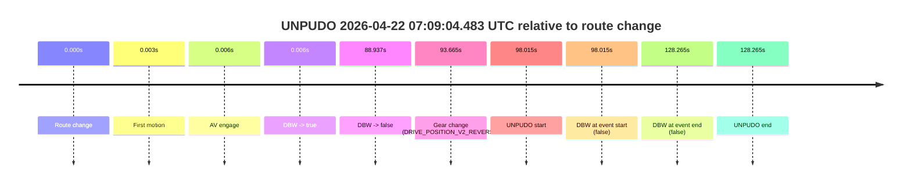
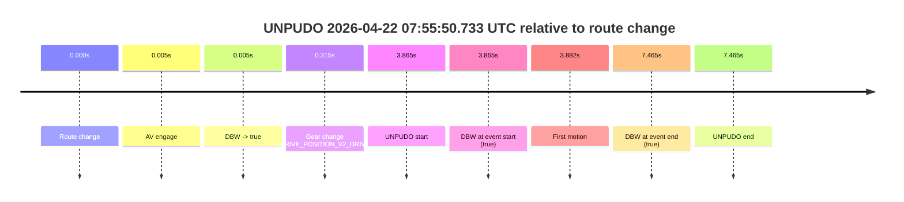

# Run Report: fme20038/2026-04-22--06-51-00--gen2-av-483466a6-a0ef-42de-ba75-8825d0b6d140

| Field | Value |
|---|---|
| Run ID | `fme20038/2026-04-22--06-51-00--gen2-av-483466a6-a0ef-42de-ba75-8825d0b6d140` |
| Date | `2026-04-22` |
| Model(s) | `eel-teal-outspoken` |
| Author | `zak` |
| Event count | `2` |

## unpudo 2026-04-22 07:09:04.483 UTC

| Field | Value |
|---|---|
| Model | `eel-teal-outspoken` |
| Author | `zak` |
| Run ID | `fme20038/2026-04-22--06-51-00--gen2-av-483466a6-a0ef-42de-ba75-8825d0b6d140` |
| Date | `2026-04-22` |
| Time (UTC) | `07:09:04.483` |
| Event type | `unpudo` |
| Disengagement type | `none observed` |
| Route change | `found` |
| Console | [run](https://console.sso.wayve.ai/run/fme20038/2026-04-22--06-51-00--gen2-av-483466a6-a0ef-42de-ba75-8825d0b6d140?id=&time-unixus=1776841744483303) |
| Foxglove | [segment](https://app.foxglove.dev/wayve-on-prem/p/prj_0dX18KZdVHg1fmmI/view?ds=foxglove-stream&ds.deviceName=fme20038&ds.start=2026-04-22T07%3A07%3A16.468226Z&ds.end=2026-04-22T07%3A09%3A44.733308Z&layoutId=lay_0e7VD4WIKDQGU73Y&time=2026-04-22T07%3A09%3A04.483303Z) |

### Event card: fail

- Fail: the credited unpudo does not stay AV-owned. The event window starts with DBW false, and the maneuver outcome lands outside a clean AV-owned segment.

| Event | Time (UTC) | Delta from route change |
|---|---:|---:|
| Route change | 2026-04-22 07:07:26.468 | `0.000s` |
| First motion | 2026-04-22 07:07:26.471 | `0.003s` |
| AV engage | 2026-04-22 07:07:26.473 | `0.006s` |
| DBW -> true | 2026-04-22 07:07:26.473 | `0.006s` |
| DBW -> false | 2026-04-22 07:08:55.404 | `88.937s` |
| Gear change (DRIVE_POSITION_V2_REVERSE) | 2026-04-22 07:09:00.133 | `93.665s` |
| UNPUDO start | 2026-04-22 07:09:04.483 | `98.015s` |
| DBW at event start (false) | 2026-04-22 07:09:04.483 | `98.015s` |
| DBW at event end (false) | 2026-04-22 07:09:34.733 | `128.265s` |
| UNPUDO end | 2026-04-22 07:09:34.733 | `128.265s` |

| Metric | Value |
|---|---|
| Outcome | `fail` |
| Effective failure type | `completed_outside_av` |
| Route change status | `found` |
| DBW at event start | `false` |
| DBW at event end | `false` |
| Predicted gear at AV start | `DRIVE_POSITION_V2_DRIVE` |
| Actual gear at AV start | `DRIVE_POSITION_V2_DRIVE` |
| Predicted gear at event start | `DRIVE_POSITION_V2_REVERSE` |
| Actual gear at event start | `DRIVE_POSITION_V2_REVERSE` |
| Planned indicator direction | `INDICATORS_STATE_V2_OFF` |
| Controller indicator direction | `INDICATORS_STATE_V2_OFF` |
| Actual indicator direction | `INDICATORS_STATE_V2_OFF` |
| Actual indicator at maneuver end | `INDICATORS_STATE_V2_OFF` |
| Driver accel help in AV | `false` |
| Driver accel help timestamp | `n/a` |
| Max accel pedal pct in AV | `0.0%` |
| Max brake pedal pct in AV | `8.0%` |
| Max speed mps in AV | `7.467` |
| Success timing baseline | `route change` |
| Route -> AV | `0.006s` |
| AV -> event start | `98.009s` |
| AV -> first motion | `-0.003s` |
| Success baseline -> event start | `98.015s` |
| Success baseline -> first motion | `0.003s` |
| AV duration before disengagement | `88.931s` |
| Trajectory waypoint count | `37` |
| Driving-plan step count | `11` |

The scored portion starts from the AV-owned window, not from the pre-AV setup. Route-change search in the stopped pre-event segment was `found`, with the baseline therefore set to route change. At the event anchor the model predicts `DRIVE_POSITION_V2_REVERSE` and the actual gear is `DRIVE_POSITION_V2_REVERSE`. The effective model outcome is `fail` because `completed_outside_av.`

### Resolution

| Field | Value |
|---|---|
| Final outcome | `fail` |
| Do we agree with this label? | `yes` |
| Source disengagement type | `none observed` |
| Resolved effective failure type | `completed_outside_av` |
| Confidence | `high` |

## unpudo 2026-04-22 07:55:50.733 UTC

| Field | Value |
|---|---|
| Model | `eel-teal-outspoken` |
| Author | `zak` |
| Run ID | `fme20038/2026-04-22--06-51-00--gen2-av-483466a6-a0ef-42de-ba75-8825d0b6d140` |
| Date | `2026-04-22` |
| Time (UTC) | `07:55:50.733` |
| Event type | `unpudo` |
| Disengagement type | `none observed` |
| Route change | `found` |
| Console | [run](https://console.sso.wayve.ai/run/fme20038/2026-04-22--06-51-00--gen2-av-483466a6-a0ef-42de-ba75-8825d0b6d140?id=&time-unixus=1776844550733305) |
| Foxglove | [segment](https://app.foxglove.dev/wayve-on-prem/p/prj_0dX18KZdVHg1fmmI/view?ds=foxglove-stream&ds.deviceName=fme20038&ds.start=2026-04-22T07%3A55%3A36.868355Z&ds.end=2026-04-22T07%3A56%3A04.333297Z&layoutId=lay_0e7VD4WIKDQGU73Y&time=2026-04-22T07%3A55%3A50.733305Z) |

### Event card: pass

- Pass: AV owns the credited unpudo from route change through the official unpudo window, the gear state is aligned at the anchor, and the vehicle moves without driver accelerator help in AV.

| Event | Time (UTC) | Delta from route change |
|---|---:|---:|
| Route change | 2026-04-22 07:55:46.868 | `0.000s` |
| AV engage | 2026-04-22 07:55:46.872 | `0.005s` |
| DBW -> true | 2026-04-22 07:55:46.872 | `0.005s` |
| Gear change (DRIVE_POSITION_V2_DRIVE) | 2026-04-22 07:55:47.183 | `0.315s` |
| UNPUDO start | 2026-04-22 07:55:50.733 | `3.865s` |
| DBW at event start (true) | 2026-04-22 07:55:50.733 | `3.865s` |
| First motion | 2026-04-22 07:55:50.750 | `3.882s` |
| DBW at event end (true) | 2026-04-22 07:55:54.333 | `7.465s` |
| UNPUDO end | 2026-04-22 07:55:54.333 | `7.465s` |

| Metric | Value |
|---|---|
| Outcome | `pass` |
| Effective failure type | `none` |
| Route change status | `found` |
| DBW at event start | `true` |
| DBW at event end | `true` |
| Predicted gear at AV start | `DRIVE_POSITION_V2_PARK` |
| Actual gear at AV start | `DRIVE_POSITION_V2_PARK` |
| Predicted gear at event start | `DRIVE_POSITION_V2_DRIVE` |
| Actual gear at event start | `DRIVE_POSITION_V2_DRIVE` |
| Planned indicator direction | `INDICATORS_STATE_V2_RIGHT_ON` |
| Controller indicator direction | `INDICATORS_STATE_V2_RIGHT_ON` |
| Actual indicator direction | `INDICATORS_STATE_V2_OFF` |
| Actual indicator at maneuver end | `INDICATORS_STATE_V2_OFF` |
| Driver accel help in AV | `false` |
| Driver accel help timestamp | `n/a` |
| Max accel pedal pct in AV | `0.0%` |
| Max brake pedal pct in AV | `8.0%` |
| Max speed mps in AV | `3.958` |
| Success timing baseline | `route change` |
| Route -> AV | `0.005s` |
| AV -> event start | `3.860s` |
| AV -> first motion | `3.878s` |
| Success baseline -> event start | `3.865s` |
| Success baseline -> first motion | `3.882s` |
| AV duration before disengagement | `n/a` |
| Trajectory waypoint count | `38` |
| Driving-plan step count | `11` |

The scored portion starts from the AV-owned window, not from the pre-AV setup. Route-change search in the stopped pre-event segment was `found`, with the baseline therefore set to route change. At the event anchor the model predicts `DRIVE_POSITION_V2_DRIVE` and the actual gear is `DRIVE_POSITION_V2_DRIVE`. The effective model outcome is `pass` because `the credited unpudo stays AV-owned through the official unpudo window.`

### Resolution

| Field | Value |
|---|---|
| Final outcome | `pass` |
| Do we agree with this label? | `yes` |
| Source disengagement type | `none observed` |
| Resolved effective failure type | `none` |
| Confidence | `high` |
