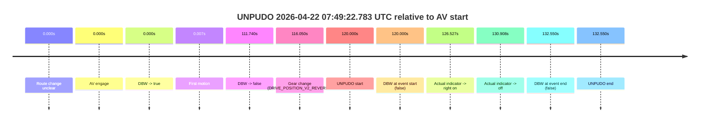
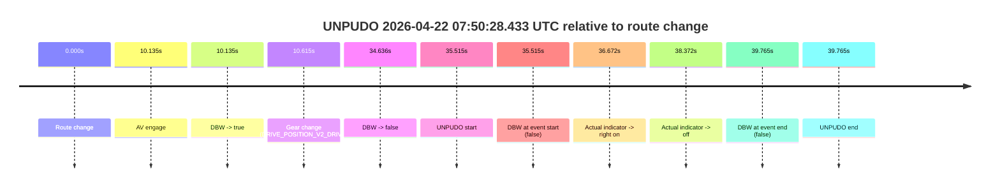

# Run Report: fme20038/2026-04-22--06-51-00--gen2-av-483466a6-a0ef-42de-ba75-8825d0b6d140

| Field | Value |
|---|---|
| Run ID | `fme20038/2026-04-22--06-51-00--gen2-av-483466a6-a0ef-42de-ba75-8825d0b6d140` |
| Date | `2026-04-22` |
| Model(s) | `pink-manta-ray-smooth` |
| Author | `guy.geva` |
| Event count | `2` |

## unpudo 2026-04-22 07:49:22.783 UTC

| Field | Value |
|---|---|
| Model | `pink-manta-ray-smooth` |
| Author | `guy.geva` |
| Run ID | `fme20038/2026-04-22--06-51-00--gen2-av-483466a6-a0ef-42de-ba75-8825d0b6d140` |
| Date | `2026-04-22` |
| Time (UTC) | `07:49:22.783` |
| Event type | `unpudo` |
| Disengagement type | `none observed` |
| Route change | `unclear` |
| Console | [run](https://console.sso.wayve.ai/run/fme20038/2026-04-22--06-51-00--gen2-av-483466a6-a0ef-42de-ba75-8825d0b6d140?id=&time-unixus=1776844162783309) |
| Foxglove | [segment](https://app.foxglove.dev/wayve-on-prem/p/prj_0dX18KZdVHg1fmmI/view?ds=foxglove-stream&ds.deviceName=fme20038&ds.start=2026-04-22T07%3A47%3A12.783423Z&ds.end=2026-04-22T07%3A49%3A45.333290Z&layoutId=lay_0e7VD4WIKDQGU73Y&time=2026-04-22T07%3A49%3A22.783309Z) |

### Event card: fail

- Fail: the credited unpudo does not stay AV-owned. The event window starts with DBW false, and the maneuver outcome lands outside a clean AV-owned segment.

| Event | Time (UTC) | Delta from AV start |
|---|---:|---:|
| Route change unclear | 2026-04-22 07:47:22.783 | `0.000s` |
| AV engage | 2026-04-22 07:47:22.783 | `0.000s` |
| DBW -> true | 2026-04-22 07:47:22.783 | `0.000s` |
| First motion | 2026-04-22 07:47:22.790 | `0.007s` |
| DBW -> false | 2026-04-22 07:49:14.522 | `111.740s` |
| Gear change (DRIVE_POSITION_V2_REVERSE) | 2026-04-22 07:49:18.833 | `116.050s` |
| UNPUDO start | 2026-04-22 07:49:22.783 | `120.000s` |
| DBW at event start (false) | 2026-04-22 07:49:22.783 | `120.000s` |
| Actual indicator -> right on | 2026-04-22 07:49:29.310 | `126.527s` |
| Actual indicator -> off | 2026-04-22 07:49:33.691 | `130.908s` |
| DBW at event end (false) | 2026-04-22 07:49:35.333 | `132.550s` |
| UNPUDO end | 2026-04-22 07:49:35.333 | `132.550s` |

| Metric | Value |
|---|---|
| Outcome | `fail` |
| Effective failure type | `not_av_owned` |
| Route change status | `unclear` |
| DBW at event start | `false` |
| DBW at event end | `false` |
| Predicted gear at AV start | `DRIVE_POSITION_V2_DRIVE` |
| Actual gear at AV start | `DRIVE_POSITION_V2_DRIVE` |
| Predicted gear at event start | `DRIVE_POSITION_V2_REVERSE` |
| Actual gear at event start | `DRIVE_POSITION_V2_REVERSE` |
| Planned indicator direction | `INDICATORS_STATE_V2_OFF` |
| Controller indicator direction | `INDICATORS_STATE_V2_OFF` |
| Actual indicator direction | `INDICATORS_STATE_V2_OFF` |
| Actual indicator at maneuver end | `INDICATORS_STATE_V2_OFF` |
| Driver accel help in AV | `false` |
| Driver accel help timestamp | `n/a` |
| Max accel pedal pct in AV | `0.0%` |
| Max brake pedal pct in AV | `9.8%` |
| Max speed mps in AV | `7.464` |
| Success timing baseline | `AV start` |
| Route -> AV | `n/a` |
| AV -> event start | `120.000s` |
| AV -> first motion | `0.007s` |
| Success baseline -> event start | `120.000s` |
| Success baseline -> first motion | `0.007s` |
| AV duration before disengagement | `111.740s` |
| Trajectory waypoint count | `37` |
| Driving-plan step count | `11` |

The scored portion starts from the AV-owned window, not from the pre-AV setup. Route-change search in the stopped pre-event segment was `unclear`, with the baseline therefore set to AV start. At the event anchor the model predicts `DRIVE_POSITION_V2_REVERSE` and the actual gear is `DRIVE_POSITION_V2_REVERSE`. The effective model outcome is `fail` because `not_av_owned.`

### Resolution

| Field | Value |
|---|---|
| Final outcome | `fail` |
| Do we agree with this label? | `yes` |
| Source disengagement type | `none observed` |
| Resolved effective failure type | `not_av_owned` |
| Confidence | `medium` |

## unpudo 2026-04-22 07:50:28.433 UTC

| Field | Value |
|---|---|
| Model | `pink-manta-ray-smooth` |
| Author | `guy.geva` |
| Run ID | `fme20038/2026-04-22--06-51-00--gen2-av-483466a6-a0ef-42de-ba75-8825d0b6d140` |
| Date | `2026-04-22` |
| Time (UTC) | `07:50:28.433` |
| Event type | `unpudo` |
| Disengagement type | `none observed` |
| Route change | `found` |
| Console | [run](https://console.sso.wayve.ai/run/fme20038/2026-04-22--06-51-00--gen2-av-483466a6-a0ef-42de-ba75-8825d0b6d140?id=&time-unixus=1776844228433303) |
| Foxglove | [segment](https://app.foxglove.dev/wayve-on-prem/p/prj_0dX18KZdVHg1fmmI/view?ds=foxglove-stream&ds.deviceName=fme20038&ds.start=2026-04-22T07%3A49%3A42.918291Z&ds.end=2026-04-22T07%3A50%3A42.683298Z&layoutId=lay_0e7VD4WIKDQGU73Y&time=2026-04-22T07%3A50%3A28.433303Z) |

### Event card: fail

- Fail: the credited unpudo does not stay AV-owned. The event window starts with DBW false, and the maneuver outcome lands outside a clean AV-owned segment.

| Event | Time (UTC) | Delta from route change |
|---|---:|---:|
| Route change | 2026-04-22 07:49:52.918 | `0.000s` |
| AV engage | 2026-04-22 07:50:03.053 | `10.135s` |
| DBW -> true | 2026-04-22 07:50:03.053 | `10.135s` |
| Gear change (DRIVE_POSITION_V2_DRIVE) | 2026-04-22 07:50:03.533 | `10.615s` |
| DBW -> false | 2026-04-22 07:50:27.553 | `34.636s` |
| UNPUDO start | 2026-04-22 07:50:28.433 | `35.515s` |
| DBW at event start (false) | 2026-04-22 07:50:28.433 | `35.515s` |
| Actual indicator -> right on | 2026-04-22 07:50:29.590 | `36.672s` |
| Actual indicator -> off | 2026-04-22 07:50:31.290 | `38.372s` |
| DBW at event end (false) | 2026-04-22 07:50:32.683 | `39.765s` |
| UNPUDO end | 2026-04-22 07:50:32.683 | `39.765s` |

| Metric | Value |
|---|---|
| Outcome | `fail` |
| Effective failure type | `not_av_owned` |
| Route change status | `found` |
| DBW at event start | `false` |
| DBW at event end | `false` |
| Predicted gear at AV start | `DRIVE_POSITION_V2_DRIVE` |
| Actual gear at AV start | `DRIVE_POSITION_V2_PARK` |
| Predicted gear at event start | `DRIVE_POSITION_V2_DRIVE` |
| Actual gear at event start | `DRIVE_POSITION_V2_DRIVE` |
| Planned indicator direction | `INDICATORS_STATE_V2_RIGHT_ON` |
| Controller indicator direction | `INDICATORS_STATE_V2_RIGHT_ON` |
| Actual indicator direction | `INDICATORS_STATE_V2_OFF` |
| Actual indicator at maneuver end | `INDICATORS_STATE_V2_OFF` |
| Driver accel help in AV | `false` |
| Driver accel help timestamp | `n/a` |
| Max accel pedal pct in AV | `0.0%` |
| Max brake pedal pct in AV | `11.1%` |
| Max speed mps in AV | `0.000` |
| Success timing baseline | `route change` |
| Route -> AV | `10.135s` |
| AV -> event start | `25.380s` |
| AV -> first motion | `n/a` |
| Success baseline -> event start | `35.515s` |
| Success baseline -> first motion | `n/a` |
| AV duration before disengagement | `24.501s` |
| Trajectory waypoint count | `38` |
| Driving-plan step count | `11` |

The scored portion starts from the AV-owned window, not from the pre-AV setup. Route-change search in the stopped pre-event segment was `found`, with the baseline therefore set to route change. At the event anchor the model predicts `DRIVE_POSITION_V2_DRIVE` and the actual gear is `DRIVE_POSITION_V2_DRIVE`. The effective model outcome is `fail` because `not_av_owned.`

### Resolution

| Field | Value |
|---|---|
| Final outcome | `fail` |
| Do we agree with this label? | `yes` |
| Source disengagement type | `none observed` |
| Resolved effective failure type | `not_av_owned` |
| Confidence | `high` |
