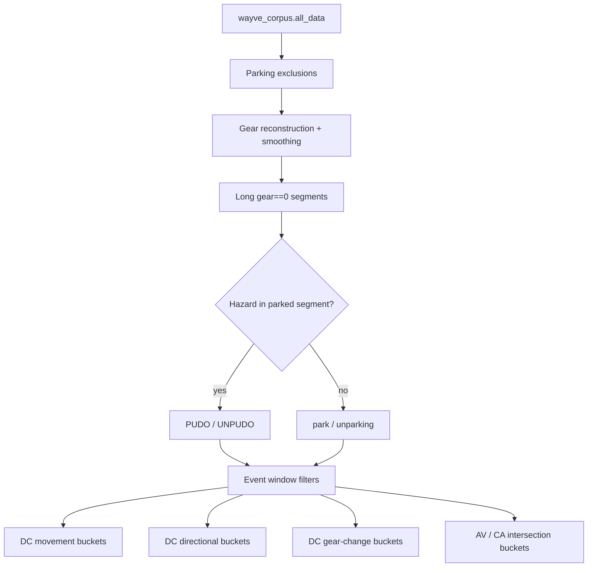
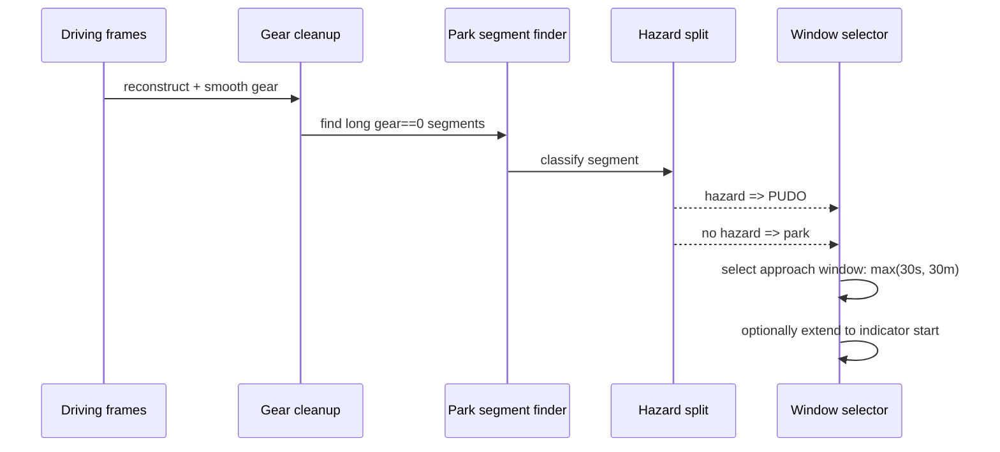
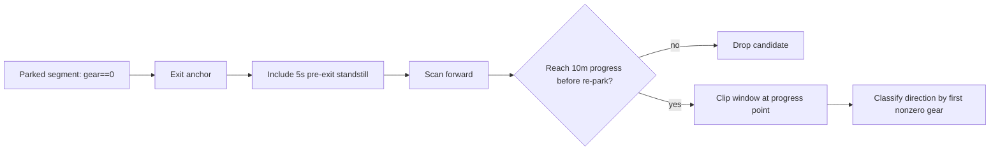

# Newsletter: Moving PUDO, park, UNPUDO, and unparking into generic materialisation

The parking notebooks have been useful because they let us iterate quickly, but they also made the parking data recipe hard to reuse: event detection lived in one place, timestamp expansion in another, Azure writes in another, and every experiment carried a risk of silently drifting from the intended semantics.

The generic materialisation work moves the core PUDO / park / UNPUDO / unparking bucket logic into `wayve/ai/services/sampling`, so the recipe can be versioned, tested, launched through Flyte, and consumed like the rest of the sampling platform.

This issue explains what we added, how park and unpark events are detected, how DC differs from AV / CA handling, and what bucket families are produced.

Branch reference: `boris/generic-parking-pudo-materialisation`

## The Shape Of The New Dataset

The new dataset is `parking_events`. It lives beside the existing parking sampling code rather than replacing `parking/default` or `parking/gc`.

The dataset covers four event types:

- `pudo`: parking-style stopping where the parked segment is associated with hazard lights.
- `park`: parking-style stopping without hazard lights.
- `unpudo`: departure from a PUDO-style stopped segment.
- `unparking`: departure from a normal parked segment.

It currently emits UK and USA buckets on Gen2 Mache data, using `wayve_corpus.all_data` as the base table.

Code references:

- `wayve/ai/services/sampling/datasets/parking/events/dataset.py:25`
- `wayve/ai/services/sampling/datasets/parking/events/dataset.py:137`

## Shared Gear Cleanup

The implementation starts from the same practical problem we saw in the notebooks: raw gear is noisy around parking maneuvers. A transition like Drive to Park can briefly pass through Reverse or Neutral and inflate gear-change counts.

The generic filters handle this with two steps:

- Gear reconstruction from speed for Gen2 Mache runs.
- Gear smoothing to remove very short gear-state blips.

Gear reconstruction derives Drive / Reverse from signed speed, keeps only long-enough Park / Neutral segments from the original gear signal, extends those parked segments into adjacent standstill frames, then fills unknown standstill regions so that the transition lands at movement start rather than at arbitrary signal noise.

Gear smoothing then removes short intermediate states below the dwell threshold. This is what prevents mechanical pass-through from looking like an intentional multi-gear maneuver.

Code references:

- `wayve/ai/services/sampling/datasets/parking/filters.py:86`
- `wayve/ai/services/sampling/datasets/parking/filters.py:143`
- `wayve/ai/services/sampling/datasets/parking/filters.py:503`

## Park And PUDO Detection

For park-like events, the anchor is the transition into a long `gear == 0` segment.

The generic logic first finds long parked segments, then classifies each segment using hazard lights:

- Hazard present in the parked segment means `pudo`.
- No hazard in the parked segment means `park`.

For each accepted park/PUDO event, the selected training window is the approach into the parked state. The current config expands backward using the wider of:

- `30s` of history
- `30m` of distance

This matches the intent of the notebook materialisation: capture the maneuver leading into the stop, not only the frame where the gear becomes Park / Neutral.

We also added indicator extension for park/PUDO. If a left/right indicator starts before the parking anchor and is active into the maneuver, the window can extend back to that indicator start. This keeps the intent signal that often begins before the actual stopping maneuver.

Direction for park/PUDO is based on the entry gear immediately before the parked segment:

- Entry gear `+1` means forward.
- Entry gear `-1` means reverse.

Code references:

- `wayve/ai/services/sampling/datasets/parking/common.py:194`
- `wayve/ai/services/sampling/datasets/parking/common.py:237`
- `wayve/ai/services/sampling/datasets/parking/filters.py:563`
- `wayve/ai/services/sampling/datasets/parking/filters.py:615`

## UNPUDO And Unparking Detection

For departure events, the anchor is the end of a long `gear == 0` segment: the moment just before the vehicle leaves the parked state.

The split again comes from hazard lights on the parked segment:

- Hazard present means `unpudo`.
- No hazard means `unparking`.

The selected window starts before the departure anchor and then follows the vehicle through the departure maneuver. The current config uses:

- `5s` before the park-exit anchor, to include standstill frames before the gear/motion decision.
- A forward maneuver window using the wider of `90s` or `120m`.
- A required progress check of `10m` within `90s`.

The progress check is important. It means a candidate is kept only if it actually drives away. If the gear returns to `0` before reaching the progress threshold, the candidate is dropped. That catches aborted or ambiguous park exits instead of turning them into positive unpark examples.

After progress is found, the maneuver window is clipped to that progress point. This keeps complex departures long enough to include multi-gear maneuvers, but avoids sampling the rest of the trip after the unpark has already succeeded.

Direction for UNPUDO/unparking is based on the first nonzero gear after the parked segment:

- First nonzero gear `+1` means forward departure.
- First nonzero gear `-1` means reverse departure.

Code references:

- `wayve/ai/services/sampling/datasets/parking/common.py:213`
- `wayve/ai/services/sampling/datasets/parking/common.py:251`
- `wayve/ai/services/sampling/datasets/parking/filters.py:332`
- `wayve/ai/services/sampling/datasets/parking/filters.py:585`
- `wayve/ai/services/sampling/datasets/parking/filters.py:625`

## DC Handling

DC buckets are the clean data-collection buckets. They use parking-specific exclusions that keep reverse / neutral / parking frames but remove autonomous data and long stopped interiors.

The DC path is where we apply movement-intent filtering for UNPUDO/unparking. For those departure buckets, a timestamp is kept only if the future speed around `+0.60s` shows movement:

- offset: `0.60s`
- tolerance: `0.05s`
- threshold: `abs(speed) >= 0.15 m/s`

This replaces the previous acceleration-threshold idea for movement-intent filtering. It aligns better with the controller question we were asking: does the near-future trajectory have enough speed to break standstill?

This speed filter is intentionally not applied to park/PUDO DC buckets, because those are approach-to-stop windows.

Code references:

- `wayve/ai/services/sampling/datasets/parking/events/dataset.py:31`
- `wayve/ai/services/sampling/datasets/parking/events/dataset.py:48`
- `wayve/ai/services/sampling/datasets/parking/common.py:132`
- `wayve/ai/services/sampling/datasets/parking/common.py:266`
- `wayve/ai/services/sampling/datasets/parking/filters.py:805`

## AV, CA, And Pre-CA Handling

AV-derived buckets are handled differently from DC buckets. These buckets are about corrective behavior around interventions, so they intersect the parking event window with intervention-relative windows rather than applying the movement-intent filter.

The generic dataset creates three AV-style families:

- `pre_ca`: frames before the intervention.
- `ca_short`: the early corrective-action window after intervention.
- `ca_long`: the later corrective-action window after the short CA region.

The parking-specific intervention filters intentionally disable directional invalid speed-limit removal, because parking lots and parking maneuvers do not behave like ordinary road-driving speed-limit cases.

Recent relaxation: CA/pre-CA UNPUDO and unparking buckets do not use the `+0.60s` future-speed filter. That filter was too aggressive for intervention windows because a disengagement can happen exactly when the model is wrong, stuck, unsafe, or not yet moving. For CA data, the intervention timing is the training signal; filtering it again by movement intent removes the failures we want to learn from.

Code references:

- `wayve/ai/services/sampling/datasets/parking/common.py:49`
- `wayve/ai/services/sampling/datasets/parking/common.py:57`
- `wayve/ai/services/sampling/datasets/parking/common.py:64`
- `wayve/ai/services/sampling/datasets/parking/common.py:141`
- `wayve/ai/services/sampling/datasets/parking/common.py:149`
- `wayve/ai/services/sampling/datasets/parking/events/dataset.py:92`
- `wayve/ai/services/sampling/datasets/parking/events/dataset.py:107`
- `wayve/ai/services/sampling/datasets/parking/events/dataset.py:122`

## Bucket Families

The dataset emits several overlapping bucket families. Counts should be interpreted as timestamp rows per bucket, not unique events. A single event can contribute to multiple bucket variants.

| Bucket pattern | Source | Meaning |
|---|---|---|
| `dc_{event_type}_{country}` | DC | Main movement/event bucket. UNPUDO/unparking additionally require future speed at `+0.60s` above `0.15 m/s`. |
| `dc_{event_type}_{country}_{forward}` | DC | Directional forward variant of the same event window. |
| `dc_{event_type}_{country}_{reverse}` | DC | Directional reverse variant of the same event window. |
| `dc_{event_type}_{country}_gear_change` | DC | Frames within `+-1s` of a smoothed gear change inside the event window. |
| `ca_short_{event_type}_{country}` | AV / CA | Event window intersected with the short corrective-action window. No future-speed filter. |
| `ca_long_{event_type}_{country}` | AV / CA | Event window intersected with the later corrective-action window. No future-speed filter. |
| `pre_ca_{event_type}_{country}` | AV / pre-CA | Event window intersected with the pre-intervention window. No future-speed filter. |

Where:

- `event_type` is one of `pudo`, `park`, `unpudo`, `unparking`.
- `country` is one of `uk`, `usa`.

Gear-change buckets use a symmetric one-second boundary around each smoothed gear transition. They are DC-only in the current implementation.

Code references:

- `wayve/ai/services/sampling/datasets/parking/events/dataset.py:48`
- `wayve/ai/services/sampling/datasets/parking/events/dataset.py:62`
- `wayve/ai/services/sampling/datasets/parking/events/dataset.py:77`
- `wayve/ai/services/sampling/datasets/parking/events/dataset.py:92`
- `wayve/ai/services/sampling/datasets/parking/common.py:182`
- `wayve/ai/services/sampling/datasets/parking/filters.py:766`

## Known Differences From The Notebook World

This is not a byte-for-byte clone of every notebook behavior.

The biggest intentional difference is PUDO classification. The generic implementation currently uses hazard presence in the parked segment to split PUDO/UNPUDO from park/unparking. It does not yet use the trip table or destination context as an additional PUDO signal. That means it can differ from notebook-generated event tables where PUDO rows came from richer context and not only hazard lights.

Another important difference is how to read counts. Generic materialisation outputs timestamp rows per bucket. Directional buckets, gear-change buckets, and CA windows can overlap with the main event bucket. So a one-day run can produce many more bucket rows than the number of unique parking events.

The right parity check is therefore not just total row count. We should compare:

- event counts by type and country
- unique `(run_id, timestamp_unixus)` counts per family
- directional split ratios
- CA/pre-CA density around known disengagements
- examples against `parking.pudo_unpudo_unpark_events`

## Why This Matters

The practical goal is to stop treating parking materialisation as a notebook-only artifact. Once this logic lives in generic materialisation, we get a repeatable path for:

- rebuilding data from a config instead of notebook state
- launching single-day and full-range Flyte runs
- testing filter behavior locally
- creating balanced forward/reverse and gear-change training buckets
- comparing changes against the existing Databricks event table

That gives us a cleaner loop for the actual modeling problem: teaching the model not just to stop for PUDO/Park, but to leave PUDO/unpark from standstill with the right gear, enough speed intent, and enough coverage of reverse departures.
