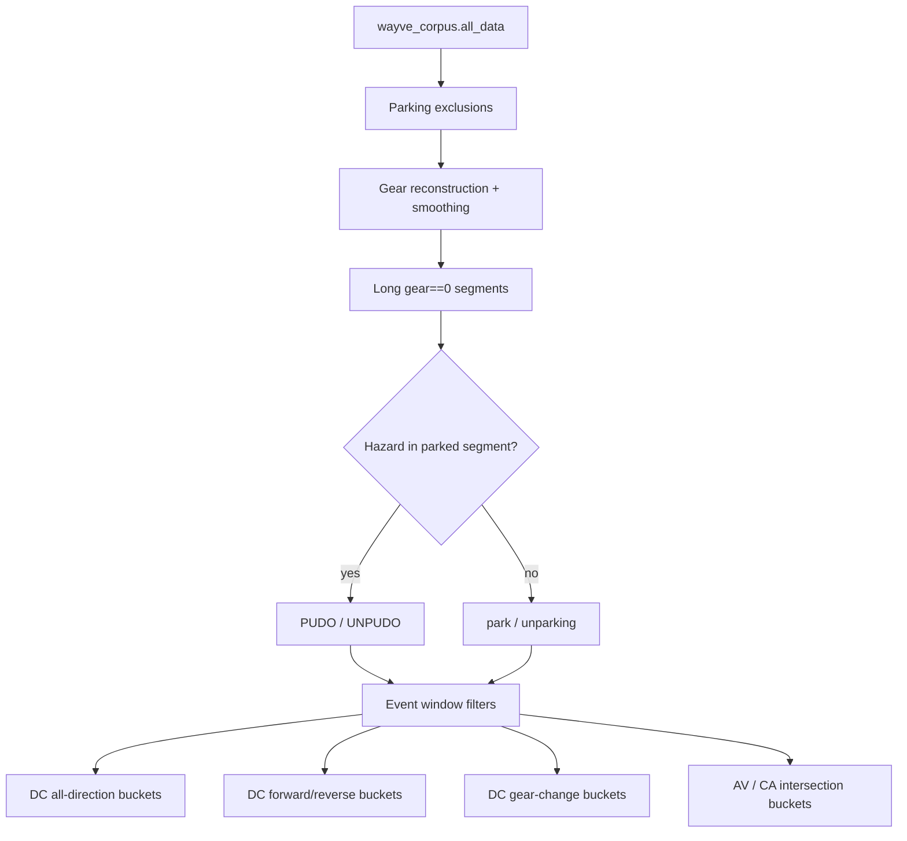
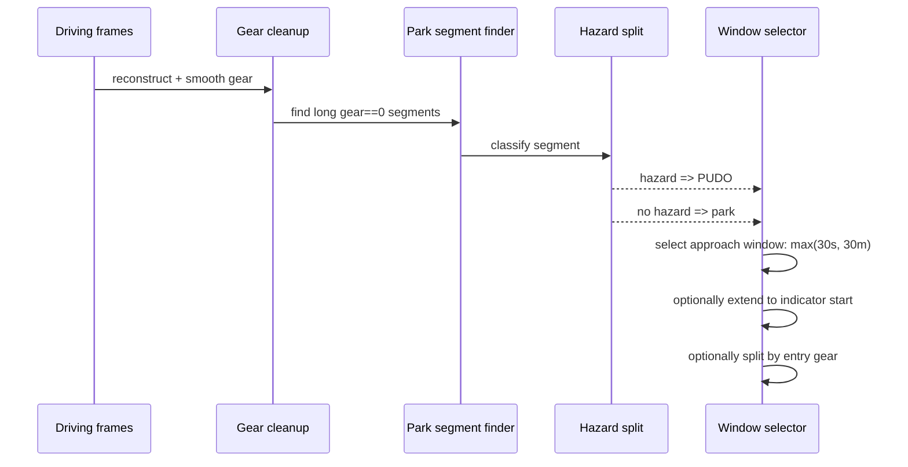
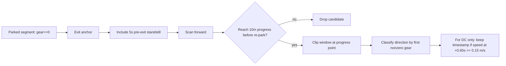

# Newsletter: Moving PUDO, park, UNPUDO, and unparking into generic materialisation

The parking notebooks have been useful because they let us iterate quickly, but they also made the parking data recipe hard to reuse: event detection lived in one place, timestamp expansion in another, Azure writes in another, and every experiment carried a risk of silently drifting from the intended semantics.

The generic materialisation work moves the core PUDO / park / UNPUDO / unparking bucket logic into `wayve/ai/services/sampling`, so the recipe can be versioned, tested, launched through Flyte, and consumed like the rest of the sampling platform.

This issue explains what we added, how park and unpark events are detected, how DC differs from AV / CA handling for each event family, and what bucket families are produced.

Branch reference: `boris/generic-parking-pudo-materialisation`

## The Shape Of The New Dataset

The new dataset is `parking_events`. It lives beside the existing parking sampling code rather than replacing `parking/default` or `parking/gc`.

The dataset covers four event types:

- `pudo`: parking-style stopping where the parked segment is associated with hazard lights.
- `park`: parking-style stopping without hazard lights.
- `unpudo`: departure from a PUDO-style stopped segment.
- `unparking`: departure from a normal parked segment.

It currently emits UK and USA buckets on Gen2 Mache data, using `wayve_corpus.all_data` as the base table.

Code references:

- `wayve/ai/services/sampling/datasets/parking/events/dataset.py:25`
- `wayve/ai/services/sampling/datasets/parking/events/dataset.py:137`

## Shared Gear Cleanup

The implementation starts from the same practical problem we saw in the notebooks: raw gear is noisy around parking maneuvers. A transition like Drive to Park can briefly pass through Reverse or Neutral and inflate gear-change counts.

The generic filters handle this with two steps:

- Gear reconstruction from speed for Gen2 Mache runs.
- Gear smoothing to remove very short gear-state blips.

Gear reconstruction derives Drive / Reverse from signed speed, keeps only long-enough Park / Neutral segments from the original gear signal, extends those parked segments into adjacent standstill frames, then fills unknown standstill regions so that the transition lands at movement start rather than at arbitrary signal noise.

Gear smoothing then removes short intermediate states below the dwell threshold. This is what prevents mechanical pass-through from looking like an intentional multi-gear maneuver.

Code references:

- `wayve/ai/services/sampling/datasets/parking/filters.py:86`
- `wayve/ai/services/sampling/datasets/parking/filters.py:143`
- `wayve/ai/services/sampling/datasets/parking/filters.py:503`

## Park And PUDO

For park-like events, the anchor is the transition into a long `gear == 0` segment.

The generic logic first finds long parked segments, then classifies each segment using hazard lights:

- Hazard present in the parked segment means `pudo`.
- No hazard in the parked segment means `park`.

For each accepted park/PUDO event, the selected training window is the approach into the parked state. The current config expands backward using the wider of:

- `30s` of history
- `30m` of distance

This captures the maneuver leading into the stop, not only the frame where the gear becomes Park / Neutral.

We also added indicator extension for park/PUDO. If a left/right indicator starts before the parking anchor and is active into the maneuver, the window can extend back to that indicator start. This keeps the intent signal that often begins before the actual stopping maneuver.

Direction for park/PUDO is based on the entry gear immediately before the parked segment:

- Entry gear `+1` means forward.
- Entry gear `-1` means reverse.

Important bucket detail: we create both all-direction and directional park/PUDO buckets.

- `dc_pudo_{country}` and `dc_park_{country}` include both entry directions.
- `dc_pudo_{country}_forward`, `dc_pudo_{country}_reverse`, `dc_park_{country}_forward`, and `dc_park_{country}_reverse` split the same event family by entry direction.

### Park/PUDO DC Handling

DC park/PUDO buckets use the parking DC exclusions: they preserve reverse / neutral / parking frames, remove autonomous data, and remove deep stopped interiors while keeping transition edges.

There is no `+0.60s` future-speed threshold on park/PUDO. That threshold is only for departure events. Park/PUDO is an approach-to-stop problem, so the relevant signal is the approach window into `gear == 0`, not future speed after a timestamp.

The current implementation also does not require a “previously moved 10m before stopping” progress check. That could be a useful follow-up: require that the vehicle had made enough approach progress before the stop anchor, analogous to the unpark progress validation. It would likely reduce accidental long-standstill / non-maneuver parked segments. It is not implemented in the generic branch today.

### Park/PUDO AV, CA, And Pre-CA Handling

For AV-derived park/PUDO buckets, we do not create a separate event detector. We take the same park/PUDO event window described above and intersect it with intervention-relative windows from `select_interventions`.

The intervention anchor is any valid intervention frame selected by `get_intervention_mask` plus the intervention taxonomy / annotation validity filters inside `select_interventions`. The filter first identifies valid intervention anchors, then broadcasts each anchor into a frame window using the configured before/after offsets.

The three park/PUDO AV bucket families are:

- `pre_ca_pudo_{country}` / `pre_ca_park_{country}`: frames from `-1.2s` to `-0.04s` before a valid intervention, intersected with the park/PUDO event window.
- `ca_short_pudo_{country}` / `ca_short_park_{country}`: frames from intervention time to `+1.48s`, intersected with the park/PUDO event window.
- `ca_long_pudo_{country}` / `ca_long_park_{country}`: frames from `+1.52s` to `+5.0s`, intersected with the park/PUDO event window. The `+0.04s` gap after short CA mirrors the normal sampling split and avoids overlap at the boundary.

The practical interpretation is:

- `pre_ca_*` asks: what was the model seeing immediately before the VSO intervened during a park/PUDO maneuver?
- `ca_short_*` asks: what corrective-action frames happen immediately after takeover?
- `ca_long_*` asks: what later correction frames still belong to the same park/PUDO event window?

The exclusion set is intentionally different from DC:

- CA buckets use `PARKING_EXCLUSIONS_DC_CA`, which does not exclude entire autonomous runs. We need AV context because CA only exists around AV interventions.
- CA buckets still apply `exclude_autonomous` at the frame level through that exclusion set, matching the existing generic sampling convention for CA frames after takeover.
- Pre-CA buckets use `PARKING_EXCLUSIONS_PRE_CA`, which keeps the pre-intervention AV frames but applies `exclude_out_of_scope_intervention`.
- Parking-specific `select_interventions` disables directional invalid speed-limit removal via `remove_invalid_speed_limits_directional=False`, because parking lots often do not have reliable road-speed-limit semantics.
- Pre-CA additionally excludes `early_turn` interventions through `additional_invalid_int_what=("early_turn",)`.

These AV buckets are not direction-split in the current dataset and do not have gear-change variants. They are meant to capture corrective behavior around the intervention, not rebalance forward/reverse approach directions.

Code references:

- `wayve/ai/services/sampling/datasets/parking/common.py:194`
- `wayve/ai/services/sampling/datasets/parking/common.py:237`
- `wayve/ai/services/sampling/datasets/parking/filters.py:563`
- `wayve/ai/services/sampling/datasets/parking/filters.py:615`
- `wayve/ai/services/sampling/datasets/parking/events/dataset.py:48`
- `wayve/ai/services/sampling/datasets/parking/events/dataset.py:62`
- `wayve/ai/services/sampling/datasets/parking/events/dataset.py:92`
- `wayve/ai/services/sampling/datasets/parking/events/dataset.py:107`
- `wayve/ai/services/sampling/datasets/parking/events/dataset.py:122`
- `wayve/ai/services/sampling/datasets/parking/common.py:49`
- `wayve/ai/services/sampling/datasets/parking/common.py:57`
- `wayve/ai/services/sampling/datasets/parking/common.py:64`
- `wayve/ai/services/sampling/datasets/parking/common.py:141`
- `wayve/ai/services/sampling/datasets/parking/common.py:149`
- `wayve/ai/services/sampling/datasets/common/filters.py:1164`

## UNPUDO And Unparking

For departure events, the anchor is the end of a long `gear == 0` segment: the moment just before the vehicle leaves the parked state.

The split again comes from hazard lights on the parked segment:

- Hazard present means `unpudo`.
- No hazard means `unparking`.

The selected window starts before the departure anchor and then follows the vehicle through the departure maneuver. The current config uses:

- `5s` before the park-exit anchor, to include standstill frames before the gear/motion decision.
- A forward maneuver window using the wider of `90s` or `120m`.
- A required progress check of `10m` within `90s`.

The progress check is important. It means a candidate is kept only if it actually drives away. If the gear returns to `0` before reaching the progress threshold, the candidate is dropped. That catches aborted or ambiguous park exits instead of turning them into positive unpark examples.

After progress is found, the maneuver window is clipped to that progress point. This keeps complex departures long enough to include multi-gear maneuvers, but avoids sampling the rest of the trip after the unpark has already succeeded.

Direction for UNPUDO/unparking is based on the first nonzero gear after the parked segment:

- First nonzero gear `+1` means forward departure.
- First nonzero gear `-1` means reverse departure.

Like park/PUDO, we create both all-direction and directional departure buckets:

- `dc_unpudo_{country}` and `dc_unparking_{country}` include both exit directions.
- `dc_unpudo_{country}_forward`, `dc_unpudo_{country}_reverse`, `dc_unparking_{country}_forward`, and `dc_unparking_{country}_reverse` split by first nonzero exit gear.

### UNPUDO/Unparking DC Handling

DC UNPUDO/unparking buckets use the same parking DC exclusions as park/PUDO, but add a movement-intent filter.

For departure buckets only, a timestamp is kept only if the future speed around `+0.60s` shows movement:

- offset: `0.60s`
- tolerance: `0.05s`
- threshold: `abs(speed) >= 0.15 m/s`

This is only applied to DC UNPUDO/unparking buckets, including their forward/reverse variants. It is not applied to park/PUDO, and it is not applied to AV/pre-CA/CA buckets.

This replaces the previous acceleration-threshold idea for movement-intent filtering. It aligns better with the controller question we were asking: does the near-future trajectory have enough speed to break standstill?

### UNPUDO/Unparking AV, CA, And Pre-CA Handling

For AV-derived UNPUDO/unparking buckets, the flow is the same intersection pattern, but the event window is the departure window rather than the approach-to-stop window.

First, the unpudo/unparking detector selects a departure event window:

- start around the park-exit anchor, including the `5s` pre-exit standstill buffer
- validate that the vehicle reaches `10m` progress before re-parking
- clip the event window at the progress point

Then `select_interventions` selects valid intervention anchors and broadcasts them into intervention-relative windows. The final bucket is the intersection of those two masks: the frame must be both inside the departure event window and inside the intervention window.

The three departure AV bucket families are:

- `pre_ca_unpudo_{country}` / `pre_ca_unparking_{country}`: frames from `-1.2s` to `-0.04s` before a valid intervention, intersected with the UNPUDO/unparking departure window.
- `ca_short_unpudo_{country}` / `ca_short_unparking_{country}`: frames from intervention time to `+1.48s`, intersected with the departure window.
- `ca_long_unpudo_{country}` / `ca_long_unparking_{country}`: frames from `+1.52s` to `+5.0s`, intersected with the departure window.

This is how we catch different failure modes:

- A disengagement while still parked or just before movement contributes through `pre_ca_*` if it lies inside the departure window.
- A disengagement immediately after the model starts the wrong maneuver contributes through `ca_short_*`.
- A correction during a longer multi-gear departure can still contribute through `ca_long_*`, as long as it is within the clipped departure event window.

These AV buckets intentionally do not use the `+0.60s` future-speed threshold. For CA data, a disengagement can happen because the model is stuck, unsafe, delayed, or not moving yet. Filtering those frames by movement would remove exactly the failure cases we want corrective-action data to teach.

The same CA/pre-CA exclusion split applies here:

- `ca_short_*` and `ca_long_*` use `PARKING_EXCLUSIONS_DC_CA`.
- `pre_ca_*` uses `PARKING_EXCLUSIONS_PRE_CA`.
- None of these buckets create forward/reverse variants today.
- None of these buckets create gear-change variants today.

Code references:

- `wayve/ai/services/sampling/datasets/parking/common.py:213`
- `wayve/ai/services/sampling/datasets/parking/common.py:251`
- `wayve/ai/services/sampling/datasets/parking/common.py:266`
- `wayve/ai/services/sampling/datasets/parking/filters.py:332`
- `wayve/ai/services/sampling/datasets/parking/filters.py:585`
- `wayve/ai/services/sampling/datasets/parking/filters.py:625`
- `wayve/ai/services/sampling/datasets/parking/filters.py:805`
- `wayve/ai/services/sampling/datasets/parking/events/dataset.py:92`
- `wayve/ai/services/sampling/datasets/parking/events/dataset.py:107`
- `wayve/ai/services/sampling/datasets/parking/events/dataset.py:122`
- `wayve/ai/services/sampling/datasets/parking/common.py:49`
- `wayve/ai/services/sampling/datasets/parking/common.py:57`
- `wayve/ai/services/sampling/datasets/parking/common.py:64`
- `wayve/ai/services/sampling/datasets/parking/common.py:141`
- `wayve/ai/services/sampling/datasets/parking/common.py:149`
- `wayve/ai/services/sampling/datasets/common/filters.py:1164`

## Bucket Families

The dataset emits several overlapping bucket families. Counts should be interpreted as timestamp rows per bucket, not unique events. A single event can contribute to multiple bucket variants.

| Bucket pattern | Source | Event types | Meaning |
|---|---|---|---|
| `dc_{event_type}_{country}` | DC | `pudo`, `park`, `unpudo`, `unparking` | Main all-direction event bucket. For `unpudo`/`unparking` only, timestamps additionally require future speed at `+0.60s` above `0.15 m/s`. |
| `dc_{event_type}_{country}_{forward}` | DC | `pudo`, `park`, `unpudo`, `unparking` | Directional forward variant. Park/PUDO uses entry gear; UNPUDO/unparking uses first nonzero exit gear. |
| `dc_{event_type}_{country}_{reverse}` | DC | `pudo`, `park`, `unpudo`, `unparking` | Directional reverse variant. Park/PUDO uses entry gear; UNPUDO/unparking uses first nonzero exit gear. |
| `dc_{event_type}_{country}_gear_change` | DC | `pudo`, `park`, `unpudo`, `unparking` | Frames within `+-1s` of a smoothed gear change inside the event window. |
| `ca_short_{event_type}_{country}` | AV / CA | `pudo`, `park`, `unpudo`, `unparking` | Event window intersected with the short corrective-action window. No future-speed filter. |
| `ca_long_{event_type}_{country}` | AV / CA | `pudo`, `park`, `unpudo`, `unparking` | Event window intersected with the later corrective-action window. No future-speed filter. |
| `pre_ca_{event_type}_{country}` | AV / pre-CA | `pudo`, `park`, `unpudo`, `unparking` | Event window intersected with the pre-intervention window. No future-speed filter. |

Where:

- `event_type` is one of `pudo`, `park`, `unpudo`, `unparking`.
- `country` is one of `uk`, `usa`.

Gear-change buckets use a symmetric one-second boundary around each smoothed gear transition. They are DC-only in the current implementation.

Code references:

- `wayve/ai/services/sampling/datasets/parking/events/dataset.py:48`
- `wayve/ai/services/sampling/datasets/parking/events/dataset.py:62`
- `wayve/ai/services/sampling/datasets/parking/events/dataset.py:77`
- `wayve/ai/services/sampling/datasets/parking/events/dataset.py:92`
- `wayve/ai/services/sampling/datasets/parking/common.py:182`
- `wayve/ai/services/sampling/datasets/parking/filters.py:766`

## Known Differences From The Notebook World

This is not a byte-for-byte clone of every notebook behavior.

The biggest intentional difference is PUDO classification. The generic implementation currently uses hazard presence in the parked segment to split PUDO/UNPUDO from park/unparking. It does not yet use the trip table or destination context as an additional PUDO signal. That means it can differ from notebook-generated event tables where PUDO rows came from richer context and not only hazard lights.

Another important difference is how to read counts. Generic materialisation outputs timestamp rows per bucket. Directional buckets, gear-change buckets, and CA windows can overlap with the main event bucket. So a one-day run can produce many more bucket rows than the number of unique parking events.

The right parity check is therefore not just total row count. We should compare:

- event counts by type and country
- unique `(run_id, timestamp_unixus)` counts per family
- directional split ratios
- CA/pre-CA density around known disengagements
- examples against `parking.pudo_unpudo_unpark_events`

## Follow-Up: Approach Progress For Park/PUDO

UNPUDO/unparking already validates that the car actually drives away by requiring `10m` of progress after the park-exit anchor.

Park/PUDO does not currently have the symmetric validation that the car was meaningfully approaching the stop before the park anchor. Adding that would mean checking that, before the transition into `gear == 0`, the vehicle had covered enough distance relative to the stop anchor. A `10m` approach-progress requirement is a reasonable candidate because it mirrors the departure-progress check and would reduce non-maneuver parked segments.

That change should be implemented deliberately because it can remove valid short parking maneuvers where the vehicle starts close to the final stop location. It should be measured against the notebook event table and spot-checked on short PUDO/park examples.

## Why This Matters

The practical goal is to stop treating parking materialisation as a notebook-only artifact. Once this logic lives in generic materialisation, we get a repeatable path for:

- rebuilding data from a config instead of notebook state
- launching single-day and full-range Flyte runs
- testing filter behavior locally
- creating balanced forward/reverse and gear-change training buckets
- comparing changes against the existing Databricks event table

That gives us a cleaner loop for the actual modeling problem: teaching the model not just to stop for PUDO/Park, but to leave PUDO/unpark from standstill with the right gear, enough speed intent, and enough coverage of reverse departures.
