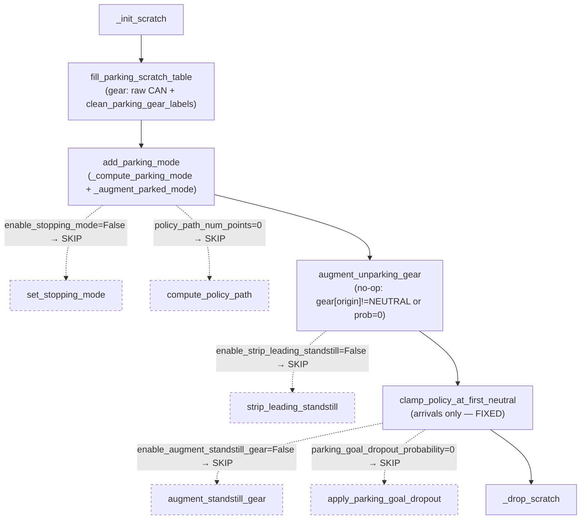

# PUDO `parking.py` Deep Critique + Flags Guide — 2026-06-14

Second-pass critique of the PUDO/UnPUDO pipeline, focused on **how `wayve/ai/si/datamodules/parking.py` actually works**, the **flags** it exposes, and **what is still wrong** after the 2026-06-13 fixes. Branches: training `boris/training/main_cherrypick_generic_data`, materialization `boris/pudo_generic_materialization`. Every claim was cross-checked in code; the load-bearing ones were independently re-verified (one earlier-pass claim was refuted — see §6). Companion to [[pudo-data-bug-report-2026-06-13]].

Symptoms in play: **U1** not pulling out after gear shift · **U2** pulling out when unsafe · **U3** gear not switching / flickering · **P1** sometimes not stopping · **P2** stops at a non-optimal position.

---

## 0. Status of the prior report + the single most important framing

**Fixed / changed since 2026-06-13:**
- ✅ **U-1 (clamp zeroes departures) is FIXED.** `clamp_policy_at_first_neutral` now guards `if not result.parking_mode: return` (`parking.py:786-787`) — departures are no longer clamped. Verified verbatim.
- ✅ **F4 (`augment_gear_direction` moves gear-not-motion) is now INERT** — `augment_gear_direction=False` in both datamodules (`parking_config.py:109,298`).
- ✅ Accepted by you: `gear==0` intentionally means **park OR neutral**; **failed_to (safe/unsafe) buckets can't be reproduced** right now — so neither is treated as a fix lever here.

**The framing that governs everything below — BC vs diffusion are two different pipelines, and only BC ships.** All four `ParkingBcTrain*` modes use `parking_bc_datamodule_cfg` (`parking_config.py:687,701,715,739`). In that BC config, most of the heavy machinery is **switched off**:

| Knob | BC (ships) | diffusion (not wired to any mode) |
|---|---|---|
| `policy_path_num_points` | **0** → no `POLICY_PATH`, no `PARKING_POSE` goal target | 50 |
| `enable_stopping_mode` | **False** → no `STOPPING_MODE` produced | True |
| `enable_strip_leading_standstill` | **False** | True |
| `parked_unparking_prob` | **0.0** → no synthetic departures | 0.5 |
| `unparking_gear_augment_prob` | **0.0** | 0.5 |
| `reconstruct_gear_from_speed` | **False** (raw CAN gear) | True |
| `enable_gear_label_cleanup` | **True** | False |

**Consequence:** the BC model the symptoms target effectively runs `gear cleanup → mode detection → (arrivals-only) clamp`. Many candidate bugs (stopping-mode randomization, policy-path drops, parked→unpark flip, random unpark gear) are **dormant in BC and live only in diffusion**. I tag every finding **[BC-LIVE]** or **[DIFFUSION-ONLY]** so you don't chase dormant ones.

---

## 1. NEW findings that are LIVE in the BC release

### N1 — Forward pull-out (P/N→D) is still never detected as unparking — **[BC-LIVE] · BLOCKER for U1**
`_compute_parking_mode`'s unparking branch only extends the window over **REVERSE** frames after the neutral segment (`parking.py:413-426`); a `FORWARD` first frame yields an empty window and falls through to "no result". The function's own NOTE admits it (`parking.py:400-406`). A robotaxi pulling **forward** away from a curbside PUDO stop — the dominant UnPUDO — is therefore **never tagged `unparking_mode`**, so it trains as ordinary driving with no departure handling. This is the training-side twin of the prior report's materialization-side **F2/P→D gap**, and it is the strongest live explanation for **U1**.
- **Fix (with the caveat the earlier pass got wrong):** accept `FORWARD` after the neutral segment — **but gate it with a real duration/standstill check**. The naive "min_duration_sec already validates it" is **false for BC**: `min_duration_sec` is only consumed inside `_reconstruct_gear_from_speed` (`parking.py:930`), which is OFF in BC. The SI detector uses raw `_find_neutral_gear_segments` with **no duration gate** (see N2). So add the gate as part of the fix, or forward-unpark will also fire on momentary neutral coasts.

### N2 — BC applies NO minimum-duration filter to "parked" neutral segments — **[BC-LIVE] · MAJOR for P1/U2**
Because `reconstruct_gear_from_speed=False` in BC, `min_duration_sec` (BC=1.0) is **never applied** — it only lives inside `_reconstruct_gear_from_speed`. `_compute_parking_mode` detects parking on **any** `gear==NEUTRAL` run via `_find_neutral_gear_segments` (`parking.py:347`) with no duration threshold, and `_build_expanded_gear` (`:519-548`) *widens* neutral over adjacent stopped frames. So a momentary neutral blip (or a brief gear==0 at a light, now that gear==0=park-or-neutral) becomes a "parked"/"parking" event → spurious stop conditioning (**P1**) and, once N1 is fixed, spurious departures (**U2**).
- **Fix:** add an explicit min-neutral-duration gate inside `_compute_parking_mode` / `_find_neutral_gear_segments` independent of gear reconstruction (e.g. reuse `min_duration_sec`).

### N3 — `clamp` (NEUTRAL) vs pre-intervention augmentor (restores motion) contradiction on pre-CA/CA PUDO arrivals — **[BC-LIVE, scoped] · MAJOR-ish for U1/U3 on those buckets**
`clamp_policy_at_first_neutral` is the last step of `insert_parking_data` (`parking.py:1388`) and sets `POLICY_GEAR_DIRECTION[clamp_idx+1:]=NEUTRAL` + zeroes speed, with **no `_pre_intervention_would_fire` guard** (unlike `strip_leading_standstill`, `:640`). Afterwards `augment_vehicle_preintervention` (`otf.py:1273-1281`) rewrites `POLICY_SPEED/POSE/WAYPOINTS` to restore motion but **never touches gear** (`intervention.py:221-229`). Result on AV-active pre-disengagement PUDO frames (`pre_ca_pudo*`/`ca_pudo*` that resolve to `parking_mode=True`): motion target says "moving", gear target says "neutral".
- **Scope (why not a blocker):** (a) only fires on AV-active frames that also hit `parking_mode` — not the bulk `dc_pudo`; (b) the gear loss supervises a *single* frame `POLICY_GEAR_DIRECTION[:,1]` (`imitation_losses.py:505`), so the NEUTRAL clobber only reaches the gear loss when `clamp_idx==0` (stop-at-origin). It still corrupts waypoint/speed targets on those samples.
- **Fix:** add the `_pre_intervention_would_fire` guard to the clamp (mirror `strip_leading_standstill`), or run the clamp before the pre-intervention augmentor and have the augmentor also set gear.

### N4 — Route-shortening reads an UNCLIPPED index against a CLIPPED stored index — **[BC-LIVE] · MINOR (boundary) for P2**
`enable_route_shortening_for_parking=True` in BC. `add_parking_mode` stores the entry index by matching against the **clipped** lookahead (`parking.py:1214-1220`; clip at `otf.py:812-813`), but the consumer rebuilds an **unclipped** `np.arange(present, present+max_future+1)` (`otf.py:1368-1370`). Near a run boundary the two arrays differ in length, so the stored positional index points at the wrong polyline frame → the route is shortened to the wrong point → stop placed off (**P2**). Boundary-only, low frequency.
- **Fix:** reuse the same `parking_indices_fn` (clipped generator) on read.

### N5 — Clamp speed/pose off-by-one at the stop — **[BC-LIVE] · MINOR for P2**
In the clamp, speed is zeroed from `clamp_idx` (inclusive) but pose/waypoints are frozen from `clamp_idx+1` (`parking.py:803-806`). At `clamp_idx` the target has `speed==0` while the waypoint still carries the displacement into that frame — a 1-frame speed/displacement inconsistency at the stop boundary.
- **Fix:** zero speed from `clamp_idx+1` to match, or freeze pose from `clamp_idx`.

### N6 — BC has no explicit stop-pose target — **[BC-LIVE] · design ceiling for P2**
`policy_path_num_points=0` ⇒ `compute_policy_path` never runs ⇒ no `POLICY_PATH`/`PARKING_POSE`; `PARKING_POSE_GT` is only written inside the (also-off) goal-dropout step. So BC supervises the stop **only** through clamped waypoints+gear. P2 quality is bounded by waypoint regression alone — there is no dedicated goal-pose objective or metric in BC.
- **Fix (optional):** add a lightweight goal-pose auxiliary target if P2 needs to improve beyond what waypoints give.

### N7 — SI vs zoo "parked tail" semantics differ — **[BC-LIVE, train=SI] · MINOR for P1**
SI marks `parked` across the full half-open neutral segment (`parking.py:354`); the zoo loader skips the last `min_parking_duration_sec` of the run (`zoo_parking.py:152-154`). A frame in the tail of a neutral run is `parked` under SI (what BC trains on) but not under zoo (what some eval/consumers use) — a train/eval label mismatch on tail frames.

---

## 2. NEW findings in the MATERIALIZATION (`pudo_generic_materialization`)

### M1 — Cross-class frame theft: `assigned |= window` runs before the class gate — **CONFIRMED · MAJOR for P1/P2**
In `select_park_pudo_event` (`filters.py:102-110`): `assigned |= window` (`:104`) is executed for **every** kept neutral segment **before** the `(event_type == "pudo") == is_pudo` class check (`:106`). During a `dc_pudo` pass, an earlier *non-PUDO* park segment marks its window frames in `assigned`; a later overlapping PUDO window then emits only `window & ~assigned`, silently dropping the overlap. Genuinely new; shrinks `dc_pudo` exactly in dense urban park+PUDO clusters.
- **Fix:** move `assigned |= window` inside the `if (event_type==...)==is_pudo:` block.

### M2 — Approach vs departure use inconsistent PUDO context windows — **CONFIRMED · MAJOR for P1/U2**
Approach classification tests a **single frame** `start-1` (`filters.py:105`, via `_park_context_index`). Departure classification tests `np.any(...)` over the **range** `[start-1 : max(end,anchor)+1]` (`signals.py:670-672`). A hazard/trip hit anywhere in the parked span flips the *departure* to UnPUDO while the *approach* of the same stop stays PARK → the same physical stop is labelled `park`-on-arrival but `unpudo`-on-exit, feeding inconsistent supervision to the stop and pull-out behaviours.
- **Fix:** use the same context window (single-frame or range) on both sides.

### M3 — Departure anchor can land on the last `gear==0` frame — **CONFIRMED (conditional) · MINOR-MAJOR for U1/U3**
`_departure_anchor` starts the movement search at `park_end_idx-1` with `side="left"` and has no `gear!=0` guard (`signals.py:619-623`). If speed already exceeds 0.01 m/s at the last park frame (neutral coast / speed noise), the anchor resolves to a still-parked frame — the departure window begins one frame too early. Conditional on a noisy final park frame, not universal.
- **Fix:** start the search at `park_end_idx`, or guard `signals.gear[movement_idx] != 0`.

### M4 — UnPUDO 15 s window end not clipped at the next stop — **CONFIRMED · MINOR-MAJOR for U2/P1 (multi-leg)**
The departure window end is computed purely from `after_movement_sec` (15 s for unpudo) with no `min(end, next_park_start_idx)` clip (`filters.py:187-189`); the next-stop clip exists only inside the anchor finder, not the window. So a departure followed by another stop within 15 s emits a window that runs into the next approach — "pulling away" frames contaminated with "approaching/stopped at the next stop".
- **Fix:** clip the window end at `next_park_start_idx` (mirror the anchor clip).

### M5 — Departure events don't skip `start<=0` (approach does) — **CONFIRMED · MINOR (skew)**
Approach skips run-start segments (`filters.py:91-93`); departure only guards run-end (`signals.py:655-658`). A run that *begins* parked yields no `dc_park`/`dc_pudo` but can yield a `dc_unpark`/`dc_unpudo` with a one-frame context (`_park_context_index(0)=0`), over-representing and mis-classifying first-of-run departures.

### M6 — trip-PUDO context built on **raw** (un-duration-validated) neutral segments — **CONFIRMED (new part) · MINOR**
`_trip_pudo_context` iterates `mask_to_segments(gear==0)` directly (`signals.py:336`), not `_parking_segments` (which applies `min_parking_duration_sec`), so sub-2 s neutral blips get trip-tagged as PUDO context. (The 100 m radius + unused trip timestamp portion **duplicates prior P-2** — not re-counted here.)

*(Partial/duplicate, do not over-invest: M-`moving_nearby` window-tail trim and the event-10s-vs-CA-30s hazard-window mismatch are real but bounded/duplicate prior P-3; leading-short-gear-glitch is usually re-filtered by the 2 s park gate.)*

---

## 3. THE FLAGS GUIDE — how to use `parking.py`'s knobs, with motivation

`ParkingDataConfig` is defined at `parking.py:65-136` and set per-datamodule in `parking_config.py`. Below: current BC value → recommendation → why. **Headline:** BC and diffusion are tuned **qualitatively differently** (different gear-labelling, mode detection, horizon, path) so nothing you learn on one transfers to the other; pick one pipeline as the product target and tune it deliberately.

### 3a. Gear labelling (drives U3 + all mode detection)
| Flag | BC now | Recommend | Why / motivation |
|---|---|---|---|
| `reconstruct_gear_from_speed` | False | **Decide via a data check, then make BC & diffusion agree.** | BC trusts raw CAN gear; diffusion fabricates gear from speed. They can't both be right. If gen2 CAN gear is reliable → keep raw (False) everywhere (speed-derived gear flickers near 0 → U3). If unreliable → reconstruct, but widen the 0.5 km/h dead-band and hold the last committed gear through it. **Action: sample ~20 PUDO runs, compare CAN gear vs speed-derived through the stop.** |
| `enable_gear_label_cleanup` | True | Keep, but audit `gear_label_cleanup_stop_buffer_sec` (0.5) | Cleanup removes reverse-distance/short-neutral noise (good). The 0.5 s buffer offsets the neutral onset (the clamp stop point) by ~0.5 s; confirm the direction and whether it shifts the learned stop (**P2**). |
| `enable_augment_standstill_gear` | False | **Keep OFF** | Randomising gear ∈ {R,N,D} at standstill destroys the standstill→gear mapping → **U3 flicker**. If ever needed as a confounder-breaker, mask (dropout) the gear input instead of substituting a random valid gear. |
| `w_gear_direction` / `enable_gear_direction` | 1.0 / True | Keep | Gear head active and supervised — needed for U3. Note: gear loss supervises only `POLICY_GEAR_DIRECTION[:,1]` (next frame), so multi-frame gear targets barely matter. |

### 3b. Mode detection & horizon (drives P1 + U1/U2)
| Flag | BC now | Recommend | Why / motivation |
|---|---|---|---|
| `min_duration_sec` | 1.0 (**inert in BC**) | **Make it actually gate neutral-segment detection** | See N2 — BC currently has *no* min-duration filter on parked segments, so neutral blips become stops. Wire a real gate (≈1–2 s) into `_compute_parking_mode`. **P1/U2.** |
| `time_threshold_sec` | 50.0 | **Lower / ablate (e.g. 15–20 s)** | parking_mode turns on up to 50 s before the stop, telling the model it's "parking" through long normal approaches → diluted/early stop behaviour (**P1**). For curbside PUDO a shorter, distance-dominated trigger localises the stop. |
| `distance_threshold_m` | 30.0 | Keep ~30 m, treat as the primary trigger | Distance is the more meaningful PUDO trigger than time; pair with a lower `time_threshold_sec`. |
| `lookahead_sec` / `past_sec` | 30 / 60 | **Confirm intentional** (diffusion is inverted: 60/30) | You want enough *future* horizon to see the stop and supervise the approach. BC's 30 s future vs diffusion's 60 s is a real divergence — decide which is right for the product and align. |
| `allow_short_path` (datamodule) | True | Keep True (BC); **set True for diffusion too** | Short PUDO/maneuver clips must be kept, not dropped (**P1**). Diffusion currently drops them (`allow_short_path` unset → False). |

### 3c. Departure / unparking (drives U1/U2)
| Flag | BC now | Recommend | Why / motivation |
|---|---|---|---|
| (fix first) forward-unpark detection | reverse-only | **Fix N1 before tuning anything here** | Until forward pull-out is detected, no departure flag tuning helps **U1**. |
| `parked_unparking_prob` | 0.0 | Keep 0 until N1 fixed; then reconsider | With real forward departures detected (N1), you may not need synthetic flips. If still data-starved, raise >0 — **but only after fixing `augment_unparking_gear`** (next row). |
| `unparking_gear_augment_prob` | 0.0 | **Keep 0 until `augment_unparking_gear` is fixed** | When >0 it sets the *read* gear input to a random D/R uncorrelated with the supervised motion (`parking.py:1007`) → **U2/U3**. Fix = `vehicle_gear[-1] = next_gear` (the motion-consistent gear). Dormant in BC, live (0.5) in diffusion. |
| `enable_strip_leading_standstill` | False | **Keep OFF for BC** | UnPUDO must learn to *initiate from standstill*; stripping the leading standstill removes exactly that transition (**U1**). Diffusion strips it (True) — may hurt diffusion's pull-out. |

### 3d. Stopping style / PUDO-vs-PARK (drives P1/P2 + double-park behaviour)
| Flag | BC now | Recommend | Why / motivation |
|---|---|---|---|
| `enable_stopping_mode` | False | **Keep OFF until the label is fixed**, then enable | The PUDO-vs-PARK distinction (relaxed double-park vs tight park) is *not conditioned* in BC. But the current label is noise: random 50/50 on non-parking frames + "hazard anywhere in the 30–50 s lookahead" on parking frames (`parking.py:1131,1135`), and it never emits the UNAVAILABLE→dropout value. Fix to a drive-level label + UNAVAILABLE first, then enable to express double-park style (**P1/P2**). |

### 3e. Goal / path / route (drives P2)
| Flag | BC now | Recommend | Why / motivation |
|---|---|---|---|
| `policy_path_num_points` / `_sample_step_m` | 0 / 0.5 | Optional: add a goal-pose aux target | BC has no explicit stop-pose objective (N6); P2 is bounded by waypoint regression. A small goal-pose aux head/target would give a direct stop-position signal. |
| `enable_route_shortening_for_parking` | True | Keep, but **fix N4** and re-check stop bias | Helps end-of-route stopping, but has the clipped-index bug (N4) and may bias the stop point; re-evaluate after fixing. |
| `parking_goal_dropout_probability` | 0.0 | Keep 0 in BC (no goal to drop) | Only meaningful when `policy_path_num_points>0`. |

### 3f. Conditioning robustness (drives U2)
| Flag | BC now | Recommend | Why / motivation |
|---|---|---|---|
| `always_dropout_gear_direction` / `always_dropout_parking_mode` (release 5_21) | False / False | **Consider small dropout (e.g. 0.05–0.1)** | The 5_21 release forces these conditioning inputs to *never* drop out, so the model can over-rely on the `parking_mode`/gear flags. A little dropout teaches it to behave sanely when the flag is wrong/late — relevant to **U2** (don't pull out just because a flag says so). |
| `use_parking_mode_adaptor` / `use_gear_direction_adaptor` | True / True | Keep | Needed conditioning; keep fed. |
| `enable_latent_action` / `w_latent_action` | False / 0 | Out of scope here | Separate multimodality research; see [[parking-capability-architecture-research]]. |

---

## 4. Config-hygiene risks (verify, may be intentional)
1. **Which datamodule do you actually train?** Every `ParkingBcTrain*` mode binds `parking_bc_datamodule_cfg`. `pudo_bc_datamodule` (a different driving partition mix, `parking_config.py:277-289`) and `parking_diffusion_datamodule` are registered but **no mode selects them** — they only apply via a CLI `datamodule=...` override. Confirm the runs you care about use the intended mix. **High-impact if wrong** (you'd be training a different data recipe than you think).
2. **`past_sec`/`lookahead_sec` inverted** between BC (60/30) and diffusion (30/60) — confirm intentional.
3. **`enable_end_of_route_blackout`** is declared (`parking.py:122`) but **never read in parking.py** — dead knob or consumed elsewhere; verify.
4. **Two gear-label algorithms** feed the same detector (BC: raw+cleanup; diffusion: reconstruct+expand) — any tuning is pipeline-specific.

---

## 5. Priority for the symptoms (BC-LIVE only)
1. **N1** forward-unpark detection (+ N2 duration gate) → **U1** (the big one).
2. **N2** min-neutral-duration gate → **P1** (false stops) / **U2** (spurious departures once N1 lands).
3. **N3** clamp×pre-intervention gear contradiction → **U1/U3** on pre-CA/CA PUDO.
4. **M1, M2** materialization label correctness (frame theft; approach/departure context mismatch) → **P1/P2/U2**.
5. **N4, N5, N6** stop-position correctness → **P2**.
6. Config-hygiene §4.1 (datamodule actually trained) — cheap, potentially highest-leverage if misconfigured.

Diffusion-only items (N-stopping-mode, parked→unpark flip, random unpark gear, policy-path drops, M-window issues that only bite multi-leg) matter **only if diffusion is the product** — they cannot explain the BC model's symptoms.

---

## 6. Verification notes (what I personally re-checked)
- **Clamp fix confirmed present** (`parking.py:786-787`).
- **Refuted an earlier-pass claim** that BC departures get all-neutral gear via `augment_unparking_gear`'s else-branch: the function gates on `result.unparking_mode AND gear[origin]==NEUTRAL` (`parking.py:1000`), and its docstring states *"Real unparking origins already have non-neutral gear and are unaffected."* Real reverse-out departures (gear[origin]≠NEUTRAL) are skipped entirely, and BC never flips parked→unpark (`parked_unparking_prob=0`) — so the else-branch never runs in BC. Not a bug.
- **N1/forward-unpark** verified against the function NOTE + the reverse-only scan (`parking.py:413-426`); the proposed-fix safety assumption ("min_duration validates it") was checked and is **false for BC** (min_duration only in the disabled `_reconstruct_gear_from_speed`) — fix must add its own gate.
- **Datamodule wiring** verified: modes bind `parking_bc_datamodule_cfg` (`:687/701/715/739`); `pudo_bc_datamodule`/diffusion are `data_store`-registered but unused by modes.
- Each materialization finding (M1–M6) was re-read against the cited lines; M1/M2/M4/M5 confirmed new, M6 partly duplicates prior P-2.

## File index
- Datamodule: `boris/training/main_cherrypick_generic_data:wayve/ai/si/datamodules/parking.py` (clamp 766-809; `_compute_parking_mode` ~295-440, unpark scan 413-426; `_augment_parked_mode` 550-588; `augment_unparking_gear` 970-1012; `set_stopping_mode` 1097-1138; pipeline order in `otf.py:1236,1356-1404`), `wayve/ai/si/configs/parking/parking_config.py` (BC datamodule 100-135, modes 687-759), loss `wayve/ai/zoo/losses/imitation_losses.py:505`, pre-intervention `wayve/ai/si/.../intervention.py:221-229`.
- Materialization: `boris/pudo_generic_materialization:wayve/ai/services/sampling/datasets/parking_pudo/{filters.py:91-110,187-189, signals.py:336-346,602-672, intervention_filters.py}`.
